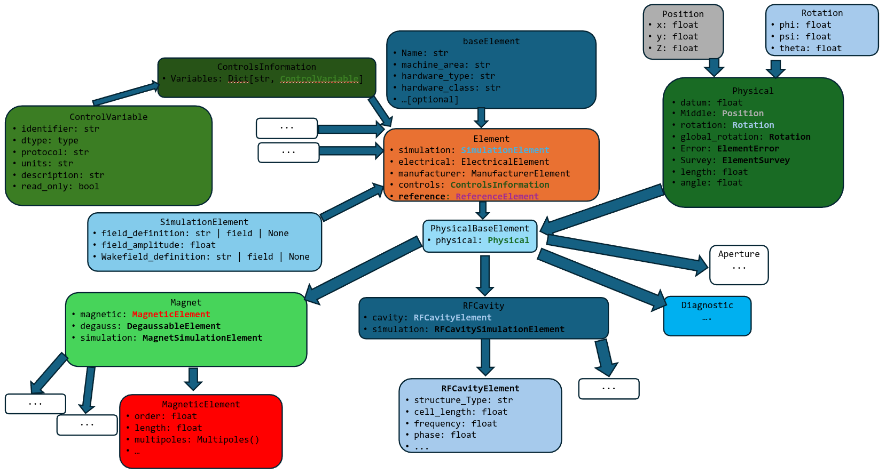

.. _element:

Element Definition
==================

Accelerator elements in :mod:`LAURA` are based on a hierarchical structure. All elements must define some common
properties in order to identify their type, machine_area, and other fields.
From this base level, additional details can be added progressively depending on the element type and its
intended use.

These generic classes are outlined below; refer to :numref:`fig-element-structure` for an inheritance diagram.

.. _fig-element-structure:

   Class structure of :mod:`LAURA` elements.

.. _base-element:

Base-level element
------------------

All elements in a :mod:`LAURA` lattice derive from the :py:class:`baseElement <laura.models.element.baseElement>`
class. At a minimum, each element must define:

* ``name: str``: The (unique) name of the element.
* ``hardware_class: str``: The generic type of the element. 
* ``hardware_type: str``: The element type. For example, a ``Quadrupole`` has ``hardware_type='Quadrupole'`` and ``hardware_class='Magnet'``. 
* ``machine_area: str``: Used for dividing the lattice into sections based on position.

The following additional properties can also be provided:

* ``hardware_model: str``: A specific model type of an element, for example the manufacturer name.
* ``virtual_name: str``: The name of the element in the virtual control system (if it exists).
* ``alias: str | list``: Alternative name(s) for the element.
* ``subelement: bool``: Represents whether the element 'belongs' to another, i.e. if they overlap in physical space, such as a wakefield attached to a cavity or a solenoid magnet around an RF photoinjector.

While most elements that are typically considered part of an accelerator lattice are defined with reference to a
fiducial position, and therefore are described in physical space with respect to that position, not all
elements supported by the :mod:`LAURA` standard need to have their position defined.
Objects that control lighting, low-level RF modules, RF modulators, or feedback systems, are all examples of
elements that derive from :py:class:`baseElement <laura.models.element.baseElement>`
but do not have a physical position defined.

**Example:** Creating a basic element without physical position:

.. code-block:: python

    from laura.models.element import baseElement

    # RF modulator - no physical position needed
    modulator = baseElement(
        name="MOD-KLYS-01",
        hardware_class="RF",
        hardware_type="Modulator",
        hardware_model="ScandiNova-K100",
        machine_area="KLYSTRON_GALLERY",
        virtual_name="MOD:KLYS:01",
        alias=["mod1", "klystron_mod_1"]
    )

    # BPM embedded in a quadrupole (subelement)
    embedded_bpm = baseElement(
        name="BPM-QUAD-01",
        hardware_class="Diagnostic",
        hardware_type="BPM",
        machine_area="LINAC-1",
        subelement=True
    )

.. _physical-element:

Physical element
----------------

The :py:class:`PhysicalBaseElement <laura.models.element.PhysicalBaseElement>` class derives from
:py:class:`baseElement <laura.models.element.baseElement>`, with the additional ``physical`` property based on
the :py:class:`PhysicalElement <laura.models.physical.PhysicalElement>` class.
This allows the position and rotation of the element in Cartesian co-ordinates to be defined. 
Furthermore, elements can be specified with ``error`` and ``survey`` attributes, both of which define a ``position`` and ``rotation``.

The full specification of an element position therefore consists of:

* ``position: Position(x, y, z)`` -- this refers to the middle of the element.
* ``global_rotation: Rotation(phi, psi, theta)``
* ``length: float``
* ``angle: float`` -- this is a simplified way of retrieving the bend angle in the X-Z plane.
* ``error: ElementError(position=Position(x, y, z), rotation=Rotation(phi, psi, theta))`` -- see :py:class:`ElementError <laura.models.physical.ElementError>`; the reference position for an error is the middle of the element.
* ``survey: ElementSurvey(position=Position(x, y, z), rotation=Rotation(phi, psi, theta))`` -- see :py:class:`ElementSurvey <laura.models.physical.ElementSurvey>`.

**Example:** Creating elements with physical properties:

.. code-block:: python

    from laura.models.element import PhysicalBaseElement
    from laura.models.physical import PhysicalElement, Position, Rotation, ElementError

    # Quadrupole with position and alignment error
    quad = PhysicalBaseElement(
        name="QUAD-02",
        hardware_class="Magnet",
        hardware_type="Quadrupole",
        machine_area="LINAC-1",
        physical=PhysicalElement(
            length=0.5,
            middle=Position(x=0, y=0, z=10.0),
            error=ElementError(
                position=Position(x=0.0001, y=-0.0002, z=0),  # 0.1mm X, -0.2mm Y offset
                rotation=Rotation(phi=0, psi=0, theta=0.001)  # 1 mrad roll
            )
        )
    )

    # Access computed positions
    print(f"Quad start: {quad.physical.start.z}")  # 9.75
    print(f"Quad end: {quad.physical.end.z}")      # 10.25

.. _element-class:

Element
-------

On top of the :py:class:`PhysicalBaseElement <laura.models.element.PhysicalBaseElement>`, additional information
pertaining to a given element can be specified in the :py:class:`Element <laura.models.element.Element>` class,
which defines the following additional properties (described in more detail in :ref:`auxiliary`):

* ``simulation: SimulationElement`` -- see :ref:`simulation-element`.
* ``controls: ControlsInformation`` -- see :ref:`controls-information`.
* ``manufacturer: ManufacturerElement`` -- see :ref:`electrical-and-manufacturer`.
* ``electrical: ElectricalElement`` -- see :ref:`electrical-and-manufacturer`.

**Example:** Complete element definition with all properties:

.. code-block:: python

    from laura.models.element import Quadrupole
    from laura.models.magnetic import Quadrupole_Magnet
    from laura.models.simulation import MagnetSimulationElement
    from laura.models.control import ControlsInformation, ControlVariable

    # Full quadrupole definition
    quad = Quadrupole(
        name="QUAD-MATCH-01",
        machine_area="MATCHING",
        physical={
            "length": 0.3,
            "middle": [0, 0, 15.0],
        },
        magnetic=Quadrupole_Magnet(
            k1l=5.2,  # Normalized gradient
            length=0.31 # Magnetic length
        ),
        electrical={
            "maxI": 250.0,
            "minI": 0.0,
            "read_tolerance": 0.01
        },
        manufacturer={
            "manufacturer": "Sigma Phi",
            "model": "QF-250",
            "serial_number": "2023-001"
        },
        simulation=MagnetSimulationElement(
            n_kicks=10,
        ),
        controls=ControlsInformation(
            variables={
                "READ": ControlVariable(
                    identifier="QUAD:MATCH:01:BACT",
                    dtype=float,
                    protocol="CA", # EPICS channel access
                    units="A",
                    description="Quadrupole read current",
                    read_only=True
                )
            }
        )
    )

    # Direct attribute access across nested models
    print(quad.k1l)            # 5.2 (finds magnetic.k1)

For more examples of creating elements and combining them into lattices, see :ref:`examples`.
Elements can be organized into :ref:`section-lattice` and :ref:`machine-layout` structures as
described in :ref:`lattice`. Once defined, elements can be exported to simulation codes using
the :ref:`translator` module.

**Alternative:** Element definition using dictionaries:

.. code-block:: python

    from laura.models.element import Quadrupole

    # Same quadrupole using dictionary notation
    # LAURA automatically converts dictionaries to appropriate class instances
    from laura.models.element import Quadrupole

    # Same quadrupole using dictionary notation
    # LAURA automatically converts dictionaries to appropriate class instances
    quad = Quadrupole(
        name="QUAD-MATCH-01",
        machine_area="MATCHING",
        physical={
            "length": 0.3,
            "middle": [0, 0, 15.0],
            "error": {
                "position": [0.0001, -0.0002, 0],
                "rotation": [0, 0, 0.001],
            }
        },
        magnetic={
            "k1l": 5.2,
            "length": 0.31,
        },
        electrical={
            "maxI": 250.0,
            "minI": 0.0,
            "read_tolerance": 0.01,
        },
        manufacturer={
            "manufacturer": "Sigma Phi",
            "model": "QF-250",
            "serial_number": "2023-001",
            "manufacture_date": "2023-06-15"
        },
        simulation={
            "field_amplitude": 5.2,
            "slice_method": "DRIFT_KICK_DRIFT",
            "n_slices": 10,
            "field_reference_position": "middle"
        },
        controls={
            "variables": {
                "READ": {
                    "identifier": "QUAD:MATCH:01:BACT",
                    "dtype": float,
                    "protocol": "CA", # EPICS channel access
                    "units": "A",
                    "description": "Quadrupole read current",
                    "read_only": True
                }
            }
        },
        degauss={
            "tolerance": 0.1,
            "steps": 10,
            "values": [100, -100, 80, -80, 60, -60, 40, -40, 20, -20]
        }
    )

    # Dictionary notation works for partial definitions too
    from laura.models.element import RFCavity

    cavity = RFCavity(
        name="CAV-L1-01",
        hardware_class="RFCavity",
        machine_area="LINAC-1",
        physical={
            "length": 1.0,
            "middle": [0, 0, 25.0],
        },
        cavity={
            "frequency": 2.856e9,
            "q0": 10000,
            "r_over_q": 100,
            "cavity_type": "StandingWave"
        },
        simulation={
            "field_amplitude": 25e6,  # 25 MV/m
            "phase": 0.0, # degrees, crest is at 0.0
            "field_definition": {
                "filename": "cavity_field.hdf5",
                "field_type": "1DElectroDynamic",
                "frequency": 2.856e9
            }
        }
    )

    # Mixed notation also works
    from laura.models.element import Element
    from laura.models.physical import Position

    screen = Element(
        name="SCREEN-01",
        hardware_class="Diagnostic",
        hardware_type="Screen",
        machine_area="INJECTOR",
        physical={
            "length": 0.01,
            "middle": Position(x=0, y=0, z=5.0),  # Mix class instance
        }
    )

This flexibility allows for easy element creation from configuration files (YAML/JSON) or programmatic
generation. See :ref:`examples` for more patterns of element creation and :ref:`lattice` for combining
elements into larger structures.

.. _auxiliary:

Auxiliary Classes
=================

The goal of describing a lattice with :mod:`LAURA` is to encapsulate as much information as possible
about accelerator lattice elements in a single object or file.
This page describes the auxiliary information that can be associated with an
:py:class:`Element <laura.models.element.Element>` (see :ref:`element-class`).

.. _simulation-element:

Simulation Element
------------------

Given that one intended use of :mod:`LAURA` is to be able to translate accelerator lattices to various formats
required for simulation codes, it is helpful to assign to each :py:class:`Element <laura.models.element.Element>`
simulation-specific parameters. At the base level, all
:py:class:`SimulationElement <laura.models.simulation.SimulationElement>` classes contain:

* ``field_definition: Optional[str]`` -- string pointing to a field definition, such as a fieldmap for an RF cavity or magnet.
* ``wakefield_definition: Optional[str]`` -- string pointing to a wakefield definition, such as the geometric wakefield associated with a cavity cell.
* ``field_reference_position: str`` -- the reference position for the field file, i.e. ``start``, ``middle``, ``end``.
* ``scale_field: float | bool`` -- if this has a numerical value, the field strength in the file is to be scaled by this factor. 

Element-specific child classes are also derived from this and associated with those elements; see
:py:class:`MagnetSimulationElement <laura.models.simulation.MagnetSimulationElement>`,
:py:class:`DriftSimulationElement <laura.models.simulation.DriftSimulationElement>`,
:py:class:`DiagnosticSimulationElement <laura.models.simulation.DiagnosticSimulationElement>`,
:py:class:`RFCavitySimulationElement <laura.models.simulation.RFCavitySimulationElement>`,
:py:class:`WakefieldSimulationElement <laura.models.simulation.WakefieldSimulationElement>`.

.. _controls-information:

Controls Information
--------------------

The :mod:`LAURA` schema also allows the storage of information about how to control the
:py:class:`Element <laura.models.element.Element>` from the accelerator control system.
Each :py:class:`Element <laura.models.element.Element>` can have multiple
:py:class:`ControlVariable <laura.models.control.ControlVariable>` items associated with its
:py:class:`ControlsInformation <laura.models.control.ControlsInformation>`, with the latter
consisting of a dictionary of the former. Each :py:class:`ControlVariable <laura.models.control.ControlVariable>`
can refer to a specific attribute of that element in the control system, such as an EPICS Process Variable or a
TANGO Attribute, organised as follows:

* ``identifier: str`` - unique identifier for the control variable.
* ``dtype: type`` -- data type of the control variable (e.g., ``int``, ``float``, ``str``).
* ``protocol: str`` -- protocol or method used to interact with the control variable, i.e. ``CA`` for EPICS Channel Access.
* ``units: str`` -- unit of measurement for the control variable.
* ``description: str`` -- description of the control variable.
* ``read_only: bool`` -- indicates if the variable is read-only.
* ``value: float | int | str | list`` -- current value of the control variable.
* ``type: str`` -- kind of control variable; one of ``scalar``, ``binary``, ``state``, ``string``, ``waveform``, ``statistical``.
* ``states: dict`` -- possible state mapping enums, for variables of ``type='state'``.
* ``target: str`` -- attribute path on the element to which the variable is applied, e.g. ``magnetic.k1l``.
* ``expression: dict`` -- expression graph defining how to compute the value set at the ``target``.
* ``readback: str`` -- connects a setpoint to a readback.
* ``setpoint: str`` -- connects a readback to a setpoint.
* ``update: dict`` -- function used to update the variable's value; see :ref:`update-functions`.
* ``dynamics: dict`` -- response model relating a readback to its setpoint; see :ref:`response-dynamics`.

.. _update-functions:

Update Functions
~~~~~~~~~~~~~~~~

A :py:class:`ControlVariable <laura.models.control.ControlVariable>` can define an ``update``
function, describing how its value evolves; this is primarily useful for driving virtual or
simulated accelerators, where no real control system is supplying values.
The available functions are the signal classes in :py:mod:`laura.utils.signals`, such as
:py:class:`Sinusoid <laura.utils.signals.Sinusoid>` and
:py:class:`RandomWalk <laura.utils.signals.RandomWalk>`; each is a callable dataclass whose fields
are the parameters of the signal.

An ``update`` can be given as a signal instance, as a signal class, or as a dictionary with a
``function`` key naming the signal alongside its parameters:

.. code-block:: python

    from laura.models.control import ControlVariable
    from laura.utils.signals import Sinusoid

    # As an instance
    cv = ControlVariable(
        identifier="BPM:01:X",
        protocol="CA",
        units="mm",
        update=Sinusoid(period=10.0, amplitude=0.5),
    )

    # Equivalently, as a dictionary
    cv = ControlVariable(
        identifier="BPM:01:X",
        protocol="CA",
        units="mm",
        update={"function": "Sinusoid", "period": 10.0, "amplitude": 0.5},
    )

The definition is validated when the :py:class:`ControlVariable <laura.models.control.ControlVariable>`
is created: the named signal must exist, and the parameters supplied must match its fields, with all
required parameters present. An invalid definition raises a warning and leaves ``update`` unset,
rather than raising an error, so that a single bad entry does not prevent a machine definition from
loading.

Whichever form is used, ``update`` is stored as a dictionary in which ``function`` is a fully
qualified import path. A definition serialised to YAML is therefore self-contained, and can be
resolved by tools that do not depend on :mod:`LAURA`:

.. code-block:: yaml

    update:
      function: laura.utils.signals.Sinusoid
      period: 10.0
      amplitude: 0.5

For the same reason, signals are not restricted to those defined by :mod:`LAURA`: any callable
dataclass can be used, provided it is named by its import path.

.. code-block:: yaml

    update:
      function: mypackage.signals.MyCustomSignal
      gain: 2.0

.. warning::

    Resolving an ``update`` imports the module named in ``function``. Only load machine definitions
    from sources you trust.

To obtain the callable itself, use
:py:meth:`build_update <laura.models.control.ControlVariable.build_update>`, which instantiates the
signal with the stored parameters and returns ``None`` if no ``update`` is defined:

.. code-block:: python

    signal = cv.build_update()   # Sinusoid(period=10.0, amplitude=0.5, noise=0.0, phase=0.0)
    signal(2.5)                  # 0.5, a quarter period in

Signals differ in what they need: a sinusoid is a function of time ``t``, while a random walk
steps on from the current ``value``. A caller driving many signals at once cannot know which is
which, so :py:func:`call_signal <laura.utils.signals.call_signal>` offers everything it knows about
and passes on only the arguments a given signal declares:

.. code-block:: python

    from laura.utils.signals import call_signal

    call_signal(signal, t=elapsed, value=current, dt=timestep)

A signal defined outside :mod:`LAURA` may therefore declare any subset of ``t``, ``value`` and
``dt`` as its arguments.

.. _response-dynamics:

Response Dynamics
~~~~~~~~~~~~~~~~~

A :py:class:`ControlVariable <laura.models.control.ControlVariable>` may be linked to its
counterpart through the ``setpoint`` and ``readback`` fields. In a real machine, a readback does
not reach a newly written setpoint instantly: the magnet current ramps, the cavity field settles,
and the measured value follows some time later. The ``dynamics`` field describes that lag, so a
simulated control system can reproduce it rather than having readbacks track setpoints exactly.

The available response models are the classes in :py:mod:`laura.utils.dynamics`:

* :py:class:`ImmediateResponse <laura.utils.dynamics.ImmediateResponse>` (``immediate``) -- the readback follows the setpoint with no lag.
* :py:class:`FirstOrderResponse <laura.utils.dynamics.FirstOrderResponse>` (``first_order``) -- exponential approach with time constant ``tau``.
* :py:class:`DelayedResponse <laura.utils.dynamics.DelayedResponse>` (``delayed``) -- the readback jumps to the setpoint after a dead time ``delay``.

A response model is a callable taking the target value and a timestep, and returning the value the
readback should now report. It is defined as for :ref:`update-functions`, except that the naming key
is ``model`` rather than ``function``:

.. code-block:: yaml

    - setpoint: LINAC:QUAD01:K1:CMD
      readback: LINAC:QUAD01:K1:MEAS
      dynamics:
        model: first_order
        tau: 0.5

As with ``update``, short names are accepted on the way in and stored as fully qualified import
paths (``laura.utils.dynamics.FirstOrderResponse``), and response models defined outside
:mod:`LAURA` may be used by naming them by import path.

:py:meth:`build_dynamics <laura.models.control.ControlVariable.build_dynamics>` instantiates the
model, for use in the readback's setter:

.. code-block:: python

    response = cv.build_dynamics()          # FirstOrderResponse(tau=0.5, initial=0.0)
    await readback.write(response(setpoint, dt))

.. note::

    Response models are stateful: each call advances an internal value towards the target, so the
    lag depends on the history of the variable. Build one instance per readback and keep it for the
    lifetime of that readback, rather than calling
    :py:meth:`build_dynamics <laura.models.control.ControlVariable.build_dynamics>` on each update.
    Runtime state is held in fields excluded from the definition, so it is neither configurable in
    the lattice nor serialised with it.

.. _electrical-and-manufacturer:

Electrical, Manufacturer and Reference Information
----------------------------------------------------

Other useful sets of information about an :py:class:`Element <laura.models.element.Element>` include electrical,
manufacturer and reference information, stored in
:py:class:`ElectricalElement <laura.models.electrical.ElectricalElement>`,
:py:class:`ManufacturerElement <laura.models.manufacturer.ManufacturerElement>`, and
:py:class:`ReferenceElement <laura.models.reference.ReferenceElement>`, respectively.

These classes can be used to store additional metadata about an element that may be useful for
maintenance, procurement, or documentation purposes.

The attributes of these classes are as follows:

Electrical
~~~~~~~~~~

* ``minI: float`` -- minimum current that the power source can deliver.
* ``maxI: float`` -- maximum current that the power source can deliver.
* ``read_tolerance: float`` -- read current tolerance.

Manufacturer
~~~~~~~~~~~~

* ``manufacturer: str`` -- name of the element manufacturer.
* ``serial_number: str`` -- serial number of the element

Reference
~~~~~~~~~

* ``drawings: List[str]`` -- Paths to mechanical drawings of the element.
* ``design_files: List[str]`` -- Paths to design files for the element.

Note that reference information is not limited to mechanical drawings and design files; it can be extended to include
other types of reference materials as needed.

.. _magnet:

Magnet Class
============

Magnet elements in :mod:`LAURA` contain, in addition to the auxiliary information associated with the
:ref:`element-class` (see :ref:`auxiliary`), detailed descriptions of the object's magnetic fields.
Various magnet types are currently supported, including :ref:`multipole`, :ref:`solenoid`, :ref:`wiggler`,
:ref:`non-linear-lens`, and :ref:`corrector-magnet`.
Every :py:class:`Magnet <laura.models.element.Magnet>` object has a ``magnetic`` attribute, described by a
:py:class:`MagneticElement <laura.models.magnetic.MagneticElement>` instance, with various examples given below.

.. _multipole:

Multipole Magnet
----------------

This class covers the majority of magnetic elements in many standard accelerator lattices, with various child
classes such as :py:class:`Dipole_Magnet <laura.models.magnetic.Dipole_Magnet>` and
:py:class:`Quadrupole_Magnet <laura.models.magnetic.Quadrupole_Magnet>` deriving from
:py:class:`MagneticElement <laura.models.magnetic.MagneticElement>`, which has the following properties:

* ``order: int`` -- magnetic order, with ``dipole=0``, ``quadrupole=1``, and so on.
* ``skew: bool`` -- indicates whether the magnetic field is skewed with respect to the nominal axis.
* ``length: float`` -- magnetic length (does not need to be the same as the physical length defined in :ref:`physical-element`).
* ``multipoles: Multipoles`` -- magnetic multipoles; see :ref:`multipoles-class`.
* ``systematic_multipoles: Multipoles`` -- systematic additional multipoles.
* ``random_multipoles: Multipoles`` -- random additional multipoles.
* ``field_integral_coefficients: FieldIntegral`` -- coefficients for calculating magnetic field integrals.
* ``linear_saturation_coefficients: LinearSaturationFit`` -- coefficients used for converting between current and magnetic field strength.
* ``entrance_edge_angle: float`` -- angle made between the nominal beam path and the magnet entrance pole face.
* ``exit_edge_angle: float`` -- angle made between the nominal beam path and the magnet exit pole face.
* ``gap: float`` -- magnetic gap (default is 3.2 cm).
* ``bore: float`` -- magnet bore size (default is 3.7 cm).
* ``width: float`` -- width of magnet (default is 20 cm).
* ``tilt: float`` -- tilt angle with respect to the X-Z plane.

.. _multipoles-class:

Multipoles Class
~~~~~~~~~~~~~~~~

Each :py:class:`MagneticElement <laura.models.magnetic.MagneticElement>` class has a ``multipoles`` field, which
consists of a dictionary of :py:class:`Multipole <laura.models.magnetic.Multipole>` items, up to 9th order,
with each order defined as follows:

* ``order: int`` -- magnetic order.
* ``normal: float`` -- normalized magnetic strength in the nominal plane.
* ``skew: float`` -- skew component of normalized magnetic strength.
* ``radius: float`` -- magnetic radius.

The values in the ``multipoles`` attribute of the :py:class:`MagneticElement <laura.models.magnetic.MagneticElement>`
class can be accessed via the ``KnL`` term, with ``n`` representing the magnetic order. So, to retrieve the normalized
field strength of a :py:class:`Quadrupole_Magnet <laura.models.magnetic.Quadrupole_Magnet>`,
one can call ``quad.KnL(1)``. Alternatively, one can call the ``quad.kl`` property which will retrieve the
normalized field strength of the nominal order for that magnet.

The ``normal`` and ``skew`` strengths may also be defined *functionally*, as a string naming a shared value
rather than a number; see :ref:`functional-parameters`. In that case ``KnL`` always returns the resolved
number (it is the computation accessor), while ``kl`` / ``k1l`` return the value as configured.

.. _solenoid:

Solenoid Magnet
----------------

Solenoid magnets comprise a different class of magnets, although their implementation is similar to that of
:ref:`multipole`. The important difference with respect to standard multipoles is that, rather than the
``multipoles`` attribute, solenoids define ``fields``. This is an instance of
:py:class:`SolenoidFields <laura.models.magnetic.SolenoidFields>` which has a similar structure to
:py:class:`Multipoles <laura.models.magnetic.Multipoles>`, although with keys defined as ``SnL``.
Furthermore, the solenoid strength can be set or retrieved as ``ks`` or ``field_amplitude``,
with the former defined as :math:`K_s = \frac{ \partial B_s }{ \partial s }`, and the latter
defining the peak solenoid field strength in Tesla. The ``SnL`` fields may be defined functionally
(see :ref:`functional-parameters`); ``field_amplitude`` always returns the resolved number, while
``ks`` returns the value as configured.

.. _wiggler:

Wiggler Magnet
--------------

Wigglers (or undulators) are defined using the following properties:

* ``length: float`` -- total length of wiggler
* ``strength: float`` -- wiggler strength K (may be defined functionally; see :ref:`functional-parameters`)
* ``peak_magnetic_field: float``
* ``period: float``
* ``num_periods: int``
* ``helical: bool`` -- if this is ``False``, the wiggler is planar
* ``quadratic_roll_off_x: float``
* ``quadratic_roll_off_y: float``
* ``transverse_gradient_x: float``
* ``transverse_gradient_y: float``

.. _non-linear-lens:

NonLinearLens Magnet
--------------------

A non-linear lens is a thin lens with an elliptic magnetic potential :cite:`NonLinearLens` which can be used to
create a fully integrable nonlinear lattice with large tune spread. Here, the MAD-X :cite:`MADX` convention
is followed, and only the quadrupole component is included:

* ``integrated_strength: float`` -- the :math:`knll` term.
* ``dimensional_parameter: float`` -- the :math:`cnll` term.

Both may be defined functionally (see :ref:`functional-parameters`).

.. _corrector-magnet:

Corrector Magnet
----------------

:py:class:`Horizontal_Corrector <laura.models.element.Horizontal_Corrector>`,
:py:class:`Vertical_Corrector <laura.models.element.Vertical_Corrector>`, and
:py:class:`Combined_Corrector <laura.models.element.Combined_Corrector>` are steering
(kicker) magnets. Although they extend :py:class:`Dipole <laura.models.element.Dipole>`
at the element level, they do **not** use :py:class:`Dipole_Magnet <laura.models.magnetic.Dipole_Magnet>`
for their ``magnetic`` attribute -- a dipole's ``normal``/``skew`` multipole components denote the
magnetic field's *orientation*, not a beam plane, and reusing them to mean "horizontal" and "vertical"
would be opaque. Instead, correctors use
:py:class:`Corrector_Magnet <laura.models.magnetic.Corrector_Magnet>`, which stores the two planes as
two independent, explicitly-named fields:

* ``horizontal_kick: float`` -- horizontal kick angle [rad].
* ``vertical_kick: float`` -- vertical kick angle [rad].

A :py:class:`Horizontal_Corrector <laura.models.element.Horizontal_Corrector>` or
:py:class:`Vertical_Corrector <laura.models.element.Vertical_Corrector>` is expected to populate only its
own plane; a :py:class:`Combined_Corrector <laura.models.element.Combined_Corrector>` may set both
simultaneously. Both fields may be defined functionally (see :ref:`functional-parameters`).

.. note::

   :py:class:`Combined_Corrector <laura.models.element.Combined_Corrector>` also has
   ``Horizontal_Corrector``/``Vertical_Corrector`` string fields. These are **not** where the kick
   strength lives -- they are name cross-references to separately-defined sibling elements, used for
   hardware/power-supply bookkeeping (see e.g. ``LAURA.get_correctors``). A
   :py:class:`Combined_Corrector <laura.models.element.Combined_Corrector>`'s own kick strength always
   comes from its own ``magnetic.horizontal_kick``/``magnetic.vertical_kick``.

.. _specialised-elements:

Specialised and Collider Elements
==================================

A handful of element types cover physics not represented by any of the classes above. These are all
primarily modelled on the equivalent MAD-X element :cite:`MADX` (see :ref:`madx-translator`); most have
no equivalent in ELEGANT, and some have an Xsuite equivalent that is noted below.

* :py:class:`MatrixTransform <laura.models.element.MatrixTransform>` -- an explicit, arbitrary transfer
  matrix (0th/1st/2nd order: ``c_matrix``, ``r_matrix``, ``t_matrix`` on
  :py:class:`MatrixTransformSimulationElement <laura.models.simulation.MatrixTransformSimulationElement>`),
  for inserting a black-box transformation when no physical element model fits. Maps to MAD-X's ``MATRIX``,
  ELEGANT's ``EMATRIX``, and Xsuite's ``SecondOrderTaylorMap``.
* :py:class:`CrabCavity <laura.models.element.CrabCavity>` -- a dedicated crab-cavity/transverse-deflecting
  RF element, extending :py:class:`RFCavity <laura.models.element.RFCavity>` (same ``cavity``/``simulation``
  models). Maps to MAD-X's ``CRABCAVITY``, ELEGANT's ``RFDF`` (shared with
  :py:class:`RFDeflectingCavity <laura.models.element.RFDeflectingCavity>`), and Xsuite's ``CrabCavity``.
* :py:class:`ElectrostaticSeparator <laura.models.element.ElectrostaticSeparator>` -- a static-field
  electrode pair providing a transverse deflection (MAD-X ``ELSEPARATOR``). No ELEGANT or Xsuite
  equivalent exists, so this element only translates to MAD-X.
* :py:class:`Horizontal_AC_Dipole <laura.models.element.Horizontal_AC_Dipole>` /
  :py:class:`Vertical_AC_Dipole <laura.models.element.Vertical_AC_Dipole>` -- an RF-driven exciter used
  for AC-dipole tune and optics measurements (MAD-X ``HACDIPOLE``/``VACDIPOLE``, Xsuite ``ACDipole``).

  .. note::

     Xsuite's ``ACDipole.freq`` is a tune-like quantity (units of :math:`2\\pi` per turn), not an absolute
     frequency, whereas this element's ``simulation.frequency`` is in Hz. Converting between the two
     requires the ring's revolution frequency -- see :ref:`revolution-frequency`.

* :py:class:`Wire <laura.models.element.Wire>` -- a current-carrying compensating wire, used for
  long-range beam-beam compensation (MAD-X ``WIRE``, Xsuite ``Wire``).
* :py:class:`BeamBeam <laura.models.element.BeamBeam>` -- a weak-strong kick representing the
  electromagnetic field of an opposing (colliding) bunch (MAD-X ``BEAMBEAM``, ELEGANT ``BEAMBEAM``, and
  Xsuite's ``BeamBeamBiGaussian2D`` via the ``xfields`` package -- a required dependency of ``xsuite``,
  so no extra install is needed). The opposing bunch's per-particle charge is stored as
  ``simulation.charge`` in elementary-charge units (matching MAD-X's and Xsuite's convention); ELEGANT's
  ``CHARGE`` (total charge in Coulombs) is derived from it (``n_particles * charge * e``). Only the
  thin, single-slice weak-strong model (``BeamBeamBiGaussian2D``) is used for Xsuite; the finite
  bunch-length ``BeamBeamBiGaussian3D`` model needs per-slice longitudinal configuration this element
  does not currently represent.
* :py:class:`RFMultipole <laura.models.element.RFMultipole>` -- a zero-length multipole kick whose
  strength oscillates at an RF frequency, up to 5th order (MAD-X ``RFMULTIPOLE``, Xsuite ``RFMultipole``).

.. _functional-parameters:

Functional Parameters
=====================

Selected element attributes can be defined either directly as a number or
*functionally*, as a string that names an entry in the lattice's functional
definitions. This is convenient when several elements share a value, or when a
parameter is driven by an external study or optimiser: the symbolic name is
stored on the element while the numeric value lives in one place (the lattice's
:ref:`functional-definitions`).

The attributes that currently accept a functional definition are:

* :py:class:`Multipole <laura.models.magnetic.Multipole>` ``normal`` and ``skew`` (and hence the magnet ``kl`` / ``k1l`` / ``KnL`` strengths, and the dipole ``angle``);
* :py:class:`SolenoidFields <laura.models.magnetic.SolenoidFields>` ``SnL`` (and hence the solenoid ``ks`` / ``field_amplitude``);
* :py:class:`MagneticElement <laura.models.magnetic.MagneticElement>` ``entrance_edge_angle`` and ``exit_edge_angle`` (see the note below on the reserved ``angle`` token);
* :py:class:`NonLinearLens_Magnet <laura.models.magnetic.NonLinearLens_Magnet>` ``integrated_strength`` and ``dimensional_parameter``;
* :py:class:`Corrector_Magnet <laura.models.magnetic.Corrector_Magnet>` ``horizontal_kick`` and ``vertical_kick``;
* :py:class:`Wiggler_Magnet <laura.models.magnetic.Wiggler_Magnet>` ``strength``;
* :py:class:`RFCavityElement <laura.models.RF.RFCavityElement>` and :py:class:`RFDeflectingCavityElement <laura.models.RF.RFDeflectingCavityElement>` ``phase``;
* :py:class:`RFCavitySimulationElement <laura.models.simulation.RFCavitySimulationElement>` ``field_amplitude``;
* :py:class:`MagnetSimulationElement <laura.models.simulation.MagnetSimulationElement>` ``field_amplitude``.

.. note::

   The dipole edge angles reserve the token ``angle``: any edge-angle string that
   contains it (``"angle"`` or ``"angle/2"``) is interpreted as an expression
   referencing the bend angle, not as a functional-definition name, and is always
   resolved to a number. A functional edge angle must therefore use a name that
   does not contain ``angle``.

A functional attribute is supplied as a string in place of a number:

.. code-block:: python

    from laura.models.element import Quadrupole

    quad = Quadrupole(
        name="QUAD-01", machine_area="LINAC-1",
        magnetic={"length": 0.3, "k1l": "quad1_k1l"},  # symbolic strength
    )

The values that the names resolve to are provided to the lattice container via
``functional_definitions`` (e.g. ``{"quad1_k1l": -2.0}``); see
:ref:`functional-definitions`.

Raw versus resolved access
--------------------------

The string is stored verbatim, and there are two kinds of accessor:

* **Configured** accessors return the value *as stored* (the functional name) by
  default: ``magnet.kl`` / ``magnet.k1l``, ``dipole.angle``, ``solenoid.ks``,
  ``Multipoles.normal(order)`` / ``skew(order)``, ``SolenoidFields.normal(order)``,
  and direct reads of the raw fields (``cavity.phase``, ``nll.integrated_strength``, …).
* **Resolved** accessors always return the *number*, resolving the functional
  definition: ``magnet.KnL(order)``, ``dipole.rho``, ``solenoid.field_amplitude``,
  ``magnet.get_gradient(...)``, ``wiggler.normalized_strength``, and the generic
  ``element.resolved("field_name")`` / ``element.resolve(value)`` helpers.

For example, with ``{"quad1_k1l": -2.0}`` and a 0.3 m magnet:

.. code-block:: python

    quad.magnetic.k1l      # 'quad1_k1l'  (configured / raw, default mode)
    quad.magnetic.KnL(1)   # -2.0         (resolved integrated strength)

A number passes through resolution unchanged, so elements that use ordinary
numeric values behave exactly as before.

Resolution mode
---------------

A global flag controls whether the *configured* accessors render functional
attributes as strings or as resolved numbers. It is **off by default** (render as
strings) and is set from the top level via the ``resolve_functional`` option of a
lattice container (see :ref:`functional-definitions`) or directly with
:py:func:`set_resolve_functional <laura.models.baseModels.set_resolve_functional>`:

.. code-block:: python

    from laura.models.baseModels import set_resolve_functional

    set_resolve_functional(True)
    quad.magnetic.k1l   # -2.0 (now resolved)

Resolved/computation accessors such as ``KnL`` are unaffected by this flag — they
always return numbers.
