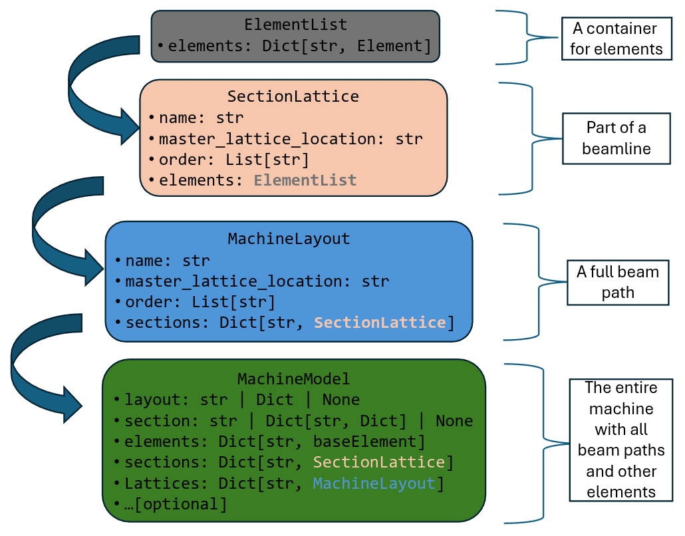

.. _lattice:

Lattice Definition
==================

Lattice structures in :mod:`LAURA` provide a hierarchical way to organize accelerator elements into sections and
complete beam paths. The lattice system is built on three main classes that progressively combine elements into
larger structures: sections, layouts, and the complete machine model.

These classes work together to define the full accelerator lattice, from individual elements up to complete
beam paths through the machine.

These classes are outlined below; refer to :numref:`fig-lattice-structure` for an inheritance diagram.

.. _fig-lattice-structure:

   Class structure of :mod:`LAURA` sections, lattices and machines.

.. _element-list:

Element List
------------

The :py:class:`ElementList <laura.models.element_list.ElementList>` class provides a container for an unordered dictionary of element objects. It is used to manage collections of :py:class:`BaseElement <laura.models.element.BaseElement>` instances, typically within a section lattice.

**Attributes:**

* ``elements: Dict[str, BaseElement | None]``: Dictionary of element objects, keyed by their names.

**Key Methods and Properties:**

* ``names``: Returns a list of element names contained in the list.
* ``index(element)``: Returns the index of an element (by name or object).
* ``list()``: Returns a list of all element objects.

**Example Usage:**

.. code-block:: python

    from laura.models.element_list import ElementList
    from laura.models.element import PhysicalBaseElement

    element_list = ElementList(
        elements={
            "cavity1": PhysicalBaseElement(
                name="cavity1",
                hardware_class="RFCavity",
                hardware_type="RFCavity",
                machine_area="INJ",
                physical={
                    "middle": [0, 0, 0.2],
                    "length": 0.4,
                }
            ),
            "quad1": PhysicalBaseElement(
                name="quad1",
                hardware_class="Magnet",
                hardware_type="Quadrupole",
                machine_area="INJ",
                physical={
                    "middle": [0, 0, 0.6],
                    "length": 0.1,
                }
            ),
            "cavity2": PhysicalBaseElement(
                name="cavity2",
                hardware_class="RFCavity",
                hardware_type="RFCavity",
                machine_area="INJ",
                physical={
                    "middle": [0, 0, 1.0],
                    "length": 0.2,
                }
            )
        }
    )

    print(element_list.names)  # ['cavity1', 'quad1', 'cavity2']
    cav1 = element_list["cavity1"]
    idx = element_list.index("quad1")  # 1
    all_elements = element_list.list()

.. _section-lattice:

Section Lattice
---------------

The :py:class:`SectionLattice <laura.models.element_list.SectionLattice>` class represents a section of a lattice,
consisting of an ordered list of elements along a beam path. Each section typically corresponds to a specific
area or functional region of the accelerator.

A section lattice must define:

* ``name: str``: The name of the lattice section.
* ``order: List[str]``: An ordered list of element names defining the sequence along the beam path.
* ``elements: ElementList``: A container holding the actual element objects.
* ``section_type: "beam" | "rf" | "laser"``: What kind of lattice this section belongs to (default ``"beam"``); see :ref:`lattice-types`.
* ``master_lattice: str | None``: Optional top-level directory containing lattice files.
* ``functional_definitions: str | dict``: Optional functional definitions (a mapping or YAML file path); see :ref:`functional-definitions`.
* ``resolve_functional: bool``: Optional global resolution mode (default ``False``); see :ref:`functional-definitions`.

Key methods and properties include:

* ``names``: Returns a list of element names in the section.
* ``create_drifts()``: Automatically inserts drift spaces between elements based on their physical positions. Drifts are named ``{section_name}_drift_{n}``.
* ``get_s_values(as_dict, at_entrance, starting_s)``: Calculates the cumulative S-position values for elements along the beamline. This operates on the section *with drifts inserted*, so the returned sequence has no gaps.
* ``get_resolved_s_values(...)``: As ``get_s_values``, but reading the ``s`` values already assigned by ``resolve_positions`` rather than re-accumulating lengths.
* ``resolve_positions(element_registry)``: Resolves all three :ref:`positioning modes <positioning-modes>` -- ``reference_placement``, ``s``, and global ``middle`` -- into a consistent set of global coordinates, and builds the section's :py:class:`Trajectory <laura.models.trajectory.Trajectory>`. Called automatically when a :ref:`machine-model` is assembled.

Example usage:

.. code-block:: python

    from laura.models.element_list import SectionLattice

    section = SectionLattice(
        name="injector",
        order=["cavity1", "quad1", "cavity2"],
        elements=element_list
    )
    s_positions = section.get_s_values(as_dict=True, at_entrance=True)

.. _machine-layout:

Machine Layout
--------------

The :py:class:`MachineLayout <laura.models.element_list.MachineLayout>` class represents a complete beam path
through the accelerator, composed of multiple :py:class:`SectionLattice <laura.models.element_list.SectionLattice>`
instances arranged in sequence.

A machine layout defines:

* ``name: str``: The name of the layout/beam path.
* ``sections: Dict[str, SectionLattice]``: Dictionary of lattice sections, keyed by section name.
* ``layout_type: "beam" | "rf" | "laser"``: What kind of lattice this beam path represents (default ``"beam"``); see :ref:`lattice-types`.
* ``master_lattice: str | None``: Directory containing lattice files.
* ``functional_definitions: str | dict``: Optional functional definitions (a mapping or YAML file path); see :ref:`functional-definitions`.
* ``resolve_functional: bool``: Optional global resolution mode (default ``False``); see :ref:`functional-definitions`.

Important methods include:

* ``get_element(name)``: Returns the element object for a given element name.
* ``get_all_elements(element_type, element_model, element_class)``: Returns filtered lists of element names.
* ``elements_between(start, end, element_type, element_model, element_class)``: Returns elements within a specified range along the beam path.
* ``_get_all_elements()``: Returns all elements in the layout in order.

.. note::

   Building a layout chains its sections together using their elements' start and end
   positions, so every element in a layout must have physical data -- i.e. be a
   :py:class:`PhysicalBaseElement <laura.models.element.PhysicalBaseElement>` subclass.
   A position-less :py:class:`Element <laura.models.element.Element>` (an LLRF module,
   a laser mirror, a lighting controller) may live in ``MachineModel.elements`` and in a
   section, but cannot take part in a beam path.

The layout automatically handles element ordering and can filter elements by various criteria:

.. code-block:: python

    from laura.models.element_list import MachineLayout
    
    layout = MachineLayout(
        name="main_beam",
        sections={"injector": inj_section, "linac": linac_section}
    )
    quads = layout.get_all_elements(element_type="Quadrupole")

.. _machine-model:

Machine Model
-------------

The :py:class:`MachineModel <laura.models.element_list.MachineModel>` class represents the complete accelerator model,
containing all possible beam paths, sections, and elements. This is the top-level class for managing the entire
lattice structure.

The machine model includes:

* ``layout: str | Dict | None``: Definition of available beam paths, either as a file path or dictionary.
* ``section: str | Dict[str, Dict] | None``: Definition of sections and their elements.
* ``elements: Dict[str, BaseElement]``: Complete dictionary of all elements in the machine.
* ``sections: Dict[str, SectionLattice]``: All section lattices available in the model.
* ``lattices: Dict[str, MachineLayout]``: All machine layouts (beam paths) defined.
* ``master_lattice: str | None``: Directory containing lattice YAML files.
* ``default_path: str``: The default beam path to use when not explicitly specified.
* ``functional_definitions: str | dict``: Functional definitions for the whole machine (a mapping or YAML file path); see :ref:`functional-definitions`.
* ``resolve_functional: bool``: Global resolution mode (default ``False``); see :ref:`functional-definitions`.

Key functionality:

* ``get_element(name)``: Retrieve any element by name from the full machine.
* ``get_all_elements(element_type, element_model, element_class, section_type)``: Filter all machine elements by criteria.
* ``elements_between(start, end, element_type, element_model, element_class, path, section_type)``: Get elements within a range on a specific beam path.
* ``get_sections_by_type(section_type)`` / ``get_layouts_by_type(layout_type)``: Filter sections/layouts by :ref:`lattice type <lattice-types>`.
* ``append(values)`` / ``update(values)``: Dynamically add new elements to the model.
* ``resolve_positions()``: Re-resolve every element's placement and rebuild the section trajectories after the model has been modified. ``resolve_reference_placements()`` is the older, narrower name for the same operation.
* ``export_rdf(path, format, machine_name)`` / ``sparql(query)``: Linked-data export and querying; see :ref:`interfaces`.

The machine model supports multiple beam paths and can automatically build sections from elements if no explicit
section definition is provided:

.. code-block:: python

    from laura.models.element_list import MachineModel

    model = MachineModel(
        layout="layouts.yaml",
        section="sections.yaml",
        elements=all_elements
    )

    # Get elements along default path
    elements = model.elements_between(
        start="gun",
        end="dump",
        element_type="Quadrupole"
    )

    # Access specific beam path
    bypass_elements = model.elements_between(
        start="split",
        end="merge",
        path="bypass_line"
    )

The machine model automatically manages the relationships between elements, sections, and layouts, ensuring
consistency across the entire lattice definition. It provides both dictionary-style access (``model["element_name"]``)
and method-based queries for flexible interaction with the lattice data.

.. _lattice-types:

Lattice Types
-------------

An accelerator is not described by a single chain of elements. Alongside the beam path there
is an RF distribution network -- modulators, klystrons, waveguide, LLRF -- and, on a
photoinjector machine, a laser transport line. These are lattices in their own right: ordered,
connected, and worth querying separately, but they are not beam paths and should not be
returned by a query for "the elements between the gun and the dump".

Both :py:class:`SectionLattice <laura.models.element_list.SectionLattice>` and
:py:class:`MachineLayout <laura.models.element_list.MachineLayout>` therefore carry a type,
one of ``"beam"`` (the default), ``"rf"`` or ``"laser"``. In a ``sections.yaml`` a section is
either a bare list (implying ``beam``) or a mapping with an explicit ``type``:

.. code-block:: yaml

    sections:
      INJ:
        elements: [GUN, SOL-01, BPM-01]
        type: beam
      LASER:
        elements: [LSR-HWP-01, LSR-MIRROR-01]
        type: laser

    # in layouts.yaml
    layouts:
      main_beam: [INJ, LINAC]
      laser_line: [LASER]
    layout_metadata:
      laser_line: laser
    default_layout: main_beam

They can then be selected with
:py:meth:`get_sections_by_type <laura.models.element_list.MachineModel.get_sections_by_type>` and
:py:meth:`get_layouts_by_type <laura.models.element_list.MachineModel.get_layouts_by_type>`, and
element queries can be restricted with ``section_type``:

.. code-block:: python

    laser_sections = model.get_sections_by_type("laser")
    beam_bpms = model.get_all_elements(element_type="BPM", section_type="beam")

See :ref:`example-lattice-types` for a complete worked example.

.. _functional-definitions:

Functional Definitions
----------------------

Every lattice container — :ref:`section-lattice`, :ref:`machine-layout`, and
:ref:`machine-model` (and therefore the top-level
:py:class:`LAURA <laura.laura.LAURA>` class) — accepts two related options that
govern :ref:`functional parameters <functional-parameters>`, i.e. element
attributes that are defined symbolically by name rather than as numbers:

* ``functional_definitions: str | dict``: a mapping of functional-parameter names
  to numeric values (e.g. ``{"quad1_k1l": -2, "cav1_phase": 90}``), or a path to a
  YAML file holding such a mapping (optionally nested under a top-level
  ``functional_definitions`` key).
* ``resolve_functional: bool``: the global resolution mode (default ``False``);
  see :ref:`functional-parameters`.

When provided to a :py:class:`MachineModel <laura.models.element_list.MachineModel>`,
both are cascaded into the sections and layouts that it builds — and on into the
translators — so that a single declaration at the top level applies to the whole
machine.

Loading from a file and validation
~~~~~~~~~~~~~~~~~~~~~~~~~~~~~~~~~~

.. code-block:: python

    from laura.models.element_list import MachineModel

    model = MachineModel(
        layout="layouts.yaml",
        section="sections.yaml",
        elements=all_elements,
        functional_definitions="functional_definitions.yaml",
    )

As the model is built, every functional reference used by an element is validated
against the available definitions. If an element references a name that is not
defined, a ``ValueError`` is raised that names the missing parameter, the
element(s) that use it, and the source (the YAML file path, or the supplied
dictionary).

Export behaviour
~~~~~~~~~~~~~~~~

When exporting with the :ref:`translator`, codes that do not support symbolic
parameters always receive resolved numbers. Codes that do — ELEGANT (via a
``% <value> sto <name>`` rpn store at the top of the file) and Xsuite (via
variables on the ``xt.Environment``) — render the symbolic references by default,
or resolved numbers when ``resolve_functional`` is ``True``.
