# LAURA Element Class Hierarchy

This diagram represents the full element class hierarchy as defined in the
[LinkML schema](../../laura/schema/YAML/laura_schema.yaml).
Concrete element classes (leaf nodes) correspond to `hardware_type` values in
YAML lattice files and to Python classes registered in `MODEL_REGISTRY`.

Where the Python class name differs from the schema name the Python name is
shown in the class body or the table at the bottom of this page.

> **Maintenance note:** This file is hand-maintained.  The `gen-erdiagram`
> tool produces only a skeletal single-class output for multi-file schemas;
> run `.\laura\schema\generate.ps1` to regenerate all *other* artefacts
> without touching this file.

```mermaid
classDiagram
    %% ═══════════════════════════════════════════════════════════
    %% Core hierarchy
    %% ═══════════════════════════════════════════════════════════

    class AcceleratorElement {
        <<schema root>>
        +string name
        +HardwareClassEnum hardware_class
        +string hardware_type
        +string hardware_model
        +string machine_area
        +list~string~ alias
        +string virtual_name
        +string subelement
    }

    class StandardElement {
        <<abstract>>
        +SimulationElement simulation
        +ElectricalElement electrical
        +ManufacturerElement manufacturer
        +ControlsInformation controls
        +ReferenceElement reference
    }

    class Element {
        <<abstract>>
    }

    class PhysicalAcceleratorElement {
        <<abstract>>
        +PhysicalElement physical
    }

    AcceleratorElement <|-- StandardElement
    StandardElement <|-- Element
    Element <|-- PhysicalAcceleratorElement

    %% ═══════════════════════════════════════════════════════════
    %% Magnet branch
    %% ═══════════════════════════════════════════════════════════

    class MagnetBaseElement {
        <<abstract>>
        +MagneticElement magnetic
        +DegaussableElement degauss
        +MagnetSimulationElement simulation
    }

    PhysicalAcceleratorElement <|-- MagnetBaseElement

    %% Concrete magnet types — Python only (not in schema)
    MagnetBaseElement <|-- Dipole
    MagnetBaseElement <|-- Quadrupole
    MagnetBaseElement <|-- Sextupole
    MagnetBaseElement <|-- Octupole
    MagnetBaseElement <|-- Solenoid
    MagnetBaseElement <|-- NonLinearLens
    MagnetBaseElement <|-- Wiggler
    Dipole <|-- Horizontal_Corrector
    Dipole <|-- Vertical_Corrector
    Dipole <|-- Combined_Corrector

    %% ═══════════════════════════════════════════════════════════
    %% Diagnostic branch
    %% ═══════════════════════════════════════════════════════════

    class Diagnostic {
        <<abstract>>
        +DiagnosticElement diagnostic
        +DiagnosticSimulationElement simulation
    }

    class ChargeDiagnostic {
        <<abstract>>
        +ChargeDiagnosticElement diagnostic
    }

    PhysicalAcceleratorElement <|-- Diagnostic
    Diagnostic <|-- BeamPositionMonitor
    Diagnostic <|-- BeamArrivalMonitor
    Diagnostic <|-- BunchLengthMonitor
    Diagnostic <|-- Camera
    Diagnostic <|-- Screen
    Diagnostic <|-- ChargeDiagnostic
    ChargeDiagnostic <|-- WallCurrentMonitor
    ChargeDiagnostic <|-- FaradayCupMonitor
    ChargeDiagnostic <|-- IntegratedCurrentTransformer

    %% ═══════════════════════════════════════════════════════════
    %% RF & feedback branch
    %% ═══════════════════════════════════════════════════════════

    class RFCavity {
        +RFCavityElement cavity
        +RFCavitySimulationElement simulation
    }

    class Wakefield {
        +WakefieldElement cavity
        +WakefieldSimulationElement simulation
    }

    PhysicalAcceleratorElement <|-- RFCavity
    RFCavity <|-- RFDeflectingCavity
    PhysicalAcceleratorElement <|-- Wakefield

    %% Non-physical RF / feedback — inherit StandardElement directly
    class LowLevelRF {
        +LowLevelRFElement llrf
    }
    class RFModulator {
        +RFModulatorElement modulator
    }
    class RFProtection {
        +RFProtectionElement protection
    }
    class RFHeartbeat {
        +RFHeartbeatElement heartbeat
    }
    class PID {
        +PIDElement pid
    }

    StandardElement <|-- LowLevelRF
    StandardElement <|-- RFModulator
    StandardElement <|-- RFProtection
    StandardElement <|-- RFHeartbeat
    StandardElement <|-- PID

    %% ═══════════════════════════════════════════════════════════
    %% Other physical elements
    %% ═══════════════════════════════════════════════════════════

    class Laser {
        +LaserElement laser
    }
    class Plasma {
        +PlasmaElement plasma
        +LaserElement laser
        +PlasmaSimulationElement simulation
    }
    class Aperture {
        +ApertureElement aperture
    }
    class Shutter {
        +ShutterElement shutter
    }
    class Valve {
        +ValveElement valve
    }

    PhysicalAcceleratorElement <|-- Laser
    PhysicalAcceleratorElement <|-- Plasma
    PhysicalAcceleratorElement <|-- Stage
    PhysicalAcceleratorElement <|-- VacuumGauge
    PhysicalAcceleratorElement <|-- Valve
    PhysicalAcceleratorElement <|-- Shutter
    PhysicalAcceleratorElement <|-- Marker
    PhysicalAcceleratorElement <|-- Aperture
    Aperture <|-- Collimator
    PhysicalAcceleratorElement <|-- TwissMatch
    PhysicalAcceleratorElement <|-- Drift

    %% ═══════════════════════════════════════════════════════════
    %% Non-physical laser / optics — inherit StandardElement directly
    %% ═══════════════════════════════════════════════════════════

    class LaserEnergyMeter {
        +LaserEnergyMeterElement laser
    }
    class LaserHalfWavePlate {
        +LaserHalfWavePlateElement laser
    }
    class LaserMirror {
        +LaserMirrorElement laser
    }
    class LaserAttenuator {
        +float maximum
        +float minimum
    }
    class Lighting {
        +LightingElement lights
    }

    StandardElement <|-- LaserEnergyMeter
    StandardElement <|-- LaserHalfWavePlate
    StandardElement <|-- LaserMirror
    StandardElement <|-- LaserAttenuator
    StandardElement <|-- Lighting

    %% ═══════════════════════════════════════════════════════════
    %% Physical placement sub-model (composition)
    %% ═══════════════════════════════════════════════════════════

    class PhysicalElement {
        +Position middle
        +Position datum
        +Rotation rotation
        +Rotation global_rotation
        +ElementPositionError error
        +ElementSurvey survey
        +float length
        +float physical_angle
    }

    class Position {
        +float x
        +float y
        +float z
    }

    class Rotation {
        +float phi
        +float psi
        +float theta
    }

    class ElementPositionError {
        +Position position
        +Rotation rotation
    }

    class ElementSurvey {
        +Position position
        +Rotation rotation
    }

    PhysicalAcceleratorElement --> PhysicalElement : physical
    PhysicalElement --> Position : middle / datum
    PhysicalElement --> Rotation : rotation / global_rotation
    PhysicalElement --> ElementPositionError : error
    PhysicalElement --> ElementSurvey : survey
```

## Schema ↔ Python class name mapping

The schema uses descriptive names to avoid collisions with composition-model
classes.  The Python wrapper classes in `laura/models/element.py` use the
names familiar from the accelerator-physics literature.

| Schema class | Python wrapper | Notes |
|---|---|---|
| `AcceleratorElement` | `baseElement` | Adds `CascadingAccessMixin`, `IgnoreExtra` |
| `StandardElement` + `Element` | `Element` | Both schema layers merged in one Python class |
| `PhysicalAcceleratorElement` | `PhysicalBaseElement` | |
| `MagnetBaseElement` | `Magnet` | Avoids collision with `MagneticElement` sub-model |
| All other schema classes | Same name | Direct one-to-one correspondence |

## Python-only concrete magnet types

The schema defines only the abstract `MagnetBaseElement`.  Concrete magnet
types are Python extensions not represented in the LinkML schema:

`Dipole`, `Quadrupole`, `Sextupole`, `Octupole`, `Solenoid`,
`NonLinearLens`, `Wiggler`, `Horizontal_Corrector`, `Vertical_Corrector`,
`Combined_Corrector`

Adding a new magnet type requires only a Python class inheriting from
`Magnet` — no schema change is needed unless new fields are introduced.

