# LAURA Element Class Hierarchy

This diagram represents the full element class hierarchy as defined in the
the ``laura/schema/YAML/laura_schema.yaml`` LinkML schema.
Concrete element classes (leaf nodes) correspond to `hardware_type` values in
YAML lattice files and to Python classes registered in `ELEMENT_REGISTRY`.

Where the Python class name differs from the schema name the Python name is
shown in the class body or the table at the bottom of this page.

> **Maintenance note:** This file is hand-maintained.  The `gen-erdiagram`
> tool produces only a skeletal single-class output for multi-file schemas;
> run `.\laura\schema\generate.ps1` to regenerate all *other* artefacts
> without touching this file.

```mermaid
classDiagram
    %% ═══════════════════════════════════════════════════════════
    %% Core hierarchy
    %% ═══════════════════════════════════════════════════════════

    class AcceleratorElement {
        <<schema root>>
        +string name
        +HardwareClassEnum hardware_class
        +string hardware_type
        +string hardware_model
        +string machine_area
        +list~string~ alias
        +string virtual_name
        +string subelement
        +list~IOTypeEnum~ inputs
        +list~IOTypeEnum~ outputs
        +list~string~ upstream
        +list~string~ downstream
    }

    class StandardElement {
        <<abstract>>
        +SimulationElement simulation
        +ElectricalElement electrical
        +ManufacturerElement manufacturer
        +ControlsInformation controls
        +ReferenceElement reference
    }

    class Element {
        <<abstract>>
    }

    class PhysicalAcceleratorElement {
        <<abstract>>
        +PhysicalElement physical
    }

    AcceleratorElement <|-- StandardElement
    StandardElement <|-- Element
    Element <|-- PhysicalAcceleratorElement

    %% ═══════════════════════════════════════════════════════════
    %% Magnet branch
    %% ═══════════════════════════════════════════════════════════

    class Magnet {
        <<abstract>>
        +MagneticElement magnetic
        +DegaussableElement degauss
        +MagnetSimulationElement simulation
    }

    PhysicalAcceleratorElement <|-- Magnet

    Magnet <|-- Dipole
    Magnet <|-- Quadrupole
    Magnet <|-- Sextupole
    Magnet <|-- Octupole
    Magnet <|-- Solenoid
    Magnet <|-- NonLinearLens
    Magnet <|-- Wiggler
    Dipole <|-- HorizontalCorrector
    Dipole <|-- VerticalCorrector
    Dipole <|-- CombinedCorrector

    %% ═══════════════════════════════════════════════════════════
    %% Diagnostic branch
    %% ═══════════════════════════════════════════════════════════

    class Diagnostic {
        <<abstract>>
        +DiagnosticElement diagnostic
        +DiagnosticSimulationElement simulation
    }

    class ChargeDiagnostic {
        <<abstract>>
        +ChargeDiagnosticElement diagnostic
    }

    PhysicalAcceleratorElement <|-- Diagnostic
    Diagnostic <|-- BeamPositionMonitor
    Diagnostic <|-- BeamArrivalMonitor
    Diagnostic <|-- BunchLengthMonitor
    Diagnostic <|-- Camera
    Diagnostic <|-- Screen
    Diagnostic <|-- PhotonMonitor
    Diagnostic <|-- ChargeDiagnostic
    ChargeDiagnostic <|-- WallCurrentMonitor
    ChargeDiagnostic <|-- FaradayCupMonitor
    ChargeDiagnostic <|-- IntegratedCurrentTransformer

    %% ═══════════════════════════════════════════════════════════
    %% RF & feedback branch
    %% ═══════════════════════════════════════════════════════════

    class RFCavity {
        +RFCavityElement cavity
        +RFCavitySimulationElement simulation
    }

    class Wakefield {
        +WakefieldElement cavity
        +WakefieldSimulationElement simulation
    }

    PhysicalAcceleratorElement <|-- RFCavity
    RFCavity <|-- RFDeflectingCavity
    PhysicalAcceleratorElement <|-- Wakefield

    %% Non-physical RF / feedback — inherit StandardElement directly
    class LowLevelRF {
        +LowLevelRFElement llrf
    }
    class RFModulator {
        +RFModulatorElement modulator
    }
    class RFProtection {
        +RFProtectionElement protection
    }
    class RFHeartbeat {
        +RFHeartbeatElement heartbeat
    }
    class PID {
        +PIDElement pid
    }

    StandardElement <|-- LowLevelRF
    StandardElement <|-- RFModulator
    StandardElement <|-- RFProtection
    StandardElement <|-- RFHeartbeat
    StandardElement <|-- PID
    StandardElement <|-- PowerSupply

    %% ═══════════════════════════════════════════════════════════
    %% Other physical elements
    %% ═══════════════════════════════════════════════════════════

    class Laser {
        +LaserElement laser
    }
    class Plasma {
        +PlasmaElement plasma
        +LaserElement laser
        +PlasmaSimulationElement simulation
    }
    class Aperture {
        +ApertureElement aperture
    }
    class Shutter {
        +ShutterElement shutter
    }
    class Valve {
        +ValveElement valve
    }

    PhysicalAcceleratorElement <|-- Laser
    PhysicalAcceleratorElement <|-- Plasma
    PhysicalAcceleratorElement <|-- Stage
    PhysicalAcceleratorElement <|-- VacuumGauge
    PhysicalAcceleratorElement <|-- Valve
    PhysicalAcceleratorElement <|-- Shutter
    PhysicalAcceleratorElement <|-- Marker
    PhysicalAcceleratorElement <|-- Aperture
    Aperture <|-- Collimator
    PhysicalAcceleratorElement <|-- TwissMatch
    PhysicalAcceleratorElement <|-- Drift

    %% ═══════════════════════════════════════════════════════════
    %% Non-physical laser / optics — inherit StandardElement directly
    %% ═══════════════════════════════════════════════════════════

    class LaserEnergyMeter {
        +LaserEnergyMeterElement laser
    }
    class LaserHalfWavePlate {
        +LaserHalfWavePlateElement laser
    }
    class LaserMirror {
        +LaserMirrorElement laser
    }
    class LaserAttenuator {
        +float maximum
        +float minimum
    }
    class Lighting {
        +LightingElement lights
    }

    StandardElement <|-- LaserEnergyMeter
    StandardElement <|-- LaserHalfWavePlate
    StandardElement <|-- LaserMirror
    StandardElement <|-- LaserAttenuator
    StandardElement <|-- Lighting

    %% ═══════════════════════════════════════════════════════════
    %% Physical placement sub-model (composition)
    %% ═══════════════════════════════════════════════════════════

    class PhysicalElement {
        +Position middle
        +Position datum
        +Rotation rotation
        +Rotation global_rotation
        +ElementPositionError error
        +ElementSurvey survey
        +ReferencePlacement reference_placement
        +float s
        +string s_point
        +float length
        +float physical_angle
    }

    class ReferencePlacement {
        +string element
        +string point
        +Position offset
        +Position world_offset
        +float s_offset
    }

    class Position {
        +float x
        +float y
        +float z
    }

    class Rotation {
        +float phi
        +float psi
        +float theta
    }

    class ElementPositionError {
        +Position position
        +Rotation rotation
    }

    class ElementSurvey {
        +Position position
        +Rotation rotation
    }

    PhysicalAcceleratorElement --> PhysicalElement : physical
    PhysicalElement --> Position : middle / datum
    PhysicalElement --> Rotation : rotation / global_rotation
    PhysicalElement --> ElementPositionError : error
    PhysicalElement --> ElementSurvey : survey
    PhysicalElement --> ReferencePlacement : reference_placement
```

`middle`, `s` and `reference_placement` are three mutually exclusive ways of
expressing the same placement; see
[Positioning modes](Element.html#positioning-modes).

`inputs` / `outputs` / `upstream` / `downstream` on the root class describe the
control/signal graph — which power supply feeds which magnet, which klystron
drives which cavity. That graph is directed, may contain feedback cycles, and is
entirely separate from beam ordering (which comes from the layout and s-position).
See [Signal connectivity](Element.html#signal-connectivity).

## Schema ↔ Python class name mapping

Most schema classes map one-to-one onto a Python class of the same name.  The
exceptions are the abstract bases (renamed to avoid collisions with
composition-model classes) and a handful of elements that use the underscored
spelling familiar from the accelerator-physics literature.

| Schema class | Python wrapper | Notes |
|---|---|---|
| `AcceleratorElement` | `baseElement` | Adds `CascadingAccessMixin`, `IgnoreExtra` |
| `StandardElement` + `Element` | `Element` | Both schema layers merged in one Python class |
| `PhysicalAcceleratorElement` | `PhysicalBaseElement` | |
| `HorizontalCorrector` | `Horizontal_Corrector` | |
| `VerticalCorrector` | `Vertical_Corrector` | |
| `CombinedCorrector` | `Combined_Corrector` | |
| `PhotonMonitor` | `Photon_Monitor` | Wrapper does not yet inherit the generated base |
| `PowerSupply` | `PowerSupply` | Wrapper does not yet inherit the generated base |
| All other schema classes | Same name | Direct one-to-one correspondence |

The Python class `Magnet` corresponds to the schema class `Magnet`; the schema's
own description still calls it `MagnetBaseElement`, a name that was dropped when
the concrete magnet types moved into the schema.

## Concrete magnet types

The concrete magnet types — `Dipole`, `Quadrupole`, `Sextupole`, `Octupole`,
`Solenoid`, `NonLinearLens`, `Wiggler`, `HorizontalCorrector`,
`VerticalCorrector` and `CombinedCorrector` — are defined in the schema, in
`laura/schema/YAML/magnets.yaml`, each with an `equals_string` constraint on its
`hardware_type` and a `slot_usage` binding its `magnetic` slot to the matching
`*_Magnet` composition model.  Adding a new one therefore means a schema class
plus a Python wrapper; see
[element-hierarchy.md](element-hierarchy.md#adding-a-concrete-magnet-type).

