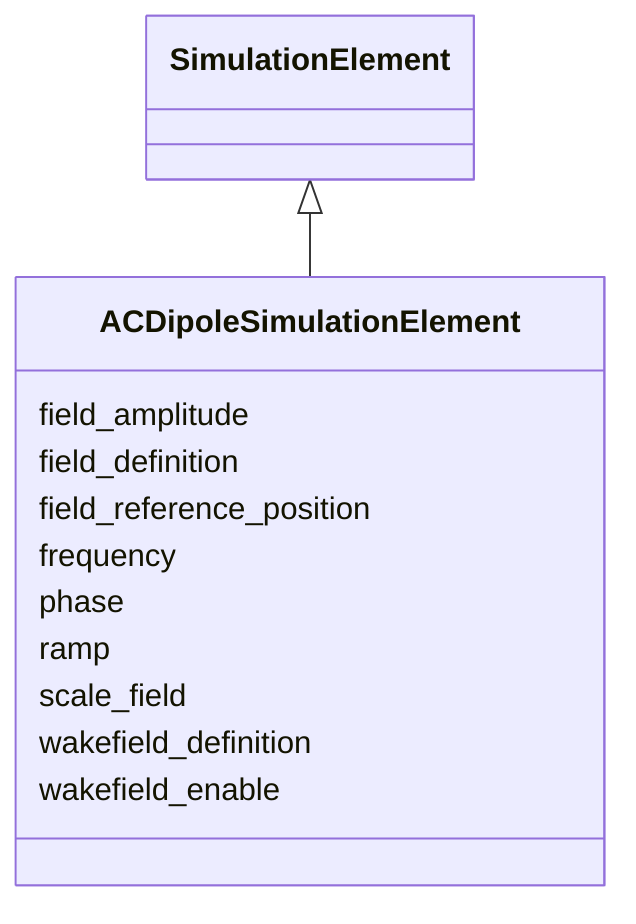

# Class: ACDipoleSimulationElement 


_Simulation attributes for an AC dipole / tune exciter._


<div data-search-exclude markdown="1">


URI: [laura:ACDipoleSimulationElement](https://w3id.org/laura/ACDipoleSimulationElement)





## Inheritance
* [SimulationElement](SimulationElement.md)
    * **ACDipoleSimulationElement**


## Class Properties

| Property | Value |
| --- | --- |
| Class URI | [laura:ACDipoleSimulationElement](https://w3id.org/laura/ACDipoleSimulationElement) |


## Slots

| Name | Cardinality and Range | Description | Inheritance |
| ---  | --- | --- | --- |
| [field_amplitude](field_amplitude.md) | 0..1 <br/> [Double](Double.md)&nbsp;or&nbsp;<br />[String](String.md) | Peak kick voltage/amplitude of the exciter | direct |
| [frequency](frequency.md) | 0..1 <br/> [Double](Double.md) | Drive frequency [Hz] | direct |
| [phase](phase.md) | 0..1 <br/> [Double](Double.md)&nbsp;or&nbsp;<br />[String](String.md) | Phase lag [deg] | direct |
| [ramp](ramp.md) | * <br/> [Integer](Integer.md) | Turn numbers [ramp1, ramp2, ramp3, ramp4] defining the drive ramp | direct |
| [field_definition](field_definition.md) | 0..1 <br/> [String](String.md) | Path to the 3-D field-map file | [SimulationElement](SimulationElement.md) |
| [wakefield_definition](wakefield_definition.md) | 0..1 <br/> [String](String.md) | Path to the wakefield impedance file | [SimulationElement](SimulationElement.md) |
| [wakefield_enable](wakefield_enable.md) | 0..1 <br/> [Boolean](Boolean.md) | Whether the wakefield named by wakefield_definition is applied | [SimulationElement](SimulationElement.md) |
| [field_reference_position](field_reference_position.md) | 0..1 <br/> [String](String.md) | Longitudinal origin of the field map [m] | [SimulationElement](SimulationElement.md) |
| [scale_field](scale_field.md) | 0..1 <br/> [Double](Double.md) | Multiplicative scale factor applied to the field map | [SimulationElement](SimulationElement.md) |


## Usages

| used by | used in | type | used |
| ---  | --- | --- | --- |
| [ACDipole](ACDipole.md) | [simulation](simulation.md) | range | [ACDipoleSimulationElement](ACDipoleSimulationElement.md) |
| [HorizontalACDipole](HorizontalACDipole.md) | [simulation](simulation.md) | range | [ACDipoleSimulationElement](ACDipoleSimulationElement.md) |
| [VerticalACDipole](VerticalACDipole.md) | [simulation](simulation.md) | range | [ACDipoleSimulationElement](ACDipoleSimulationElement.md) |


## Identifier and Mapping Information


### Schema Source


* from schema: https://w3id.org/laura/schema


## Mappings

| Mapping Type | Mapped Value |
| ---  | ---  |
| self | laura:ACDipoleSimulationElement |
| native | laura:ACDipoleSimulationElement |


## LinkML Source

<!-- TODO: investigate https://stackoverflow.com/questions/37606292/how-to-create-tabbed-code-blocks-in-mkdocs-or-sphinx -->

### Direct

<details>
```yaml
name: ACDipoleSimulationElement
description: Simulation attributes for an AC dipole / tune exciter.
from_schema: https://w3id.org/laura/schema
is_a: SimulationElement
slots:
- field_amplitude
- frequency
- phase
slot_usage:
  field_amplitude:
    name: field_amplitude
    description: Peak kick voltage/amplitude of the exciter.
    ifabsent: float(0.0)
  frequency:
    name: frequency
    description: Drive frequency [Hz].
    ifabsent: float(0.0)
  phase:
    name: phase
    description: Phase lag [deg].
    ifabsent: float(0.0)
attributes:
  ramp:
    name: ramp
    description: Turn numbers [ramp1, ramp2, ramp3, ramp4] defining the drive ramp.
    from_schema: https://w3id.org/laura/schema/simulation
    rank: 1000
    domain_of:
    - ACDipoleSimulationElement
    range: integer
    multivalued: true
class_uri: laura:ACDipoleSimulationElement

```
</details>

### Induced

<details>
```yaml
name: ACDipoleSimulationElement
description: Simulation attributes for an AC dipole / tune exciter.
from_schema: https://w3id.org/laura/schema
is_a: SimulationElement
slot_usage:
  field_amplitude:
    name: field_amplitude
    description: Peak kick voltage/amplitude of the exciter.
    ifabsent: float(0.0)
  frequency:
    name: frequency
    description: Drive frequency [Hz].
    ifabsent: float(0.0)
  phase:
    name: phase
    description: Phase lag [deg].
    ifabsent: float(0.0)
attributes:
  ramp:
    name: ramp
    description: Turn numbers [ramp1, ramp2, ramp3, ramp4] defining the drive ramp.
    from_schema: https://w3id.org/laura/schema/simulation
    rank: 1000
    owner: ACDipoleSimulationElement
    domain_of:
    - ACDipoleSimulationElement
    range: integer
    multivalued: true
  field_amplitude:
    name: field_amplitude
    description: Peak kick voltage/amplitude of the exciter.
    in_subset:
    - functional_parameters
    from_schema: https://w3id.org/laura/schema
    rank: 1000
    ifabsent: float(0.0)
    owner: ACDipoleSimulationElement
    domain_of:
    - MagnetSimulationElement
    - RFCavitySimulationElement
    - ACDipoleSimulationElement
    - RFMultipoleSimulationElement
    range: double
    any_of:
    - range: double
    - range: string
  frequency:
    name: frequency
    description: Drive frequency [Hz].
    from_schema: https://w3id.org/laura/schema
    rank: 1000
    ifabsent: float(0.0)
    owner: ACDipoleSimulationElement
    domain_of:
    - ACDipoleSimulationElement
    - RFMultipoleSimulationElement
    - RFCavityElement
    - RFDeflectingCavityElement
    range: double
    minimum_value: 0.0
    unit:
      ucum_code: Hz
  phase:
    name: phase
    description: Phase lag [deg].
    in_subset:
    - functional_parameters
    from_schema: https://w3id.org/laura/schema
    rank: 1000
    ifabsent: float(0.0)
    owner: ACDipoleSimulationElement
    domain_of:
    - ACDipoleSimulationElement
    - RFMultipoleSimulationElement
    - RFCavityElement
    - RFDeflectingCavityElement
    range: double
    unit:
      ucum_code: deg
    any_of:
    - range: double
    - range: string
  field_definition:
    name: field_definition
    description: Path to the 3-D field-map file.
    from_schema: https://w3id.org/laura/schema/simulation
    rank: 1000
    owner: ACDipoleSimulationElement
    domain_of:
    - SimulationElement
    range: string
  wakefield_definition:
    name: wakefield_definition
    description: Path to the wakefield impedance file.
    from_schema: https://w3id.org/laura/schema/simulation
    rank: 1000
    owner: ACDipoleSimulationElement
    domain_of:
    - SimulationElement
    range: string
  wakefield_enable:
    name: wakefield_enable
    description: Whether the wakefield named by wakefield_definition is applied. Set
      false to track the element without its wakefield while keeping the definition
      itself.
    from_schema: https://w3id.org/laura/schema/simulation
    rank: 1000
    ifabsent: 'true'
    owner: ACDipoleSimulationElement
    domain_of:
    - SimulationElement
    range: boolean
  field_reference_position:
    name: field_reference_position
    description: Longitudinal origin of the field map [m].
    from_schema: https://w3id.org/laura/schema/simulation
    rank: 1000
    owner: ACDipoleSimulationElement
    domain_of:
    - SimulationElement
    range: string
  scale_field:
    name: scale_field
    description: Multiplicative scale factor applied to the field map.
    from_schema: https://w3id.org/laura/schema/simulation
    rank: 1000
    ifabsent: float(1)
    owner: ACDipoleSimulationElement
    domain_of:
    - SimulationElement
    range: double
class_uri: laura:ACDipoleSimulationElement

```
</details></div>