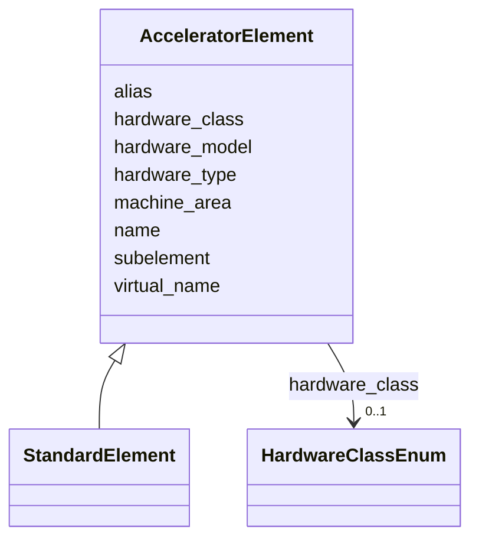

---
search:
  boost: 10.0
---

# Class: AcceleratorElement 


_Root base class for all LAURA accelerator elements.  Every lattice element is an instance of a concrete subclass identified by ``hardware_type``._


<div data-search-exclude markdown="1">


URI: [laura:AcceleratorElement](https://w3id.org/laura/AcceleratorElement)





## Inheritance
* **AcceleratorElement**
    * [StandardElement](StandardElement.md)


## Class Properties

| Property | Value |
| --- | --- |
| Class URI | [laura:AcceleratorElement](https://w3id.org/laura/AcceleratorElement) |
| Tree Root | Yes |


## Slots

| Name | Cardinality and Range | Description | Inheritance |
| ---  | --- | --- | --- |
| [name](name.md) | 1 <br/> [String](String.md) | Unique element name within the machine | direct |
| [hardware_class](hardware_class.md) | 0..1 <br/> [HardwareClassEnum](HardwareClassEnum.md) | Functional category (e | direct |
| [hardware_type](hardware_type.md) | 0..1 <br/> [String](String.md) | Python class name used for MODEL_REGISTRY dispatch | direct |
| [hardware_model](hardware_model.md) | 0..1 <br/> [String](String.md) | Model or variant name within the hardware type (e | direct |
| [machine_area](machine_area.md) | 0..1 <br/> [String](String.md) | Machine area label grouping related elements (e | direct |
| [virtual_name](virtual_name.md) | 0..1 <br/> [String](String.md) | Alternative internal name used by the control system when the physical name i... | direct |
| [alias](alias.md) | * <br/> [String](String.md) | Human-readable aliases for the element | direct |
| [subelement](subelement.md) | 0..1 <br/> [String](String.md) | If set, this element is a logical sub-component of the named parent element | direct |


## Usages

| used by | used in | type | used |
| ---  | --- | --- | --- |
| [MachineModel](MachineModel.md) | [elements](elements.md) | range | [AcceleratorElement](AcceleratorElement.md) |


## Identifier and Mapping Information


### Schema Source


* from schema: https://w3id.org/laura/schema


## Mappings

| Mapping Type | Mapped Value |
| ---  | ---  |
| self | laura:AcceleratorElement |
| native | laura:AcceleratorElement |


## LinkML Source

<!-- TODO: investigate https://stackoverflow.com/questions/37606292/how-to-create-tabbed-code-blocks-in-mkdocs-or-sphinx -->

### Direct

<details>
```yaml
name: AcceleratorElement
description: Root base class for all LAURA accelerator elements.  Every lattice element
  is an instance of a concrete subclass identified by ``hardware_type``.
from_schema: https://w3id.org/laura/schema
attributes:
  name:
    name: name
    description: Unique element name within the machine.
    from_schema: https://w3id.org/laura/schema
    rank: 1000
    identifier: true
    domain_of:
    - AcceleratorElement
    - SectionLattice
    - MachineLayout
    range: string
  hardware_class:
    name: hardware_class
    description: Functional category (e.g., ``Magnet``, ``Diagnostic``).
    from_schema: https://w3id.org/laura/schema
    rank: 1000
    domain_of:
    - AcceleratorElement
    range: HardwareClassEnum
  hardware_type:
    name: hardware_type
    description: Python class name used for MODEL_REGISTRY dispatch.  Identifies the
      concrete subclass to instantiate when loading from YAML.
    from_schema: https://w3id.org/laura/schema
    rank: 1000
    designates_type: true
    domain_of:
    - AcceleratorElement
    range: string
  hardware_model:
    name: hardware_model
    description: Model or variant name within the hardware type (e.g., ``Generic``,
      ``TESLA``).
    from_schema: https://w3id.org/laura/schema
    rank: 1000
    ifabsent: string(Generic)
    domain_of:
    - AcceleratorElement
    range: string
  machine_area:
    name: machine_area
    description: Machine area label grouping related elements (e.g., ``LINAC``, ``BA1``).
    from_schema: https://w3id.org/laura/schema
    rank: 1000
    domain_of:
    - AcceleratorElement
    range: string
  virtual_name:
    name: virtual_name
    description: Alternative internal name used by the control system when the physical
      name is inaccessible.
    from_schema: https://w3id.org/laura/schema
    rank: 1000
    ifabsent: string()
    domain_of:
    - AcceleratorElement
    range: string
  alias:
    name: alias
    description: Human-readable aliases for the element. Populated from ``name_alias``
      in YAML. Accepts a single string or a list of strings.
    from_schema: https://w3id.org/laura/schema
    aliases:
    - name_alias
    rank: 1000
    domain_of:
    - AcceleratorElement
    range: string
    multivalued: true
  subelement:
    name: subelement
    description: If set, this element is a logical sub-component of the named parent
      element.
    from_schema: https://w3id.org/laura/schema
    rank: 1000
    domain_of:
    - AcceleratorElement
    range: string
class_uri: laura:AcceleratorElement
tree_root: true

```
</details>

### Induced

<details>
```yaml
name: AcceleratorElement
description: Root base class for all LAURA accelerator elements.  Every lattice element
  is an instance of a concrete subclass identified by ``hardware_type``.
from_schema: https://w3id.org/laura/schema
attributes:
  name:
    name: name
    description: Unique element name within the machine.
    from_schema: https://w3id.org/laura/schema
    rank: 1000
    identifier: true
    owner: AcceleratorElement
    domain_of:
    - AcceleratorElement
    - SectionLattice
    - MachineLayout
    range: string
    required: true
  hardware_class:
    name: hardware_class
    description: Functional category (e.g., ``Magnet``, ``Diagnostic``).
    from_schema: https://w3id.org/laura/schema
    rank: 1000
    owner: AcceleratorElement
    domain_of:
    - AcceleratorElement
    range: HardwareClassEnum
  hardware_type:
    name: hardware_type
    description: Python class name used for MODEL_REGISTRY dispatch.  Identifies the
      concrete subclass to instantiate when loading from YAML.
    from_schema: https://w3id.org/laura/schema
    rank: 1000
    designates_type: true
    owner: AcceleratorElement
    domain_of:
    - AcceleratorElement
    range: string
  hardware_model:
    name: hardware_model
    description: Model or variant name within the hardware type (e.g., ``Generic``,
      ``TESLA``).
    from_schema: https://w3id.org/laura/schema
    rank: 1000
    ifabsent: string(Generic)
    owner: AcceleratorElement
    domain_of:
    - AcceleratorElement
    range: string
  machine_area:
    name: machine_area
    description: Machine area label grouping related elements (e.g., ``LINAC``, ``BA1``).
    from_schema: https://w3id.org/laura/schema
    rank: 1000
    owner: AcceleratorElement
    domain_of:
    - AcceleratorElement
    range: string
  virtual_name:
    name: virtual_name
    description: Alternative internal name used by the control system when the physical
      name is inaccessible.
    from_schema: https://w3id.org/laura/schema
    rank: 1000
    ifabsent: string()
    owner: AcceleratorElement
    domain_of:
    - AcceleratorElement
    range: string
  alias:
    name: alias
    description: Human-readable aliases for the element. Populated from ``name_alias``
      in YAML. Accepts a single string or a list of strings.
    from_schema: https://w3id.org/laura/schema
    aliases:
    - name_alias
    rank: 1000
    owner: AcceleratorElement
    domain_of:
    - AcceleratorElement
    range: string
    multivalued: true
  subelement:
    name: subelement
    description: If set, this element is a logical sub-component of the named parent
      element.
    from_schema: https://w3id.org/laura/schema
    rank: 1000
    owner: AcceleratorElement
    domain_of:
    - AcceleratorElement
    range: string
class_uri: laura:AcceleratorElement
tree_root: true

```
</details></div>