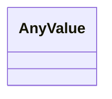

# Class: AnyValue 


_A value with no fixed structure. Used for slots holding nested mappings that LAURA stores and interprets itself, so that consumers validating against the generated JSON Schema or SHACL shapes are not told to expect a plain string._


<div data-search-exclude markdown="1">


URI: [linkml:Any](https://w3id.org/linkml/Any)





<!-- no inheritance hierarchy -->

## Class Properties

| Property | Value |
| --- | --- |
| Class URI | [linkml:Any](https://w3id.org/linkml/Any) |


## Slots

| Name | Cardinality and Range | Description | Inheritance |
| ---  | --- | --- | --- |


## Usages

| used by | used in | type | used |
| ---  | --- | --- | --- |
| [ControlVariable](ControlVariable.md) | [expression](expression.md) | range | [AnyValue](AnyValue.md) |
| [ControlVariable](ControlVariable.md) | [states](states.md) | range | [AnyValue](AnyValue.md) |
| [ControlVariable](ControlVariable.md) | [update](update.md) | range | [AnyValue](AnyValue.md) |
| [ControlVariable](ControlVariable.md) | [dynamics](dynamics.md) | range | [AnyValue](AnyValue.md) |


## Identifier and Mapping Information


### Schema Source


* from schema: https://w3id.org/laura/schema


## Mappings

| Mapping Type | Mapped Value |
| ---  | ---  |
| self | linkml:Any |
| native | laura:AnyValue |


## LinkML Source

<!-- TODO: investigate https://stackoverflow.com/questions/37606292/how-to-create-tabbed-code-blocks-in-mkdocs-or-sphinx -->

### Direct

<details>
```yaml
name: AnyValue
description: A value with no fixed structure. Used for slots holding nested mappings
  that LAURA stores and interprets itself, so that consumers validating against the
  generated JSON Schema or SHACL shapes are not told to expect a plain string.
from_schema: https://w3id.org/laura/schema
class_uri: linkml:Any

```
</details>

### Induced

<details>
```yaml
name: AnyValue
description: A value with no fixed structure. Used for slots holding nested mappings
  that LAURA stores and interprets itself, so that consumers validating against the
  generated JSON Schema or SHACL shapes are not told to expect a plain string.
from_schema: https://w3id.org/laura/schema
class_uri: linkml:Any

```
</details></div>