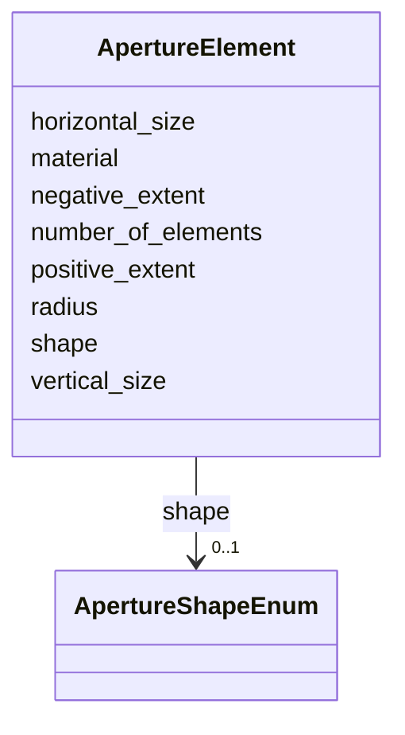

# Class: ApertureElement 


_Transverse aperture geometry for drift-space checks and collimators._


<div data-search-exclude markdown="1">


URI: [laura:ApertureElement](https://w3id.org/laura/ApertureElement)





<!-- no inheritance hierarchy -->

## Class Properties

| Property | Value |
| --- | --- |
| Class URI | [laura:ApertureElement](https://w3id.org/laura/ApertureElement) |


## Slots

| Name | Cardinality and Range | Description | Inheritance |
| ---  | --- | --- | --- |
| [number_of_elements](number_of_elements.md) | 0..1 <br/> [Integer](Integer.md) | Number of aperture sub-elements (e | direct |
| [horizontal_size](horizontal_size.md) | 0..1 <br/> [Float](Float.md) | Full horizontal aperture [m] | direct |
| [vertical_size](vertical_size.md) | 0..1 <br/> [Float](Float.md) | Full vertical aperture [m] | direct |
| [shape](shape.md) | 0..1 <br/> [ApertureShapeEnum](ApertureShapeEnum.md) | Cross-sectional aperture shape | direct |
| [radius](radius.md) | 0..1 <br/> [Float](Float.md) | Radius for circular apertures [m] | direct |
| [negative_extent](negative_extent.md) | 0..1 <br/> [Float](Float.md) | Upstream / inner extent [m] | direct |
| [positive_extent](positive_extent.md) | 0..1 <br/> [Float](Float.md) | Downstream / outer extent [m] | direct |
| [material](material.md) | 0..1 <br/> [String](String.md) | Aperture material | direct |


## Usages

| used by | used in | type | used |
| ---  | --- | --- | --- |
| [PhysicalAcceleratorElement](PhysicalAcceleratorElement.md) | [aperture](aperture.md) | range | [ApertureElement](ApertureElement.md) |
| [TwissMatch](TwissMatch.md) | [aperture](aperture.md) | range | [ApertureElement](ApertureElement.md) |
| [MatrixTransform](MatrixTransform.md) | [aperture](aperture.md) | range | [ApertureElement](ApertureElement.md) |
| [ElectrostaticSeparator](ElectrostaticSeparator.md) | [aperture](aperture.md) | range | [ApertureElement](ApertureElement.md) |
| [ACDipole](ACDipole.md) | [aperture](aperture.md) | range | [ApertureElement](ApertureElement.md) |
| [HorizontalACDipole](HorizontalACDipole.md) | [aperture](aperture.md) | range | [ApertureElement](ApertureElement.md) |
| [VerticalACDipole](VerticalACDipole.md) | [aperture](aperture.md) | range | [ApertureElement](ApertureElement.md) |
| [Wire](Wire.md) | [aperture](aperture.md) | range | [ApertureElement](ApertureElement.md) |
| [BeamBeam](BeamBeam.md) | [aperture](aperture.md) | range | [ApertureElement](ApertureElement.md) |
| [RFMultipole](RFMultipole.md) | [aperture](aperture.md) | range | [ApertureElement](ApertureElement.md) |
| [Stage](Stage.md) | [aperture](aperture.md) | range | [ApertureElement](ApertureElement.md) |
| [VacuumGauge](VacuumGauge.md) | [aperture](aperture.md) | range | [ApertureElement](ApertureElement.md) |
| [Laser](Laser.md) | [aperture](aperture.md) | range | [ApertureElement](ApertureElement.md) |
| [Shutter](Shutter.md) | [aperture](aperture.md) | range | [ApertureElement](ApertureElement.md) |
| [Valve](Valve.md) | [aperture](aperture.md) | range | [ApertureElement](ApertureElement.md) |
| [Marker](Marker.md) | [aperture](aperture.md) | range | [ApertureElement](ApertureElement.md) |
| [Aperture](Aperture.md) | [aperture](aperture.md) | range | [ApertureElement](ApertureElement.md) |
| [Collimator](Collimator.md) | [aperture](aperture.md) | range | [ApertureElement](ApertureElement.md) |
| [Drift](Drift.md) | [aperture](aperture.md) | range | [ApertureElement](ApertureElement.md) |
| [Magnet](Magnet.md) | [aperture](aperture.md) | range | [ApertureElement](ApertureElement.md) |
| [RFCavity](RFCavity.md) | [aperture](aperture.md) | range | [ApertureElement](ApertureElement.md) |
| [RFDeflectingCavity](RFDeflectingCavity.md) | [aperture](aperture.md) | range | [ApertureElement](ApertureElement.md) |
| [CrabCavity](CrabCavity.md) | [aperture](aperture.md) | range | [ApertureElement](ApertureElement.md) |
| [Wakefield](Wakefield.md) | [aperture](aperture.md) | range | [ApertureElement](ApertureElement.md) |
| [Diagnostic](Diagnostic.md) | [aperture](aperture.md) | range | [ApertureElement](ApertureElement.md) |
| [BeamPositionMonitor](BeamPositionMonitor.md) | [aperture](aperture.md) | range | [ApertureElement](ApertureElement.md) |
| [BeamArrivalMonitor](BeamArrivalMonitor.md) | [aperture](aperture.md) | range | [ApertureElement](ApertureElement.md) |
| [BunchLengthMonitor](BunchLengthMonitor.md) | [aperture](aperture.md) | range | [ApertureElement](ApertureElement.md) |
| [Camera](Camera.md) | [aperture](aperture.md) | range | [ApertureElement](ApertureElement.md) |
| [Screen](Screen.md) | [aperture](aperture.md) | range | [ApertureElement](ApertureElement.md) |
| [WireScanner](WireScanner.md) | [aperture](aperture.md) | range | [ApertureElement](ApertureElement.md) |
| [ChargeDiagnostic](ChargeDiagnostic.md) | [aperture](aperture.md) | range | [ApertureElement](ApertureElement.md) |
| [WallCurrentMonitor](WallCurrentMonitor.md) | [aperture](aperture.md) | range | [ApertureElement](ApertureElement.md) |
| [FaradayCupMonitor](FaradayCupMonitor.md) | [aperture](aperture.md) | range | [ApertureElement](ApertureElement.md) |
| [IntegratedCurrentTransformer](IntegratedCurrentTransformer.md) | [aperture](aperture.md) | range | [ApertureElement](ApertureElement.md) |
| [PhotonMonitor](PhotonMonitor.md) | [aperture](aperture.md) | range | [ApertureElement](ApertureElement.md) |
| [Plasma](Plasma.md) | [aperture](aperture.md) | range | [ApertureElement](ApertureElement.md) |
| [Dipole](Dipole.md) | [aperture](aperture.md) | range | [ApertureElement](ApertureElement.md) |
| [Quadrupole](Quadrupole.md) | [aperture](aperture.md) | range | [ApertureElement](ApertureElement.md) |
| [Sextupole](Sextupole.md) | [aperture](aperture.md) | range | [ApertureElement](ApertureElement.md) |
| [Octupole](Octupole.md) | [aperture](aperture.md) | range | [ApertureElement](ApertureElement.md) |
| [Decapole](Decapole.md) | [aperture](aperture.md) | range | [ApertureElement](ApertureElement.md) |
| [HorizontalCorrector](HorizontalCorrector.md) | [aperture](aperture.md) | range | [ApertureElement](ApertureElement.md) |
| [VerticalCorrector](VerticalCorrector.md) | [aperture](aperture.md) | range | [ApertureElement](ApertureElement.md) |
| [CombinedCorrector](CombinedCorrector.md) | [aperture](aperture.md) | range | [ApertureElement](ApertureElement.md) |
| [Solenoid](Solenoid.md) | [aperture](aperture.md) | range | [ApertureElement](ApertureElement.md) |
| [CombinedSolenoidQuadrupole](CombinedSolenoidQuadrupole.md) | [aperture](aperture.md) | range | [ApertureElement](ApertureElement.md) |
| [Wiggler](Wiggler.md) | [aperture](aperture.md) | range | [ApertureElement](ApertureElement.md) |
| [NonLinearLens](NonLinearLens.md) | [aperture](aperture.md) | range | [ApertureElement](ApertureElement.md) |


## Identifier and Mapping Information


### Schema Source


* from schema: https://w3id.org/laura/schema


## Mappings

| Mapping Type | Mapped Value |
| ---  | ---  |
| self | laura:ApertureElement |
| native | laura:ApertureElement |


## LinkML Source

<!-- TODO: investigate https://stackoverflow.com/questions/37606292/how-to-create-tabbed-code-blocks-in-mkdocs-or-sphinx -->

### Direct

<details>
```yaml
name: ApertureElement
description: Transverse aperture geometry for drift-space checks and collimators.
from_schema: https://w3id.org/laura/schema
attributes:
  number_of_elements:
    name: number_of_elements
    description: Number of aperture sub-elements (e.g., for multi-leaf collimators).
    from_schema: https://w3id.org/laura/schema/elements
    rank: 1000
    ifabsent: int(0)
    domain_of:
    - ApertureElement
    range: integer
    minimum_value: 0
  horizontal_size:
    name: horizontal_size
    description: Full horizontal aperture [m].
    from_schema: https://w3id.org/laura/schema/elements
    rank: 1000
    ifabsent: float(0.0)
    domain_of:
    - ApertureElement
    range: float
    minimum_value: 0.0
    unit:
      ucum_code: m
  vertical_size:
    name: vertical_size
    description: Full vertical aperture [m].
    from_schema: https://w3id.org/laura/schema/elements
    rank: 1000
    ifabsent: float(0.0)
    domain_of:
    - ApertureElement
    range: float
    minimum_value: 0.0
    unit:
      ucum_code: m
  shape:
    name: shape
    description: Cross-sectional aperture shape.
    from_schema: https://w3id.org/laura/schema/elements
    rank: 1000
    domain_of:
    - ApertureElement
    range: ApertureShapeEnum
  radius:
    name: radius
    description: Radius for circular apertures [m].
    from_schema: https://w3id.org/laura/schema/elements
    rank: 1000
    domain_of:
    - ApertureElement
    - Multipole
    - CameraMask
    range: float
    minimum_value: 0.0
    unit:
      ucum_code: m
  negative_extent:
    name: negative_extent
    description: Upstream / inner extent [m].
    from_schema: https://w3id.org/laura/schema/elements
    rank: 1000
    domain_of:
    - ApertureElement
    range: float
    unit:
      ucum_code: m
  positive_extent:
    name: positive_extent
    description: Downstream / outer extent [m].
    from_schema: https://w3id.org/laura/schema/elements
    rank: 1000
    domain_of:
    - ApertureElement
    range: float
    unit:
      ucum_code: m
  material:
    name: material
    description: Aperture material.
    from_schema: https://w3id.org/laura/schema/elements
    domain_of:
    - PhysicalAcceleratorElement
    - ApertureElement
    range: string
class_uri: laura:ApertureElement

```
</details>

### Induced

<details>
```yaml
name: ApertureElement
description: Transverse aperture geometry for drift-space checks and collimators.
from_schema: https://w3id.org/laura/schema
attributes:
  number_of_elements:
    name: number_of_elements
    description: Number of aperture sub-elements (e.g., for multi-leaf collimators).
    from_schema: https://w3id.org/laura/schema/elements
    rank: 1000
    ifabsent: int(0)
    owner: ApertureElement
    domain_of:
    - ApertureElement
    range: integer
    minimum_value: 0
  horizontal_size:
    name: horizontal_size
    description: Full horizontal aperture [m].
    from_schema: https://w3id.org/laura/schema/elements
    rank: 1000
    ifabsent: float(0.0)
    owner: ApertureElement
    domain_of:
    - ApertureElement
    range: float
    minimum_value: 0.0
    unit:
      ucum_code: m
  vertical_size:
    name: vertical_size
    description: Full vertical aperture [m].
    from_schema: https://w3id.org/laura/schema/elements
    rank: 1000
    ifabsent: float(0.0)
    owner: ApertureElement
    domain_of:
    - ApertureElement
    range: float
    minimum_value: 0.0
    unit:
      ucum_code: m
  shape:
    name: shape
    description: Cross-sectional aperture shape.
    from_schema: https://w3id.org/laura/schema/elements
    rank: 1000
    owner: ApertureElement
    domain_of:
    - ApertureElement
    range: ApertureShapeEnum
  radius:
    name: radius
    description: Radius for circular apertures [m].
    from_schema: https://w3id.org/laura/schema/elements
    rank: 1000
    owner: ApertureElement
    domain_of:
    - ApertureElement
    - Multipole
    - CameraMask
    range: float
    minimum_value: 0.0
    unit:
      ucum_code: m
  negative_extent:
    name: negative_extent
    description: Upstream / inner extent [m].
    from_schema: https://w3id.org/laura/schema/elements
    rank: 1000
    owner: ApertureElement
    domain_of:
    - ApertureElement
    range: float
    unit:
      ucum_code: m
  positive_extent:
    name: positive_extent
    description: Downstream / outer extent [m].
    from_schema: https://w3id.org/laura/schema/elements
    rank: 1000
    owner: ApertureElement
    domain_of:
    - ApertureElement
    range: float
    unit:
      ucum_code: m
  material:
    name: material
    description: Aperture material.
    from_schema: https://w3id.org/laura/schema/elements
    owner: ApertureElement
    domain_of:
    - PhysicalAcceleratorElement
    - ApertureElement
    range: string
class_uri: laura:ApertureElement

```
</details></div>