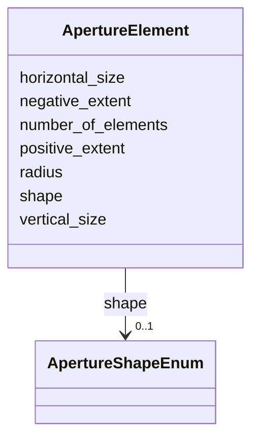

# Class: ApertureElement 


_Transverse aperture geometry for drift-space checks and collimators._


<div data-search-exclude markdown="1">


URI: [laura:ApertureElement](https://w3id.org/laura/ApertureElement)





<!-- no inheritance hierarchy -->

## Class Properties

| Property | Value |
| --- | --- |
| Class URI | [laura:ApertureElement](https://w3id.org/laura/ApertureElement) |


## Slots

| Name | Cardinality and Range | Description | Inheritance |
| ---  | --- | --- | --- |
| [number_of_elements](number_of_elements.md) | 0..1 <br/> [Integer](Integer.md) | Number of aperture sub-elements (e | direct |
| [horizontal_size](horizontal_size.md) | 0..1 <br/> [Double](Double.md) | Full horizontal aperture [m] | direct |
| [vertical_size](vertical_size.md) | 0..1 <br/> [Double](Double.md) | Full vertical aperture [m] | direct |
| [shape](shape.md) | 0..1 <br/> [ApertureShapeEnum](ApertureShapeEnum.md) | Cross-sectional aperture shape | direct |
| [radius](radius.md) | 0..1 <br/> [Double](Double.md) | Radius for circular apertures [m] | direct |
| [negative_extent](negative_extent.md) | 0..1 <br/> [Double](Double.md) | Upstream / inner extent [m] | direct |
| [positive_extent](positive_extent.md) | 0..1 <br/> [Double](Double.md) | Downstream / outer extent [m] | direct |


## Usages

| used by | used in | type | used |
| ---  | --- | --- | --- |
| [Aperture](Aperture.md) | [aperture](aperture.md) | range | [ApertureElement](ApertureElement.md) |
| [Collimator](Collimator.md) | [aperture](aperture.md) | range | [ApertureElement](ApertureElement.md) |


## Identifier and Mapping Information


### Schema Source


* from schema: https://w3id.org/laura/schema


## Mappings

| Mapping Type | Mapped Value |
| ---  | ---  |
| self | laura:ApertureElement |
| native | laura:ApertureElement |


## LinkML Source

<!-- TODO: investigate https://stackoverflow.com/questions/37606292/how-to-create-tabbed-code-blocks-in-mkdocs-or-sphinx -->

### Direct

<details>
```yaml
name: ApertureElement
description: Transverse aperture geometry for drift-space checks and collimators.
from_schema: https://w3id.org/laura/schema
attributes:
  number_of_elements:
    name: number_of_elements
    description: Number of aperture sub-elements (e.g., for multi-leaf collimators).
    from_schema: https://w3id.org/laura/schema/elements
    rank: 1000
    ifabsent: int(0)
    domain_of:
    - ApertureElement
    range: integer
    minimum_value: 0
  horizontal_size:
    name: horizontal_size
    description: Full horizontal aperture [m].
    from_schema: https://w3id.org/laura/schema/elements
    rank: 1000
    ifabsent: float(0.0)
    domain_of:
    - ApertureElement
    range: double
    minimum_value: 0.0
    unit:
      ucum_code: m
  vertical_size:
    name: vertical_size
    description: Full vertical aperture [m].
    from_schema: https://w3id.org/laura/schema/elements
    rank: 1000
    ifabsent: float(0.0)
    domain_of:
    - ApertureElement
    range: double
    minimum_value: 0.0
    unit:
      ucum_code: m
  shape:
    name: shape
    description: Cross-sectional aperture shape.
    from_schema: https://w3id.org/laura/schema/elements
    rank: 1000
    domain_of:
    - ApertureElement
    range: ApertureShapeEnum
  radius:
    name: radius
    description: Radius for circular apertures [m].
    from_schema: https://w3id.org/laura/schema/elements
    rank: 1000
    domain_of:
    - ApertureElement
    - Multipole
    - CameraMask
    range: double
    minimum_value: 0.0
    unit:
      ucum_code: m
  negative_extent:
    name: negative_extent
    description: Upstream / inner extent [m].
    from_schema: https://w3id.org/laura/schema/elements
    rank: 1000
    domain_of:
    - ApertureElement
    range: double
    unit:
      ucum_code: m
  positive_extent:
    name: positive_extent
    description: Downstream / outer extent [m].
    from_schema: https://w3id.org/laura/schema/elements
    rank: 1000
    domain_of:
    - ApertureElement
    range: double
    unit:
      ucum_code: m
class_uri: laura:ApertureElement

```
</details>

### Induced

<details>
```yaml
name: ApertureElement
description: Transverse aperture geometry for drift-space checks and collimators.
from_schema: https://w3id.org/laura/schema
attributes:
  number_of_elements:
    name: number_of_elements
    description: Number of aperture sub-elements (e.g., for multi-leaf collimators).
    from_schema: https://w3id.org/laura/schema/elements
    rank: 1000
    ifabsent: int(0)
    owner: ApertureElement
    domain_of:
    - ApertureElement
    range: integer
    minimum_value: 0
  horizontal_size:
    name: horizontal_size
    description: Full horizontal aperture [m].
    from_schema: https://w3id.org/laura/schema/elements
    rank: 1000
    ifabsent: float(0.0)
    owner: ApertureElement
    domain_of:
    - ApertureElement
    range: double
    minimum_value: 0.0
    unit:
      ucum_code: m
  vertical_size:
    name: vertical_size
    description: Full vertical aperture [m].
    from_schema: https://w3id.org/laura/schema/elements
    rank: 1000
    ifabsent: float(0.0)
    owner: ApertureElement
    domain_of:
    - ApertureElement
    range: double
    minimum_value: 0.0
    unit:
      ucum_code: m
  shape:
    name: shape
    description: Cross-sectional aperture shape.
    from_schema: https://w3id.org/laura/schema/elements
    rank: 1000
    owner: ApertureElement
    domain_of:
    - ApertureElement
    range: ApertureShapeEnum
  radius:
    name: radius
    description: Radius for circular apertures [m].
    from_schema: https://w3id.org/laura/schema/elements
    rank: 1000
    owner: ApertureElement
    domain_of:
    - ApertureElement
    - Multipole
    - CameraMask
    range: double
    minimum_value: 0.0
    unit:
      ucum_code: m
  negative_extent:
    name: negative_extent
    description: Upstream / inner extent [m].
    from_schema: https://w3id.org/laura/schema/elements
    rank: 1000
    owner: ApertureElement
    domain_of:
    - ApertureElement
    range: double
    unit:
      ucum_code: m
  positive_extent:
    name: positive_extent
    description: Downstream / outer extent [m].
    from_schema: https://w3id.org/laura/schema/elements
    rank: 1000
    owner: ApertureElement
    domain_of:
    - ApertureElement
    range: double
    unit:
      ucum_code: m
class_uri: laura:ApertureElement

```
</details></div>