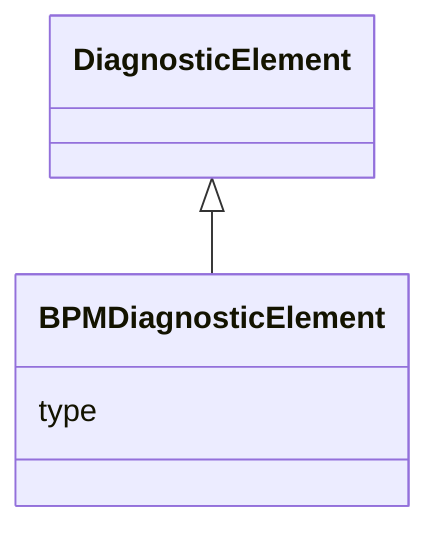

---
search:
  boost: 10.0
---

# Class: BPMDiagnosticElement 


_Beam-position monitor (BPM) diagnostic data._


<div data-search-exclude markdown="1">


URI: [laura:BPMDiagnosticElement](https://w3id.org/laura/BPMDiagnosticElement)





## Inheritance
* [DiagnosticElement](DiagnosticElement.md)
    * **BPMDiagnosticElement**


## Class Properties

| Property | Value |
| --- | --- |
| Class URI | [laura:BPMDiagnosticElement](https://w3id.org/laura/BPMDiagnosticElement) |


## Slots

| Name | Cardinality and Range | Description | Inheritance |
| ---  | --- | --- | --- |
| [type](type.md) | 0..1 <br/> [String](String.md) | BPM type (e | direct |


## Usages

| used by | used in | type | used |
| ---  | --- | --- | --- |
| [BeamPositionMonitor](BeamPositionMonitor.md) | [diagnostic](diagnostic.md) | range | [BPMDiagnosticElement](BPMDiagnosticElement.md) |


## In Subsets


* [DiagnosticProperties](DiagnosticProperties.md)


## Identifier and Mapping Information


### Schema Source


* from schema: https://w3id.org/laura/schema


## Mappings

| Mapping Type | Mapped Value |
| ---  | ---  |
| self | laura:BPMDiagnosticElement |
| native | laura:BPMDiagnosticElement |


## LinkML Source

<!-- TODO: investigate https://stackoverflow.com/questions/37606292/how-to-create-tabbed-code-blocks-in-mkdocs-or-sphinx -->

### Direct

<details>
```yaml
name: BPMDiagnosticElement
description: Beam-position monitor (BPM) diagnostic data.
in_subset:
- diagnostic_properties
from_schema: https://w3id.org/laura/schema
is_a: DiagnosticElement
attributes:
  type:
    name: type
    description: BPM type (e.g., ``Stripline``, ``Cavity``, ``Button``). Accepted
      in YAML as ``bpm_type``.
    from_schema: https://w3id.org/laura/schema/diagnostics
    aliases:
    - bpm_type
    rank: 1000
    ifabsent: string(Stripline)
    domain_of:
    - BPMDiagnosticElement
    - BAMDiagnosticElement
    - BLMDiagnosticElement
    - ScreenDiagnosticElement
    - ChargeDiagnosticElement
    - CameraDiagnosticElement
    range: string
class_uri: laura:BPMDiagnosticElement

```
</details>

### Induced

<details>
```yaml
name: BPMDiagnosticElement
description: Beam-position monitor (BPM) diagnostic data.
in_subset:
- diagnostic_properties
from_schema: https://w3id.org/laura/schema
is_a: DiagnosticElement
attributes:
  type:
    name: type
    description: BPM type (e.g., ``Stripline``, ``Cavity``, ``Button``). Accepted
      in YAML as ``bpm_type``.
    from_schema: https://w3id.org/laura/schema/diagnostics
    aliases:
    - bpm_type
    rank: 1000
    ifabsent: string(Stripline)
    owner: BPMDiagnosticElement
    domain_of:
    - BPMDiagnosticElement
    - BAMDiagnosticElement
    - BLMDiagnosticElement
    - ScreenDiagnosticElement
    - ChargeDiagnosticElement
    - CameraDiagnosticElement
    range: string
class_uri: laura:BPMDiagnosticElement

```
</details></div>