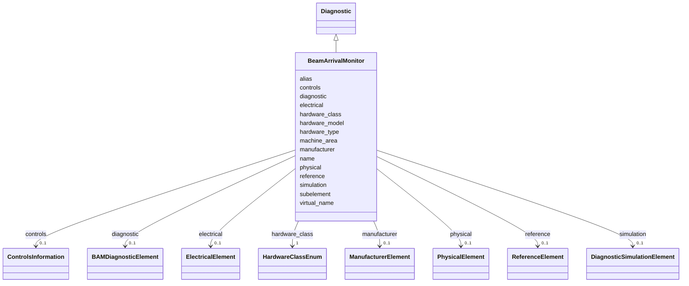

---
search:
  boost: 10.0
---

# Class: BeamArrivalMonitor 


_Beam-arrival-time monitor (BAM)._


<div data-search-exclude markdown="1">


URI: [laura:BeamArrivalMonitor](https://w3id.org/laura/BeamArrivalMonitor)





## Inheritance
* [AcceleratorElement](AcceleratorElement.md)
    * [StandardElement](StandardElement.md)
        * [Element](Element.md)
            * [PhysicalAcceleratorElement](PhysicalAcceleratorElement.md)
                * [Diagnostic](Diagnostic.md)
                    * **BeamArrivalMonitor**


## Class Properties

| Property | Value |
| --- | --- |
| Class URI | [laura:BeamArrivalMonitor](https://w3id.org/laura/BeamArrivalMonitor) |


## Slots

| Name | Cardinality and Range | Description | Inheritance |
| ---  | --- | --- | --- |
| [diagnostic](diagnostic.md) | 0..1 <br/> [BAMDiagnosticElement](BAMDiagnosticElement.md) | Instrument-specific diagnostic parameters | direct |
| [physical](physical.md) | 0..1 <br/> [PhysicalElement](PhysicalElement.md) | Position, rotation, and length data | [PhysicalAcceleratorElement](PhysicalAcceleratorElement.md) |
| [simulation](simulation.md) | 0..1 <br/> [DiagnosticSimulationElement](DiagnosticSimulationElement.md) | Simulation / tracking attributes | [StandardElement](StandardElement.md) |
| [electrical](electrical.md) | 0..1 <br/> [ElectricalElement](ElectricalElement.md) | Power-supply electrical limits | [StandardElement](StandardElement.md) |
| [manufacturer](manufacturer.md) | 0..1 <br/> [ManufacturerElement](ManufacturerElement.md) | Manufacturer and serial-number data | [StandardElement](StandardElement.md) |
| [controls](controls.md) | 0..1 <br/> [ControlsInformation](ControlsInformation.md) | Control-system process-variable definitions | [StandardElement](StandardElement.md) |
| [reference](reference.md) | 0..1 <br/> [ReferenceElement](ReferenceElement.md) | Links to design drawings and files | [StandardElement](StandardElement.md) |
| [name](name.md) | 1 <br/> [String](String.md) | Unique element name within the machine | [AcceleratorElement](AcceleratorElement.md) |
| [hardware_class](hardware_class.md) | 1 <br/> [HardwareClassEnum](HardwareClassEnum.md) | Functional category (e | [AcceleratorElement](AcceleratorElement.md) |
| [hardware_type](hardware_type.md) | 0..1 <br/> [String](String.md) | Python class name used for MODEL_REGISTRY dispatch | [AcceleratorElement](AcceleratorElement.md) |
| [hardware_model](hardware_model.md) | 0..1 <br/> [String](String.md) | Model or variant name within the hardware type (e | [AcceleratorElement](AcceleratorElement.md) |
| [machine_area](machine_area.md) | 0..1 <br/> [String](String.md) | Machine area label grouping related elements (e | [AcceleratorElement](AcceleratorElement.md) |
| [virtual_name](virtual_name.md) | 0..1 <br/> [String](String.md) | Alternative internal name used by the control system when the physical name i... | [AcceleratorElement](AcceleratorElement.md) |
| [alias](alias.md) | * <br/> [String](String.md) | Human-readable aliases for the element | [AcceleratorElement](AcceleratorElement.md) |
| [subelement](subelement.md) | 0..1 <br/> [String](String.md) | If set, this element is a logical sub-component of the named parent element | [AcceleratorElement](AcceleratorElement.md) |


## Identifier and Mapping Information


### Schema Source


* from schema: https://w3id.org/laura/schema


## Mappings

| Mapping Type | Mapped Value |
| ---  | ---  |
| self | laura:BeamArrivalMonitor |
| native | laura:BeamArrivalMonitor |


## LinkML Source

<!-- TODO: investigate https://stackoverflow.com/questions/37606292/how-to-create-tabbed-code-blocks-in-mkdocs-or-sphinx -->

### Direct

<details>
```yaml
name: BeamArrivalMonitor
description: Beam-arrival-time monitor (BAM).
from_schema: https://w3id.org/laura/schema
is_a: Diagnostic
slot_usage:
  hardware_type:
    name: hardware_type
    equals_string: Beam_Arrival_Monitor
attributes:
  diagnostic:
    name: diagnostic
    description: Instrument-specific diagnostic parameters.
    in_subset:
    - diagnostic_properties
    from_schema: https://w3id.org/laura/schema
    domain_of:
    - Diagnostic
    - BeamPositionMonitor
    - BeamArrivalMonitor
    - BunchLengthMonitor
    - Camera
    - Screen
    - ChargeDiagnostic
    range: BAMDiagnosticElement
class_uri: laura:BeamArrivalMonitor

```
</details>

### Induced

<details>
```yaml
name: BeamArrivalMonitor
description: Beam-arrival-time monitor (BAM).
from_schema: https://w3id.org/laura/schema
is_a: Diagnostic
slot_usage:
  hardware_type:
    name: hardware_type
    equals_string: Beam_Arrival_Monitor
attributes:
  diagnostic:
    name: diagnostic
    description: Instrument-specific diagnostic parameters.
    in_subset:
    - diagnostic_properties
    from_schema: https://w3id.org/laura/schema
    owner: BeamArrivalMonitor
    domain_of:
    - Diagnostic
    - BeamPositionMonitor
    - BeamArrivalMonitor
    - BunchLengthMonitor
    - Camera
    - Screen
    - ChargeDiagnostic
    range: BAMDiagnosticElement
  physical:
    name: physical
    description: Position, rotation, and length data.
    in_subset:
    - physical_properties
    from_schema: https://w3id.org/laura/schema
    rank: 1000
    owner: BeamArrivalMonitor
    domain_of:
    - PhysicalAcceleratorElement
    range: PhysicalElement
  simulation:
    name: simulation
    description: Simulation / tracking attributes.
    from_schema: https://w3id.org/laura/schema
    rank: 1000
    owner: BeamArrivalMonitor
    domain_of:
    - StandardElement
    range: DiagnosticSimulationElement
  electrical:
    name: electrical
    description: Power-supply electrical limits.
    from_schema: https://w3id.org/laura/schema
    rank: 1000
    owner: BeamArrivalMonitor
    domain_of:
    - StandardElement
    range: ElectricalElement
  manufacturer:
    name: manufacturer
    description: Manufacturer and serial-number data.
    from_schema: https://w3id.org/laura/schema
    owner: BeamArrivalMonitor
    domain_of:
    - ManufacturerElement
    - StandardElement
    range: ManufacturerElement
  controls:
    name: controls
    description: Control-system process-variable definitions.
    from_schema: https://w3id.org/laura/schema
    rank: 1000
    owner: BeamArrivalMonitor
    domain_of:
    - StandardElement
    range: ControlsInformation
  reference:
    name: reference
    description: Links to design drawings and files.
    from_schema: https://w3id.org/laura/schema
    rank: 1000
    owner: BeamArrivalMonitor
    domain_of:
    - StandardElement
    range: ReferenceElement
  name:
    name: name
    description: Unique element name within the machine.
    from_schema: https://w3id.org/laura/schema
    rank: 1000
    identifier: true
    owner: BeamArrivalMonitor
    domain_of:
    - AcceleratorElement
    - SectionLattice
    - MachineLayout
    range: string
    required: true
  hardware_class:
    name: hardware_class
    description: Functional category (e.g., ``Magnet``, ``Diagnostic``).
    from_schema: https://w3id.org/laura/schema
    rank: 1000
    owner: BeamArrivalMonitor
    domain_of:
    - AcceleratorElement
    range: HardwareClassEnum
    required: true
  hardware_type:
    name: hardware_type
    description: Python class name used for MODEL_REGISTRY dispatch.  Identifies the
      concrete subclass to instantiate when loading from YAML.
    from_schema: https://w3id.org/laura/schema
    rank: 1000
    ifabsent: string(Generic)
    owner: BeamArrivalMonitor
    domain_of:
    - AcceleratorElement
    range: string
    equals_string: Beam_Arrival_Monitor
  hardware_model:
    name: hardware_model
    description: Model or variant name within the hardware type (e.g., ``Generic``,
      ``TESLA``).
    from_schema: https://w3id.org/laura/schema
    rank: 1000
    ifabsent: string(Generic)
    owner: BeamArrivalMonitor
    domain_of:
    - AcceleratorElement
    range: string
  machine_area:
    name: machine_area
    description: Machine area label grouping related elements (e.g., ``LINAC``, ``BA1``).
    from_schema: https://w3id.org/laura/schema
    rank: 1000
    owner: BeamArrivalMonitor
    domain_of:
    - AcceleratorElement
    range: string
  virtual_name:
    name: virtual_name
    description: Alternative internal name used by the control system when the physical
      name is inaccessible.
    from_schema: https://w3id.org/laura/schema
    rank: 1000
    ifabsent: string()
    owner: BeamArrivalMonitor
    domain_of:
    - AcceleratorElement
    range: string
  alias:
    name: alias
    description: Human-readable aliases for the element. Populated from ``name_alias``
      in YAML. Accepts a single string or a list of strings.
    from_schema: https://w3id.org/laura/schema
    aliases:
    - name_alias
    rank: 1000
    owner: BeamArrivalMonitor
    domain_of:
    - AcceleratorElement
    range: string
    multivalued: true
  subelement:
    name: subelement
    description: If set, this element is a logical sub-component of the named parent
      element.
    from_schema: https://w3id.org/laura/schema
    rank: 1000
    owner: BeamArrivalMonitor
    domain_of:
    - AcceleratorElement
    range: string
class_uri: laura:BeamArrivalMonitor

```
</details></div>