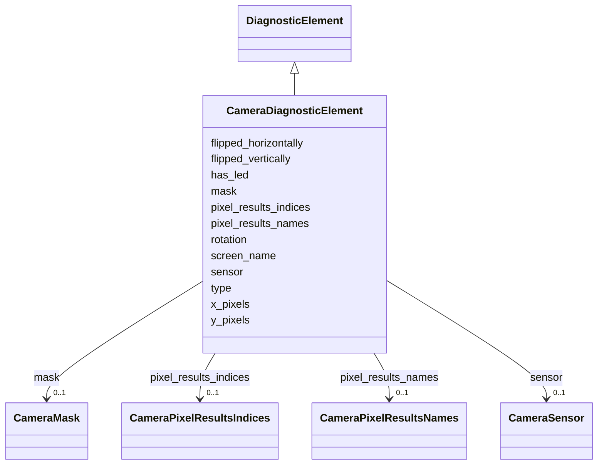

# Class: CameraDiagnosticElement 


_Camera diagnostic data, including sensor parameters, analysis mask, and pixel-to-mm scale factors._


<div data-search-exclude markdown="1">


URI: [laura:CameraDiagnosticElement](https://w3id.org/laura/CameraDiagnosticElement)





## Inheritance
* [DiagnosticElement](DiagnosticElement.md)
    * **CameraDiagnosticElement**


## Class Properties

| Property | Value |
| --- | --- |
| Class URI | [laura:CameraDiagnosticElement](https://w3id.org/laura/CameraDiagnosticElement) |


## Slots

| Name | Cardinality and Range | Description | Inheritance |
| ---  | --- | --- | --- |
| [type](type.md) | 0..1 <br/> [String](String.md) | Camera type / model string (e | direct |
| [x_pixels](x_pixels.md) | 0..1 <br/> [Integer](Integer.md) | Image width reported by the control system [pix] | direct |
| [y_pixels](y_pixels.md) | 0..1 <br/> [Integer](Integer.md) | Image height reported by the control system [pix] | direct |
| [rotation](rotation.md) | 0..1 <br/> [Double](Double.md) | Camera rotation relative to the screen plane [deg] | direct |
| [flipped_horizontally](flipped_horizontally.md) | 0..1 <br/> [Boolean](Boolean.md) | True if the image is mirrored left-right | direct |
| [flipped_vertically](flipped_vertically.md) | 0..1 <br/> [Boolean](Boolean.md) | True if the image is mirrored top-bottom | direct |
| [screen_name](screen_name.md) | 0..1 <br/> [String](String.md) | Name of the screen element to which this camera is attached | direct |
| [has_led](has_led.md) | 0..1 <br/> [Boolean](Boolean.md) | True if the camera mount includes an LED backlight | direct |
| [pixel_results_indices](pixel_results_indices.md) | 0..1 <br/> [CameraPixelResultsIndices](CameraPixelResultsIndices.md) | Indices of pixel analysis result arrays | direct |
| [pixel_results_names](pixel_results_names.md) | 0..1 <br/> [CameraPixelResultsNames](CameraPixelResultsNames.md) | Names of pixel analysis result arrays | direct |
| [mask](mask.md) | 0..1 <br/> [CameraMask](CameraMask.md) | Camera analysis mask configuration | direct |
| [sensor](sensor.md) | 0..1 <br/> [CameraSensor](CameraSensor.md) | Camera sensor hardware configuration | direct |


## Usages

| used by | used in | type | used |
| ---  | --- | --- | --- |
| [Camera](Camera.md) | [diagnostic](diagnostic.md) | range | [CameraDiagnosticElement](CameraDiagnosticElement.md) |


## In Subsets


* [DiagnosticProperties](DiagnosticProperties.md)


## Identifier and Mapping Information


### Schema Source


* from schema: https://w3id.org/laura/schema


## Mappings

| Mapping Type | Mapped Value |
| ---  | ---  |
| self | laura:CameraDiagnosticElement |
| native | laura:CameraDiagnosticElement |


## LinkML Source

<!-- TODO: investigate https://stackoverflow.com/questions/37606292/how-to-create-tabbed-code-blocks-in-mkdocs-or-sphinx -->

### Direct

<details>
```yaml
name: CameraDiagnosticElement
description: Camera diagnostic data, including sensor parameters, analysis mask, and
  pixel-to-mm scale factors.
in_subset:
- diagnostic_properties
from_schema: https://w3id.org/laura/schema
is_a: DiagnosticElement
attributes:
  type:
    name: type
    description: Camera type / model string (e.g., ``PCO``, ``Manta``). Accepted in
      YAML as ``CAM_TYPE``.
    from_schema: https://w3id.org/laura/schema/diagnostics
    aliases:
    - CAM_TYPE
    domain_of:
    - BPMDiagnosticElement
    - BAMDiagnosticElement
    - PhotonIntensityMonitorDiagnostic
    - BLMDiagnosticElement
    - ScreenDiagnosticElement
    - ChargeDiagnosticElement
    - CameraDiagnosticElement
    range: string
  x_pixels:
    name: x_pixels
    description: Image width reported by the control system [pix].
    from_schema: https://w3id.org/laura/schema/diagnostics
    aliases:
    - ARRAY_DATA_NUM_PIX_X
    - epics_x_pixels
    ifabsent: int(1080)
    domain_of:
    - CameraSensor
    - CameraDiagnosticElement
    range: integer
  y_pixels:
    name: y_pixels
    description: Image height reported by the control system [pix].
    from_schema: https://w3id.org/laura/schema/diagnostics
    aliases:
    - ARRAY_DATA_NUM_PIX_Y
    - epics_y_pixels
    ifabsent: int(1280)
    domain_of:
    - CameraSensor
    - CameraDiagnosticElement
    range: integer
  rotation:
    name: rotation
    description: Camera rotation relative to the screen plane [deg].
    from_schema: https://w3id.org/laura/schema/diagnostics
    ifabsent: float(0)
    domain_of:
    - ElementPositionError
    - ElementSurvey
    - PhysicalElement
    - CameraDiagnosticElement
    range: double
    unit:
      ucum_code: deg
  flipped_horizontally:
    name: flipped_horizontally
    description: True if the image is mirrored left-right.
    from_schema: https://w3id.org/laura/schema/diagnostics
    aliases:
    - IMAGE_FLIP_LR
    rank: 1000
    ifabsent: 'True'
    domain_of:
    - CameraDiagnosticElement
    range: boolean
  flipped_vertically:
    name: flipped_vertically
    description: True if the image is mirrored top-bottom.
    from_schema: https://w3id.org/laura/schema/diagnostics
    aliases:
    - IMAGE_FLIP_UD
    rank: 1000
    ifabsent: 'False'
    domain_of:
    - CameraDiagnosticElement
    range: boolean
  screen_name:
    name: screen_name
    description: Name of the screen element to which this camera is attached.
    from_schema: https://w3id.org/laura/schema/diagnostics
    rank: 1000
    domain_of:
    - CameraDiagnosticElement
    range: string
  has_led:
    name: has_led
    description: True if the camera mount includes an LED backlight.
    from_schema: https://w3id.org/laura/schema/diagnostics
    rank: 1000
    ifabsent: 'True'
    domain_of:
    - CameraDiagnosticElement
    range: boolean
  pixel_results_indices:
    name: pixel_results_indices
    description: Indices of pixel analysis result arrays.
    from_schema: https://w3id.org/laura/schema/diagnostics
    rank: 1000
    domain_of:
    - CameraDiagnosticElement
    range: CameraPixelResultsIndices
  pixel_results_names:
    name: pixel_results_names
    description: Names of pixel analysis result arrays.
    from_schema: https://w3id.org/laura/schema/diagnostics
    rank: 1000
    domain_of:
    - CameraDiagnosticElement
    range: CameraPixelResultsNames
  mask:
    name: mask
    description: Camera analysis mask configuration.
    from_schema: https://w3id.org/laura/schema/diagnostics
    rank: 1000
    domain_of:
    - CameraDiagnosticElement
    range: CameraMask
  sensor:
    name: sensor
    description: Camera sensor hardware configuration.
    from_schema: https://w3id.org/laura/schema/diagnostics
    rank: 1000
    domain_of:
    - CameraDiagnosticElement
    range: CameraSensor
class_uri: laura:CameraDiagnosticElement

```
</details>

### Induced

<details>
```yaml
name: CameraDiagnosticElement
description: Camera diagnostic data, including sensor parameters, analysis mask, and
  pixel-to-mm scale factors.
in_subset:
- diagnostic_properties
from_schema: https://w3id.org/laura/schema
is_a: DiagnosticElement
attributes:
  type:
    name: type
    description: Camera type / model string (e.g., ``PCO``, ``Manta``). Accepted in
      YAML as ``CAM_TYPE``.
    from_schema: https://w3id.org/laura/schema/diagnostics
    aliases:
    - CAM_TYPE
    owner: CameraDiagnosticElement
    domain_of:
    - BPMDiagnosticElement
    - BAMDiagnosticElement
    - PhotonIntensityMonitorDiagnostic
    - BLMDiagnosticElement
    - ScreenDiagnosticElement
    - ChargeDiagnosticElement
    - CameraDiagnosticElement
    range: string
  x_pixels:
    name: x_pixels
    description: Image width reported by the control system [pix].
    from_schema: https://w3id.org/laura/schema/diagnostics
    aliases:
    - ARRAY_DATA_NUM_PIX_X
    - epics_x_pixels
    ifabsent: int(1080)
    owner: CameraDiagnosticElement
    domain_of:
    - CameraSensor
    - CameraDiagnosticElement
    range: integer
  y_pixels:
    name: y_pixels
    description: Image height reported by the control system [pix].
    from_schema: https://w3id.org/laura/schema/diagnostics
    aliases:
    - ARRAY_DATA_NUM_PIX_Y
    - epics_y_pixels
    ifabsent: int(1280)
    owner: CameraDiagnosticElement
    domain_of:
    - CameraSensor
    - CameraDiagnosticElement
    range: integer
  rotation:
    name: rotation
    description: Camera rotation relative to the screen plane [deg].
    from_schema: https://w3id.org/laura/schema/diagnostics
    ifabsent: float(0)
    owner: CameraDiagnosticElement
    domain_of:
    - ElementPositionError
    - ElementSurvey
    - PhysicalElement
    - CameraDiagnosticElement
    range: double
    unit:
      ucum_code: deg
  flipped_horizontally:
    name: flipped_horizontally
    description: True if the image is mirrored left-right.
    from_schema: https://w3id.org/laura/schema/diagnostics
    aliases:
    - IMAGE_FLIP_LR
    rank: 1000
    ifabsent: 'True'
    owner: CameraDiagnosticElement
    domain_of:
    - CameraDiagnosticElement
    range: boolean
  flipped_vertically:
    name: flipped_vertically
    description: True if the image is mirrored top-bottom.
    from_schema: https://w3id.org/laura/schema/diagnostics
    aliases:
    - IMAGE_FLIP_UD
    rank: 1000
    ifabsent: 'False'
    owner: CameraDiagnosticElement
    domain_of:
    - CameraDiagnosticElement
    range: boolean
  screen_name:
    name: screen_name
    description: Name of the screen element to which this camera is attached.
    from_schema: https://w3id.org/laura/schema/diagnostics
    rank: 1000
    owner: CameraDiagnosticElement
    domain_of:
    - CameraDiagnosticElement
    range: string
  has_led:
    name: has_led
    description: True if the camera mount includes an LED backlight.
    from_schema: https://w3id.org/laura/schema/diagnostics
    rank: 1000
    ifabsent: 'True'
    owner: CameraDiagnosticElement
    domain_of:
    - CameraDiagnosticElement
    range: boolean
  pixel_results_indices:
    name: pixel_results_indices
    description: Indices of pixel analysis result arrays.
    from_schema: https://w3id.org/laura/schema/diagnostics
    rank: 1000
    owner: CameraDiagnosticElement
    domain_of:
    - CameraDiagnosticElement
    range: CameraPixelResultsIndices
  pixel_results_names:
    name: pixel_results_names
    description: Names of pixel analysis result arrays.
    from_schema: https://w3id.org/laura/schema/diagnostics
    rank: 1000
    owner: CameraDiagnosticElement
    domain_of:
    - CameraDiagnosticElement
    range: CameraPixelResultsNames
  mask:
    name: mask
    description: Camera analysis mask configuration.
    from_schema: https://w3id.org/laura/schema/diagnostics
    rank: 1000
    owner: CameraDiagnosticElement
    domain_of:
    - CameraDiagnosticElement
    range: CameraMask
  sensor:
    name: sensor
    description: Camera sensor hardware configuration.
    from_schema: https://w3id.org/laura/schema/diagnostics
    rank: 1000
    owner: CameraDiagnosticElement
    domain_of:
    - CameraDiagnosticElement
    range: CameraSensor
class_uri: laura:CameraDiagnosticElement

```
</details></div>