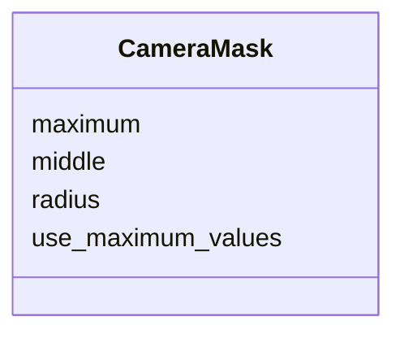

---
search:
  boost: 10.0
---

# Class: CameraMask 


_Camera analysis mask parameters._


<div data-search-exclude markdown="1">


URI: [laura:CameraMask](https://w3id.org/laura/CameraMask)





<!-- no inheritance hierarchy -->

## Class Properties

| Property | Value |
| --- | --- |
| Class URI | [laura:CameraMask](https://w3id.org/laura/CameraMask) |


## Slots

| Name | Cardinality and Range | Description | Inheritance |
| ---  | --- | --- | --- |
| [middle](middle.md) | * <br/> [Float](Float.md) | Center of the mask in pixels [x, y] | direct |
| [radius](radius.md) | * <br/> [Float](Float.md) | Mask radius in pixels [x, y] | direct |
| [maximum](maximum.md) | * <br/> [Float](Float.md) | Maximum mask radius in pixels [x, y] | direct |
| [use_maximum_values](use_maximum_values.md) | 0..1 <br/> [Boolean](Boolean.md) | If True, use maximum mask radius constraints | direct |


## Usages

| used by | used in | type | used |
| ---  | --- | --- | --- |
| [CameraDiagnosticElement](CameraDiagnosticElement.md) | [mask](mask.md) | range | [CameraMask](CameraMask.md) |


## Identifier and Mapping Information


### Schema Source


* from schema: https://w3id.org/laura/schema


## Mappings

| Mapping Type | Mapped Value |
| ---  | ---  |
| self | laura:CameraMask |
| native | laura:CameraMask |


## LinkML Source

<!-- TODO: investigate https://stackoverflow.com/questions/37606292/how-to-create-tabbed-code-blocks-in-mkdocs-or-sphinx -->

### Direct

<details>
```yaml
name: CameraMask
description: Camera analysis mask parameters.
from_schema: https://w3id.org/laura/schema
attributes:
  middle:
    name: middle
    description: Center of the mask in pixels [x, y].
    from_schema: https://w3id.org/laura/schema/diagnostics
    domain_of:
    - PhysicalElement
    - CameraMask
    - CameraSensor
    range: float
    multivalued: true
  radius:
    name: radius
    description: Mask radius in pixels [x, y].
    from_schema: https://w3id.org/laura/schema/diagnostics
    domain_of:
    - Multipole
    - ApertureElement
    - CameraMask
    range: float
    multivalued: true
  maximum:
    name: maximum
    description: Maximum mask radius in pixels [x, y].
    from_schema: https://w3id.org/laura/schema/diagnostics
    domain_of:
    - LaserAttenuator
    - CameraMask
    - CameraSensor
    range: float
    multivalued: true
  use_maximum_values:
    name: use_maximum_values
    description: If True, use maximum mask radius constraints.
    from_schema: https://w3id.org/laura/schema/diagnostics
    aliases:
    - USE_MASK_RAD_LIMITS
    rank: 1000
    ifabsent: 'True'
    domain_of:
    - CameraMask
    range: boolean
class_uri: laura:CameraMask

```
</details>

### Induced

<details>
```yaml
name: CameraMask
description: Camera analysis mask parameters.
from_schema: https://w3id.org/laura/schema
attributes:
  middle:
    name: middle
    description: Center of the mask in pixels [x, y].
    from_schema: https://w3id.org/laura/schema/diagnostics
    owner: CameraMask
    domain_of:
    - PhysicalElement
    - CameraMask
    - CameraSensor
    range: float
    multivalued: true
  radius:
    name: radius
    description: Mask radius in pixels [x, y].
    from_schema: https://w3id.org/laura/schema/diagnostics
    owner: CameraMask
    domain_of:
    - Multipole
    - ApertureElement
    - CameraMask
    range: float
    multivalued: true
  maximum:
    name: maximum
    description: Maximum mask radius in pixels [x, y].
    from_schema: https://w3id.org/laura/schema/diagnostics
    owner: CameraMask
    domain_of:
    - LaserAttenuator
    - CameraMask
    - CameraSensor
    range: float
    multivalued: true
  use_maximum_values:
    name: use_maximum_values
    description: If True, use maximum mask radius constraints.
    from_schema: https://w3id.org/laura/schema/diagnostics
    aliases:
    - USE_MASK_RAD_LIMITS
    rank: 1000
    ifabsent: 'True'
    owner: CameraMask
    domain_of:
    - CameraMask
    range: boolean
class_uri: laura:CameraMask

```
</details></div>