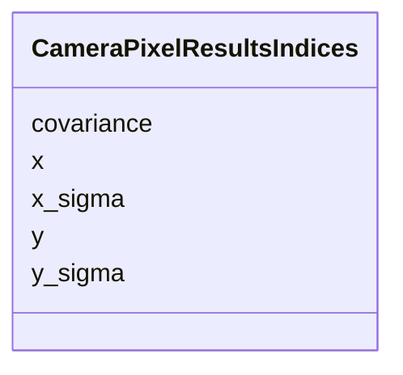

---
search:
  boost: 10.0
---

# Class: CameraPixelResultsIndices 


_Indices into camera pixel-analysis result arrays._


<div data-search-exclude markdown="1">


URI: [laura:CameraPixelResultsIndices](https://w3id.org/laura/CameraPixelResultsIndices)





<!-- no inheritance hierarchy -->

## Class Properties

| Property | Value |
| --- | --- |
| Class URI | [laura:CameraPixelResultsIndices](https://w3id.org/laura/CameraPixelResultsIndices) |


## Slots

| Name | Cardinality and Range | Description | Inheritance |
| ---  | --- | --- | --- |
| [x](x.md) | 0..1 <br/> [Integer](Integer.md) | Beam centroid index in x | direct |
| [y](y.md) | 0..1 <br/> [Integer](Integer.md) | Beam centroid index in y | direct |
| [x_sigma](x_sigma.md) | 0..1 <br/> [Integer](Integer.md) | Beam sigma index in x | direct |
| [y_sigma](y_sigma.md) | 0..1 <br/> [Integer](Integer.md) | Beam sigma index in y | direct |
| [covariance](covariance.md) | 0..1 <br/> [Integer](Integer.md) | Beam covariance index | direct |


## Usages

| used by | used in | type | used |
| ---  | --- | --- | --- |
| [CameraDiagnosticElement](CameraDiagnosticElement.md) | [pixel_results_indices](pixel_results_indices.md) | range | [CameraPixelResultsIndices](CameraPixelResultsIndices.md) |


## Identifier and Mapping Information


### Schema Source


* from schema: https://w3id.org/laura/schema


## Mappings

| Mapping Type | Mapped Value |
| ---  | ---  |
| self | laura:CameraPixelResultsIndices |
| native | laura:CameraPixelResultsIndices |


## LinkML Source

<!-- TODO: investigate https://stackoverflow.com/questions/37606292/how-to-create-tabbed-code-blocks-in-mkdocs-or-sphinx -->

### Direct

<details>
```yaml
name: CameraPixelResultsIndices
description: Indices into camera pixel-analysis result arrays.
from_schema: https://w3id.org/laura/schema
attributes:
  x:
    name: x
    description: Beam centroid index in x.
    from_schema: https://w3id.org/laura/schema/diagnostics
    aliases:
    - X_POS
    ifabsent: int(0)
    domain_of:
    - Position
    - CameraPixelResultsIndices
    - CameraPixelResultsNames
    range: integer
  y:
    name: y
    description: Beam centroid index in y.
    from_schema: https://w3id.org/laura/schema/diagnostics
    aliases:
    - Y_POS
    ifabsent: int(1)
    domain_of:
    - Position
    - CameraPixelResultsIndices
    - CameraPixelResultsNames
    range: integer
  x_sigma:
    name: x_sigma
    description: Beam sigma index in x.
    from_schema: https://w3id.org/laura/schema/diagnostics
    aliases:
    - X_SIGMA_POS
    rank: 1000
    ifabsent: int(2)
    domain_of:
    - CameraPixelResultsIndices
    - CameraPixelResultsNames
    range: integer
  y_sigma:
    name: y_sigma
    description: Beam sigma index in y.
    from_schema: https://w3id.org/laura/schema/diagnostics
    aliases:
    - Y_SIGMA_POS
    rank: 1000
    ifabsent: int(3)
    domain_of:
    - CameraPixelResultsIndices
    - CameraPixelResultsNames
    range: integer
  covariance:
    name: covariance
    description: Beam covariance index.
    from_schema: https://w3id.org/laura/schema/diagnostics
    aliases:
    - COV_POS
    rank: 1000
    ifabsent: int(4)
    domain_of:
    - CameraPixelResultsIndices
    - CameraPixelResultsNames
    range: integer
class_uri: laura:CameraPixelResultsIndices

```
</details>

### Induced

<details>
```yaml
name: CameraPixelResultsIndices
description: Indices into camera pixel-analysis result arrays.
from_schema: https://w3id.org/laura/schema
attributes:
  x:
    name: x
    description: Beam centroid index in x.
    from_schema: https://w3id.org/laura/schema/diagnostics
    aliases:
    - X_POS
    ifabsent: int(0)
    owner: CameraPixelResultsIndices
    domain_of:
    - Position
    - CameraPixelResultsIndices
    - CameraPixelResultsNames
    range: integer
  y:
    name: y
    description: Beam centroid index in y.
    from_schema: https://w3id.org/laura/schema/diagnostics
    aliases:
    - Y_POS
    ifabsent: int(1)
    owner: CameraPixelResultsIndices
    domain_of:
    - Position
    - CameraPixelResultsIndices
    - CameraPixelResultsNames
    range: integer
  x_sigma:
    name: x_sigma
    description: Beam sigma index in x.
    from_schema: https://w3id.org/laura/schema/diagnostics
    aliases:
    - X_SIGMA_POS
    rank: 1000
    ifabsent: int(2)
    owner: CameraPixelResultsIndices
    domain_of:
    - CameraPixelResultsIndices
    - CameraPixelResultsNames
    range: integer
  y_sigma:
    name: y_sigma
    description: Beam sigma index in y.
    from_schema: https://w3id.org/laura/schema/diagnostics
    aliases:
    - Y_SIGMA_POS
    rank: 1000
    ifabsent: int(3)
    owner: CameraPixelResultsIndices
    domain_of:
    - CameraPixelResultsIndices
    - CameraPixelResultsNames
    range: integer
  covariance:
    name: covariance
    description: Beam covariance index.
    from_schema: https://w3id.org/laura/schema/diagnostics
    aliases:
    - COV_POS
    rank: 1000
    ifabsent: int(4)
    owner: CameraPixelResultsIndices
    domain_of:
    - CameraPixelResultsIndices
    - CameraPixelResultsNames
    range: integer
class_uri: laura:CameraPixelResultsIndices

```
</details></div>