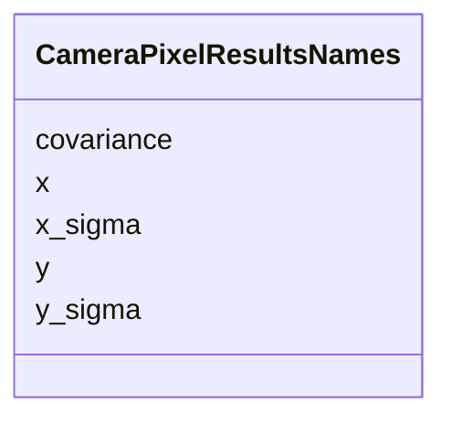

# Class: CameraPixelResultsNames 


_Names of camera pixel-analysis result arrays._


<div data-search-exclude markdown="1">


URI: [laura:CameraPixelResultsNames](https://w3id.org/laura/CameraPixelResultsNames)





<!-- no inheritance hierarchy -->

## Class Properties

| Property | Value |
| --- | --- |
| Class URI | [laura:CameraPixelResultsNames](https://w3id.org/laura/CameraPixelResultsNames) |


## Slots

| Name | Cardinality and Range | Description | Inheritance |
| ---  | --- | --- | --- |
| [x](x.md) | 0..1 <br/> [String](String.md) | Beam centroid name in x | direct |
| [y](y.md) | 0..1 <br/> [String](String.md) | Beam centroid name in y | direct |
| [x_sigma](x_sigma.md) | 0..1 <br/> [String](String.md) | Beam sigma name in x | direct |
| [y_sigma](y_sigma.md) | 0..1 <br/> [String](String.md) | Beam sigma name in y | direct |
| [covariance](covariance.md) | 0..1 <br/> [String](String.md) | Beam covariance name | direct |


## Usages

| used by | used in | type | used |
| ---  | --- | --- | --- |
| [CameraDiagnosticElement](CameraDiagnosticElement.md) | [pixel_results_names](pixel_results_names.md) | range | [CameraPixelResultsNames](CameraPixelResultsNames.md) |


## Identifier and Mapping Information


### Schema Source


* from schema: https://w3id.org/laura/schema


## Mappings

| Mapping Type | Mapped Value |
| ---  | ---  |
| self | laura:CameraPixelResultsNames |
| native | laura:CameraPixelResultsNames |


## LinkML Source

<!-- TODO: investigate https://stackoverflow.com/questions/37606292/how-to-create-tabbed-code-blocks-in-mkdocs-or-sphinx -->

### Direct

<details>
```yaml
name: CameraPixelResultsNames
description: Names of camera pixel-analysis result arrays.
from_schema: https://w3id.org/laura/schema
attributes:
  x:
    name: x
    description: Beam centroid name in x.
    from_schema: https://w3id.org/laura/schema/diagnostics
    aliases:
    - X_NAME
    ifabsent: string(X)
    domain_of:
    - Position
    - CameraPixelResultsIndices
    - CameraPixelResultsNames
    range: string
  y:
    name: y
    description: Beam centroid name in y.
    from_schema: https://w3id.org/laura/schema/diagnostics
    aliases:
    - Y_NAME
    ifabsent: string(Y)
    domain_of:
    - Position
    - CameraPixelResultsIndices
    - CameraPixelResultsNames
    range: string
  x_sigma:
    name: x_sigma
    description: Beam sigma name in x.
    from_schema: https://w3id.org/laura/schema/diagnostics
    aliases:
    - X_SIGMA_NAME
    ifabsent: string(X_SIGMA)
    domain_of:
    - CameraPixelResultsIndices
    - CameraPixelResultsNames
    range: string
  y_sigma:
    name: y_sigma
    description: Beam sigma name in y.
    from_schema: https://w3id.org/laura/schema/diagnostics
    aliases:
    - Y_SIGMA_NAME
    ifabsent: string(Y_SIGMA)
    domain_of:
    - CameraPixelResultsIndices
    - CameraPixelResultsNames
    range: string
  covariance:
    name: covariance
    description: Beam covariance name.
    from_schema: https://w3id.org/laura/schema/diagnostics
    aliases:
    - COV_NAME
    ifabsent: string(COV)
    domain_of:
    - CameraPixelResultsIndices
    - CameraPixelResultsNames
    range: string
class_uri: laura:CameraPixelResultsNames

```
</details>

### Induced

<details>
```yaml
name: CameraPixelResultsNames
description: Names of camera pixel-analysis result arrays.
from_schema: https://w3id.org/laura/schema
attributes:
  x:
    name: x
    description: Beam centroid name in x.
    from_schema: https://w3id.org/laura/schema/diagnostics
    aliases:
    - X_NAME
    ifabsent: string(X)
    owner: CameraPixelResultsNames
    domain_of:
    - Position
    - CameraPixelResultsIndices
    - CameraPixelResultsNames
    range: string
  y:
    name: y
    description: Beam centroid name in y.
    from_schema: https://w3id.org/laura/schema/diagnostics
    aliases:
    - Y_NAME
    ifabsent: string(Y)
    owner: CameraPixelResultsNames
    domain_of:
    - Position
    - CameraPixelResultsIndices
    - CameraPixelResultsNames
    range: string
  x_sigma:
    name: x_sigma
    description: Beam sigma name in x.
    from_schema: https://w3id.org/laura/schema/diagnostics
    aliases:
    - X_SIGMA_NAME
    ifabsent: string(X_SIGMA)
    owner: CameraPixelResultsNames
    domain_of:
    - CameraPixelResultsIndices
    - CameraPixelResultsNames
    range: string
  y_sigma:
    name: y_sigma
    description: Beam sigma name in y.
    from_schema: https://w3id.org/laura/schema/diagnostics
    aliases:
    - Y_SIGMA_NAME
    ifabsent: string(Y_SIGMA)
    owner: CameraPixelResultsNames
    domain_of:
    - CameraPixelResultsIndices
    - CameraPixelResultsNames
    range: string
  covariance:
    name: covariance
    description: Beam covariance name.
    from_schema: https://w3id.org/laura/schema/diagnostics
    aliases:
    - COV_NAME
    ifabsent: string(COV)
    owner: CameraPixelResultsNames
    domain_of:
    - CameraPixelResultsIndices
    - CameraPixelResultsNames
    range: string
class_uri: laura:CameraPixelResultsNames

```
</details></div>