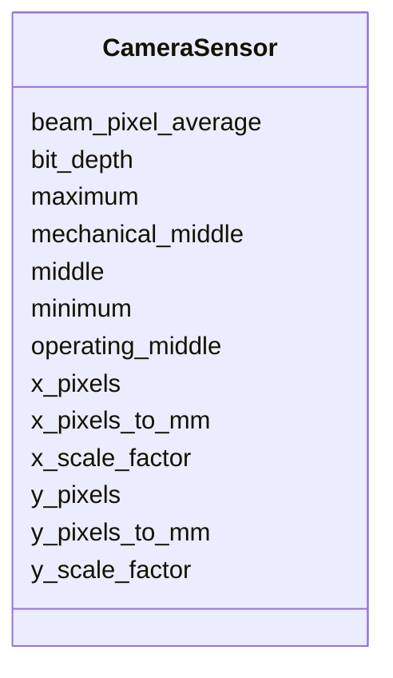

---
search:
  boost: 10.0
---

# Class: CameraSensor 


_Camera sensor hardware configuration._


<div data-search-exclude markdown="1">


URI: [laura:CameraSensor](https://w3id.org/laura/CameraSensor)





<!-- no inheritance hierarchy -->

## Class Properties

| Property | Value |
| --- | --- |
| Class URI | [laura:CameraSensor](https://w3id.org/laura/CameraSensor) |


## Slots

| Name | Cardinality and Range | Description | Inheritance |
| ---  | --- | --- | --- |
| [x_pixels](x_pixels.md) | 0..1 <br/> [Integer](Integer.md) | Raw sensor pixel count in x | direct |
| [y_pixels](y_pixels.md) | 0..1 <br/> [Integer](Integer.md) | Raw sensor pixel count in y | direct |
| [x_scale_factor](x_scale_factor.md) | 0..1 <br/> [Integer](Integer.md) | Pixel binning factor in x | direct |
| [y_scale_factor](y_scale_factor.md) | 0..1 <br/> [Integer](Integer.md) | Pixel binning factor in y | direct |
| [beam_pixel_average](beam_pixel_average.md) | 0..1 <br/> [Float](Float.md) | Average pixel value for beam detection | direct |
| [middle](middle.md) | * <br/> [Float](Float.md) | Sensor optical center in pixels [x, y] | direct |
| [x_pixels_to_mm](x_pixels_to_mm.md) | 0..1 <br/> [Float](Float.md) | Pixel-to-mm scale factor in x | direct |
| [y_pixels_to_mm](y_pixels_to_mm.md) | 0..1 <br/> [Float](Float.md) | Pixel-to-mm scale factor in y | direct |
| [minimum](minimum.md) | * <br/> [Float](Float.md) | Minimum pixel positions [x, y] | direct |
| [maximum](maximum.md) | * <br/> [Float](Float.md) | Maximum pixel positions [x, y] | direct |
| [bit_depth](bit_depth.md) | 0..1 <br/> [Integer](Integer.md) | Camera bit depth | direct |
| [operating_middle](operating_middle.md) | * <br/> [Float](Float.md) | Operating center positions in pixels [x, y] | direct |
| [mechanical_middle](mechanical_middle.md) | * <br/> [Float](Float.md) | Mechanical center of the camera in pixels [x, y] | direct |


## Usages

| used by | used in | type | used |
| ---  | --- | --- | --- |
| [CameraDiagnosticElement](CameraDiagnosticElement.md) | [sensor](sensor.md) | range | [CameraSensor](CameraSensor.md) |


## Identifier and Mapping Information


### Schema Source


* from schema: https://w3id.org/laura/schema


## Mappings

| Mapping Type | Mapped Value |
| ---  | ---  |
| self | laura:CameraSensor |
| native | laura:CameraSensor |


## LinkML Source

<!-- TODO: investigate https://stackoverflow.com/questions/37606292/how-to-create-tabbed-code-blocks-in-mkdocs-or-sphinx -->

### Direct

<details>
```yaml
name: CameraSensor
description: Camera sensor hardware configuration.
from_schema: https://w3id.org/laura/schema
attributes:
  x_pixels:
    name: x_pixels
    description: Raw sensor pixel count in x.
    from_schema: https://w3id.org/laura/schema
    aliases:
    - BINARY_NUM_PIX_X
    rank: 1000
    ifabsent: int(2160)
    domain_of:
    - CameraSensor
    - CameraDiagnosticElement
    range: integer
  y_pixels:
    name: y_pixels
    description: Raw sensor pixel count in y.
    from_schema: https://w3id.org/laura/schema
    aliases:
    - BINARY_NUM_PIX_Y
    rank: 1000
    ifabsent: int(2560)
    domain_of:
    - CameraSensor
    - CameraDiagnosticElement
    range: integer
  x_scale_factor:
    name: x_scale_factor
    description: Pixel binning factor in x.
    from_schema: https://w3id.org/laura/schema
    aliases:
    - X_PIX_SCALE_FACTOR
    rank: 1000
    ifabsent: int(2)
    domain_of:
    - CameraSensor
    range: integer
  y_scale_factor:
    name: y_scale_factor
    description: Pixel binning factor in y.
    from_schema: https://w3id.org/laura/schema
    aliases:
    - Y_PIX_SCALE_FACTOR
    rank: 1000
    ifabsent: int(2)
    domain_of:
    - CameraSensor
    range: integer
  beam_pixel_average:
    name: beam_pixel_average
    description: Average pixel value for beam detection.
    from_schema: https://w3id.org/laura/schema
    aliases:
    - AVG_PIXEL_VALUE_FOR_BEAM
    rank: 1000
    ifabsent: float(97.2)
    domain_of:
    - CameraSensor
    range: float
  middle:
    name: middle
    description: Sensor optical center in pixels [x, y].
    from_schema: https://w3id.org/laura/schema
    domain_of:
    - PhysicalElement
    - CameraMask
    - CameraSensor
    range: float
    multivalued: true
  x_pixels_to_mm:
    name: x_pixels_to_mm
    description: Pixel-to-mm scale factor in x.
    from_schema: https://w3id.org/laura/schema
    rank: 1000
    ifabsent: float(0.0134)
    domain_of:
    - CameraSensor
    range: float
  y_pixels_to_mm:
    name: y_pixels_to_mm
    description: Pixel-to-mm scale factor in y.
    from_schema: https://w3id.org/laura/schema
    rank: 1000
    ifabsent: float(0.0134)
    domain_of:
    - CameraSensor
    range: float
  minimum:
    name: minimum
    description: Minimum pixel positions [x, y].
    from_schema: https://w3id.org/laura/schema
    rank: 1000
    domain_of:
    - CameraSensor
    - LaserAttenuator
    range: float
    multivalued: true
  maximum:
    name: maximum
    description: Maximum pixel positions [x, y].
    from_schema: https://w3id.org/laura/schema
    domain_of:
    - CameraMask
    - CameraSensor
    - LaserAttenuator
    range: float
    multivalued: true
  bit_depth:
    name: bit_depth
    description: Camera bit depth.
    from_schema: https://w3id.org/laura/schema
    rank: 1000
    ifabsent: int(16)
    domain_of:
    - CameraSensor
    range: integer
  operating_middle:
    name: operating_middle
    description: Operating center positions in pixels [x, y].
    from_schema: https://w3id.org/laura/schema
    rank: 1000
    domain_of:
    - CameraSensor
    range: float
    multivalued: true
  mechanical_middle:
    name: mechanical_middle
    description: Mechanical center of the camera in pixels [x, y].
    from_schema: https://w3id.org/laura/schema
    rank: 1000
    domain_of:
    - CameraSensor
    range: float
    multivalued: true
class_uri: laura:CameraSensor

```
</details>

### Induced

<details>
```yaml
name: CameraSensor
description: Camera sensor hardware configuration.
from_schema: https://w3id.org/laura/schema
attributes:
  x_pixels:
    name: x_pixels
    description: Raw sensor pixel count in x.
    from_schema: https://w3id.org/laura/schema
    aliases:
    - BINARY_NUM_PIX_X
    rank: 1000
    ifabsent: int(2160)
    owner: CameraSensor
    domain_of:
    - CameraSensor
    - CameraDiagnosticElement
    range: integer
  y_pixels:
    name: y_pixels
    description: Raw sensor pixel count in y.
    from_schema: https://w3id.org/laura/schema
    aliases:
    - BINARY_NUM_PIX_Y
    rank: 1000
    ifabsent: int(2560)
    owner: CameraSensor
    domain_of:
    - CameraSensor
    - CameraDiagnosticElement
    range: integer
  x_scale_factor:
    name: x_scale_factor
    description: Pixel binning factor in x.
    from_schema: https://w3id.org/laura/schema
    aliases:
    - X_PIX_SCALE_FACTOR
    rank: 1000
    ifabsent: int(2)
    owner: CameraSensor
    domain_of:
    - CameraSensor
    range: integer
  y_scale_factor:
    name: y_scale_factor
    description: Pixel binning factor in y.
    from_schema: https://w3id.org/laura/schema
    aliases:
    - Y_PIX_SCALE_FACTOR
    rank: 1000
    ifabsent: int(2)
    owner: CameraSensor
    domain_of:
    - CameraSensor
    range: integer
  beam_pixel_average:
    name: beam_pixel_average
    description: Average pixel value for beam detection.
    from_schema: https://w3id.org/laura/schema
    aliases:
    - AVG_PIXEL_VALUE_FOR_BEAM
    rank: 1000
    ifabsent: float(97.2)
    owner: CameraSensor
    domain_of:
    - CameraSensor
    range: float
  middle:
    name: middle
    description: Sensor optical center in pixels [x, y].
    from_schema: https://w3id.org/laura/schema
    owner: CameraSensor
    domain_of:
    - PhysicalElement
    - CameraMask
    - CameraSensor
    range: float
    multivalued: true
  x_pixels_to_mm:
    name: x_pixels_to_mm
    description: Pixel-to-mm scale factor in x.
    from_schema: https://w3id.org/laura/schema
    rank: 1000
    ifabsent: float(0.0134)
    owner: CameraSensor
    domain_of:
    - CameraSensor
    range: float
  y_pixels_to_mm:
    name: y_pixels_to_mm
    description: Pixel-to-mm scale factor in y.
    from_schema: https://w3id.org/laura/schema
    rank: 1000
    ifabsent: float(0.0134)
    owner: CameraSensor
    domain_of:
    - CameraSensor
    range: float
  minimum:
    name: minimum
    description: Minimum pixel positions [x, y].
    from_schema: https://w3id.org/laura/schema
    rank: 1000
    owner: CameraSensor
    domain_of:
    - CameraSensor
    - LaserAttenuator
    range: float
    multivalued: true
  maximum:
    name: maximum
    description: Maximum pixel positions [x, y].
    from_schema: https://w3id.org/laura/schema
    owner: CameraSensor
    domain_of:
    - CameraMask
    - CameraSensor
    - LaserAttenuator
    range: float
    multivalued: true
  bit_depth:
    name: bit_depth
    description: Camera bit depth.
    from_schema: https://w3id.org/laura/schema
    rank: 1000
    ifabsent: int(16)
    owner: CameraSensor
    domain_of:
    - CameraSensor
    range: integer
  operating_middle:
    name: operating_middle
    description: Operating center positions in pixels [x, y].
    from_schema: https://w3id.org/laura/schema
    rank: 1000
    owner: CameraSensor
    domain_of:
    - CameraSensor
    range: float
    multivalued: true
  mechanical_middle:
    name: mechanical_middle
    description: Mechanical center of the camera in pixels [x, y].
    from_schema: https://w3id.org/laura/schema
    rank: 1000
    owner: CameraSensor
    domain_of:
    - CameraSensor
    range: float
    multivalued: true
class_uri: laura:CameraSensor

```
</details></div>