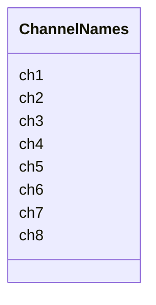

---
search:
  boost: 10.0
---

# Class: ChannelNames 


_Names for LLRF channels 1..8._


<div data-search-exclude markdown="1">


URI: [laura:ChannelNames](https://w3id.org/laura/ChannelNames)





<!-- no inheritance hierarchy -->

## Class Properties

| Property | Value |
| --- | --- |
| Class URI | [laura:ChannelNames](https://w3id.org/laura/ChannelNames) |


## Slots

| Name | Cardinality and Range | Description | Inheritance |
| ---  | --- | --- | --- |
| [ch1](ch1.md) | 0..1 <br/> [String](String.md) |  | direct |
| [ch2](ch2.md) | 0..1 <br/> [String](String.md) |  | direct |
| [ch3](ch3.md) | 0..1 <br/> [String](String.md) |  | direct |
| [ch4](ch4.md) | 0..1 <br/> [String](String.md) |  | direct |
| [ch5](ch5.md) | 0..1 <br/> [String](String.md) |  | direct |
| [ch6](ch6.md) | 0..1 <br/> [String](String.md) |  | direct |
| [ch7](ch7.md) | 0..1 <br/> [String](String.md) |  | direct |
| [ch8](ch8.md) | 0..1 <br/> [String](String.md) |  | direct |


## Usages

| used by | used in | type | used |
| ---  | --- | --- | --- |
| [LowLevelRFElement](LowLevelRFElement.md) | [channel_names](channel_names.md) | range | [ChannelNames](ChannelNames.md) |


## Identifier and Mapping Information


### Schema Source


* from schema: https://w3id.org/laura/schema


## Mappings

| Mapping Type | Mapped Value |
| ---  | ---  |
| self | laura:ChannelNames |
| native | laura:ChannelNames |


## LinkML Source

<!-- TODO: investigate https://stackoverflow.com/questions/37606292/how-to-create-tabbed-code-blocks-in-mkdocs-or-sphinx -->

### Direct

<details>
```yaml
name: ChannelNames
description: Names for LLRF channels 1..8.
from_schema: https://w3id.org/laura/schema
attributes:
  ch1:
    name: ch1
    from_schema: https://w3id.org/laura/schema
    aliases:
    - CH1
    rank: 1000
    ifabsent: string()
    domain_of:
    - ChannelNames
    range: string
  ch2:
    name: ch2
    from_schema: https://w3id.org/laura/schema
    aliases:
    - CH2
    rank: 1000
    ifabsent: string()
    domain_of:
    - ChannelNames
    range: string
  ch3:
    name: ch3
    from_schema: https://w3id.org/laura/schema
    aliases:
    - CH3
    rank: 1000
    ifabsent: string()
    domain_of:
    - ChannelNames
    range: string
  ch4:
    name: ch4
    from_schema: https://w3id.org/laura/schema
    aliases:
    - CH4
    rank: 1000
    ifabsent: string()
    domain_of:
    - ChannelNames
    range: string
  ch5:
    name: ch5
    from_schema: https://w3id.org/laura/schema
    aliases:
    - CH5
    rank: 1000
    ifabsent: string()
    domain_of:
    - ChannelNames
    range: string
  ch6:
    name: ch6
    from_schema: https://w3id.org/laura/schema
    aliases:
    - CH6
    rank: 1000
    ifabsent: string()
    domain_of:
    - ChannelNames
    range: string
  ch7:
    name: ch7
    from_schema: https://w3id.org/laura/schema
    aliases:
    - CH7
    rank: 1000
    ifabsent: string()
    domain_of:
    - ChannelNames
    range: string
  ch8:
    name: ch8
    from_schema: https://w3id.org/laura/schema
    aliases:
    - CH8
    rank: 1000
    ifabsent: string()
    domain_of:
    - ChannelNames
    range: string
class_uri: laura:ChannelNames

```
</details>

### Induced

<details>
```yaml
name: ChannelNames
description: Names for LLRF channels 1..8.
from_schema: https://w3id.org/laura/schema
attributes:
  ch1:
    name: ch1
    from_schema: https://w3id.org/laura/schema
    aliases:
    - CH1
    rank: 1000
    ifabsent: string()
    owner: ChannelNames
    domain_of:
    - ChannelNames
    range: string
  ch2:
    name: ch2
    from_schema: https://w3id.org/laura/schema
    aliases:
    - CH2
    rank: 1000
    ifabsent: string()
    owner: ChannelNames
    domain_of:
    - ChannelNames
    range: string
  ch3:
    name: ch3
    from_schema: https://w3id.org/laura/schema
    aliases:
    - CH3
    rank: 1000
    ifabsent: string()
    owner: ChannelNames
    domain_of:
    - ChannelNames
    range: string
  ch4:
    name: ch4
    from_schema: https://w3id.org/laura/schema
    aliases:
    - CH4
    rank: 1000
    ifabsent: string()
    owner: ChannelNames
    domain_of:
    - ChannelNames
    range: string
  ch5:
    name: ch5
    from_schema: https://w3id.org/laura/schema
    aliases:
    - CH5
    rank: 1000
    ifabsent: string()
    owner: ChannelNames
    domain_of:
    - ChannelNames
    range: string
  ch6:
    name: ch6
    from_schema: https://w3id.org/laura/schema
    aliases:
    - CH6
    rank: 1000
    ifabsent: string()
    owner: ChannelNames
    domain_of:
    - ChannelNames
    range: string
  ch7:
    name: ch7
    from_schema: https://w3id.org/laura/schema
    aliases:
    - CH7
    rank: 1000
    ifabsent: string()
    owner: ChannelNames
    domain_of:
    - ChannelNames
    range: string
  ch8:
    name: ch8
    from_schema: https://w3id.org/laura/schema
    aliases:
    - CH8
    rank: 1000
    ifabsent: string()
    owner: ChannelNames
    domain_of:
    - ChannelNames
    range: string
class_uri: laura:ChannelNames

```
</details></div>