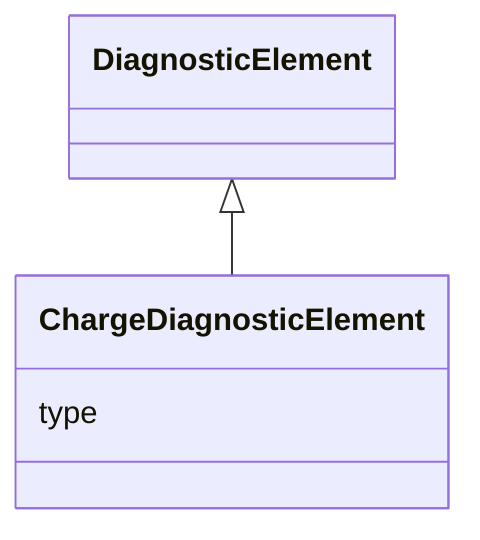

# Class: ChargeDiagnosticElement 


_Charge-measurement diagnostic data (base for ICT, FCM, WCM)._


<div data-search-exclude markdown="1">


URI: [laura:ChargeDiagnosticElement](https://w3id.org/laura/ChargeDiagnosticElement)





## Inheritance
* [DiagnosticElement](DiagnosticElement.md)
    * **ChargeDiagnosticElement**


## Class Properties

| Property | Value |
| --- | --- |
| Class URI | [laura:ChargeDiagnosticElement](https://w3id.org/laura/ChargeDiagnosticElement) |


## Slots

| Name | Cardinality and Range | Description | Inheritance |
| ---  | --- | --- | --- |
| [type](type.md) | 0..1 <br/> [String](String.md) | Charge-diagnostic type | direct |


## Usages

| used by | used in | type | used |
| ---  | --- | --- | --- |
| [ChargeDiagnostic](ChargeDiagnostic.md) | [diagnostic](diagnostic.md) | range | [ChargeDiagnosticElement](ChargeDiagnosticElement.md) |
| [WallCurrentMonitor](WallCurrentMonitor.md) | [diagnostic](diagnostic.md) | range | [ChargeDiagnosticElement](ChargeDiagnosticElement.md) |
| [FaradayCupMonitor](FaradayCupMonitor.md) | [diagnostic](diagnostic.md) | range | [ChargeDiagnosticElement](ChargeDiagnosticElement.md) |
| [IntegratedCurrentTransformer](IntegratedCurrentTransformer.md) | [diagnostic](diagnostic.md) | range | [ChargeDiagnosticElement](ChargeDiagnosticElement.md) |


## In Subsets


* [DiagnosticProperties](DiagnosticProperties.md)


## Identifier and Mapping Information


### Schema Source


* from schema: https://w3id.org/laura/schema


## Mappings

| Mapping Type | Mapped Value |
| ---  | ---  |
| self | laura:ChargeDiagnosticElement |
| native | laura:ChargeDiagnosticElement |


## LinkML Source

<!-- TODO: investigate https://stackoverflow.com/questions/37606292/how-to-create-tabbed-code-blocks-in-mkdocs-or-sphinx -->

### Direct

<details>
```yaml
name: ChargeDiagnosticElement
description: Charge-measurement diagnostic data (base for ICT, FCM, WCM).
in_subset:
- diagnostic_properties
from_schema: https://w3id.org/laura/schema
is_a: DiagnosticElement
attributes:
  type:
    name: type
    description: Charge-diagnostic type. Accepted in YAML as ``charge_type``.
    from_schema: https://w3id.org/laura/schema/diagnostics
    aliases:
    - charge_type
    domain_of:
    - BPMDiagnosticElement
    - BAMDiagnosticElement
    - PhotonIntensityMonitorDiagnostic
    - BLMDiagnosticElement
    - ScreenDiagnosticElement
    - ChargeDiagnosticElement
    - CameraDiagnosticElement
    range: string
class_uri: laura:ChargeDiagnosticElement

```
</details>

### Induced

<details>
```yaml
name: ChargeDiagnosticElement
description: Charge-measurement diagnostic data (base for ICT, FCM, WCM).
in_subset:
- diagnostic_properties
from_schema: https://w3id.org/laura/schema
is_a: DiagnosticElement
attributes:
  type:
    name: type
    description: Charge-diagnostic type. Accepted in YAML as ``charge_type``.
    from_schema: https://w3id.org/laura/schema/diagnostics
    aliases:
    - charge_type
    owner: ChargeDiagnosticElement
    domain_of:
    - BPMDiagnosticElement
    - BAMDiagnosticElement
    - PhotonIntensityMonitorDiagnostic
    - BLMDiagnosticElement
    - ScreenDiagnosticElement
    - ChargeDiagnosticElement
    - CameraDiagnosticElement
    range: string
class_uri: laura:ChargeDiagnosticElement

```
</details></div>