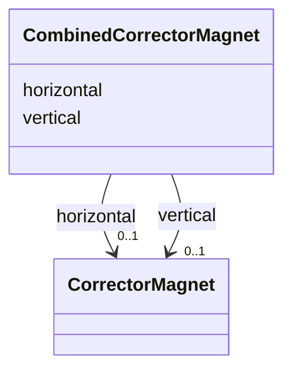

# Class: CombinedCorrectorMagnet 


_The pair of steering-corrector fields inside one combined corrector. The two planes are separate magnets with separate windings, so they must not share a magnetic model: in the CLARA magnet table the horizontal and vertical halves of a single unit have different slope [units/A] and different magnetic lengths, so one shared calibration converts current to angle correctly for at most one of the two planes._


<div data-search-exclude markdown="1">


URI: [laura:Combined_Corrector_Magnet](https://w3id.org/laura/Combined_Corrector_Magnet)





<!-- no inheritance hierarchy -->

## Class Properties

| Property | Value |
| --- | --- |
| Class URI | [laura:Combined_Corrector_Magnet](https://w3id.org/laura/Combined_Corrector_Magnet) |


## Slots

| Name | Cardinality and Range | Description | Inheritance |
| ---  | --- | --- | --- |
| [horizontal](horizontal.md) | 0..1 <br/> [CorrectorMagnet](CorrectorMagnet.md) | Horizontal-plane corrector field, with its own calibration | direct |
| [vertical](vertical.md) | 0..1 <br/> [CorrectorMagnet](CorrectorMagnet.md) | Vertical-plane corrector field, with its own calibration | direct |


## Usages

| used by | used in | type | used |
| ---  | --- | --- | --- |
| [CombinedCorrector](CombinedCorrector.md) | [magnetic](magnetic.md) | range | [CombinedCorrectorMagnet](CombinedCorrectorMagnet.md) |


## Identifier and Mapping Information


### Schema Source


* from schema: https://w3id.org/laura/schema


## Mappings

| Mapping Type | Mapped Value |
| ---  | ---  |
| self | laura:Combined_Corrector_Magnet |
| native | laura:CombinedCorrectorMagnet |


## LinkML Source

<!-- TODO: investigate https://stackoverflow.com/questions/37606292/how-to-create-tabbed-code-blocks-in-mkdocs-or-sphinx -->

### Direct

<details>
```yaml
name: Combined_Corrector_Magnet
description: 'The pair of steering-corrector fields inside one combined corrector.
  The two planes are separate magnets with separate windings, so they must not share
  a magnetic model: in the CLARA magnet table the horizontal and vertical halves of
  a single unit have different slope [units/A] and different magnetic lengths, so
  one shared calibration converts current to angle correctly for at most one of the
  two planes.'
from_schema: https://w3id.org/laura/schema
attributes:
  horizontal:
    name: horizontal
    description: Horizontal-plane corrector field, with its own calibration.
    from_schema: https://w3id.org/laura/schema/magnetic
    rank: 1000
    domain_of:
    - Combined_Corrector_Magnet
    range: Corrector_Magnet
  vertical:
    name: vertical
    description: Vertical-plane corrector field, with its own calibration.
    from_schema: https://w3id.org/laura/schema/magnetic
    rank: 1000
    domain_of:
    - Combined_Corrector_Magnet
    range: Corrector_Magnet
class_uri: laura:Combined_Corrector_Magnet

```
</details>

### Induced

<details>
```yaml
name: Combined_Corrector_Magnet
description: 'The pair of steering-corrector fields inside one combined corrector.
  The two planes are separate magnets with separate windings, so they must not share
  a magnetic model: in the CLARA magnet table the horizontal and vertical halves of
  a single unit have different slope [units/A] and different magnetic lengths, so
  one shared calibration converts current to angle correctly for at most one of the
  two planes.'
from_schema: https://w3id.org/laura/schema
attributes:
  horizontal:
    name: horizontal
    description: Horizontal-plane corrector field, with its own calibration.
    from_schema: https://w3id.org/laura/schema/magnetic
    rank: 1000
    owner: Combined_Corrector_Magnet
    domain_of:
    - Combined_Corrector_Magnet
    range: Corrector_Magnet
  vertical:
    name: vertical
    description: Vertical-plane corrector field, with its own calibration.
    from_schema: https://w3id.org/laura/schema/magnetic
    rank: 1000
    owner: Combined_Corrector_Magnet
    domain_of:
    - Combined_Corrector_Magnet
    range: Corrector_Magnet
class_uri: laura:Combined_Corrector_Magnet

```
</details></div>