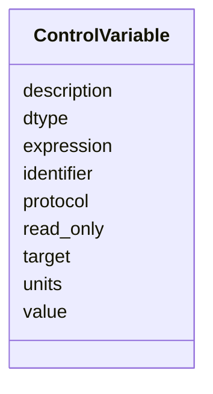

---
search:
  boost: 10.0
---

# Class: ControlVariable 


_A single process-variable entry mapping a logical name to a control-system PV identifier._


<div data-search-exclude markdown="1">


URI: [laura:ControlVariable](https://w3id.org/laura/ControlVariable)





<!-- no inheritance hierarchy -->

## Class Properties

| Property | Value |
| --- | --- |
| Class URI | [laura:ControlVariable](https://w3id.org/laura/ControlVariable) |


## Slots

| Name | Cardinality and Range | Description | Inheritance |
| ---  | --- | --- | --- |
| [identifier](identifier.md) | 0..1 <br/> [String](String.md) | Protocol-specific PV name (e | direct |
| [dtype](dtype.md) | 0..1 <br/> [String](String.md) | Data type (e | direct |
| [protocol](protocol.md) | 0..1 <br/> [String](String.md) | Control-system protocol (e | direct |
| [units](units.md) | 0..1 <br/> [String](String.md) | Physical units string (e | direct |
| [description](description.md) | 0..1 <br/> [String](String.md) | Human-readable description | direct |
| [read_only](read_only.md) | 0..1 <br/> [Boolean](Boolean.md) | Whether the variable is read-only | direct |
| [value](value.md) | 0..1 <br/> [Float](Float.md) | Last-read value | direct |
| [target](target.md) | 0..1 <br/> [Float](Float.md) | Set-point target value | direct |
| [expression](expression.md) | 0..1 <br/> [String](String.md) | Optional expression string for derived values | direct |


## Usages

| used by | used in | type | used |
| ---  | --- | --- | --- |
| [ControlsInformation](ControlsInformation.md) | [variables](variables.md) | range | [ControlVariable](ControlVariable.md) |


## Identifier and Mapping Information


### Schema Source


* from schema: https://w3id.org/laura/schema


## Mappings

| Mapping Type | Mapped Value |
| ---  | ---  |
| self | laura:ControlVariable |
| native | laura:ControlVariable |


## LinkML Source

<!-- TODO: investigate https://stackoverflow.com/questions/37606292/how-to-create-tabbed-code-blocks-in-mkdocs-or-sphinx -->

### Direct

<details>
```yaml
name: ControlVariable
description: A single process-variable entry mapping a logical name to a control-system
  PV identifier.
from_schema: https://w3id.org/laura/schema
attributes:
  identifier:
    name: identifier
    description: Protocol-specific PV name (e.g., EPICS PV address).
    from_schema: https://w3id.org/laura/schema
    rank: 1000
    domain_of:
    - ControlVariable
    range: string
  dtype:
    name: dtype
    description: Data type (e.g., ``float``, ``int``).
    from_schema: https://w3id.org/laura/schema
    rank: 1000
    domain_of:
    - ControlVariable
    range: string
  protocol:
    name: protocol
    description: Control-system protocol (e.g., ``EPICS``, ``Tango``).
    from_schema: https://w3id.org/laura/schema
    rank: 1000
    domain_of:
    - ControlVariable
    range: string
  units:
    name: units
    description: Physical units string (e.g., ``A``, ``T/m``).
    from_schema: https://w3id.org/laura/schema
    rank: 1000
    domain_of:
    - ControlVariable
    range: string
  description:
    name: description
    description: Human-readable description.
    from_schema: https://w3id.org/laura/schema
    rank: 1000
    domain_of:
    - ControlVariable
    range: string
  read_only:
    name: read_only
    description: Whether the variable is read-only.
    from_schema: https://w3id.org/laura/schema
    rank: 1000
    domain_of:
    - ControlVariable
    range: boolean
  value:
    name: value
    description: Last-read value.
    from_schema: https://w3id.org/laura/schema
    rank: 1000
    domain_of:
    - ControlVariable
    range: float
  target:
    name: target
    description: Set-point target value.
    from_schema: https://w3id.org/laura/schema
    rank: 1000
    domain_of:
    - ControlVariable
    range: float
  expression:
    name: expression
    description: Optional expression string for derived values.
    from_schema: https://w3id.org/laura/schema
    rank: 1000
    domain_of:
    - ControlVariable
    range: string
class_uri: laura:ControlVariable

```
</details>

### Induced

<details>
```yaml
name: ControlVariable
description: A single process-variable entry mapping a logical name to a control-system
  PV identifier.
from_schema: https://w3id.org/laura/schema
attributes:
  identifier:
    name: identifier
    description: Protocol-specific PV name (e.g., EPICS PV address).
    from_schema: https://w3id.org/laura/schema
    rank: 1000
    owner: ControlVariable
    domain_of:
    - ControlVariable
    range: string
  dtype:
    name: dtype
    description: Data type (e.g., ``float``, ``int``).
    from_schema: https://w3id.org/laura/schema
    rank: 1000
    owner: ControlVariable
    domain_of:
    - ControlVariable
    range: string
  protocol:
    name: protocol
    description: Control-system protocol (e.g., ``EPICS``, ``Tango``).
    from_schema: https://w3id.org/laura/schema
    rank: 1000
    owner: ControlVariable
    domain_of:
    - ControlVariable
    range: string
  units:
    name: units
    description: Physical units string (e.g., ``A``, ``T/m``).
    from_schema: https://w3id.org/laura/schema
    rank: 1000
    owner: ControlVariable
    domain_of:
    - ControlVariable
    range: string
  description:
    name: description
    description: Human-readable description.
    from_schema: https://w3id.org/laura/schema
    rank: 1000
    owner: ControlVariable
    domain_of:
    - ControlVariable
    range: string
  read_only:
    name: read_only
    description: Whether the variable is read-only.
    from_schema: https://w3id.org/laura/schema
    rank: 1000
    owner: ControlVariable
    domain_of:
    - ControlVariable
    range: boolean
  value:
    name: value
    description: Last-read value.
    from_schema: https://w3id.org/laura/schema
    rank: 1000
    owner: ControlVariable
    domain_of:
    - ControlVariable
    range: float
  target:
    name: target
    description: Set-point target value.
    from_schema: https://w3id.org/laura/schema
    rank: 1000
    owner: ControlVariable
    domain_of:
    - ControlVariable
    range: float
  expression:
    name: expression
    description: Optional expression string for derived values.
    from_schema: https://w3id.org/laura/schema
    rank: 1000
    owner: ControlVariable
    domain_of:
    - ControlVariable
    range: string
class_uri: laura:ControlVariable

```
</details></div>