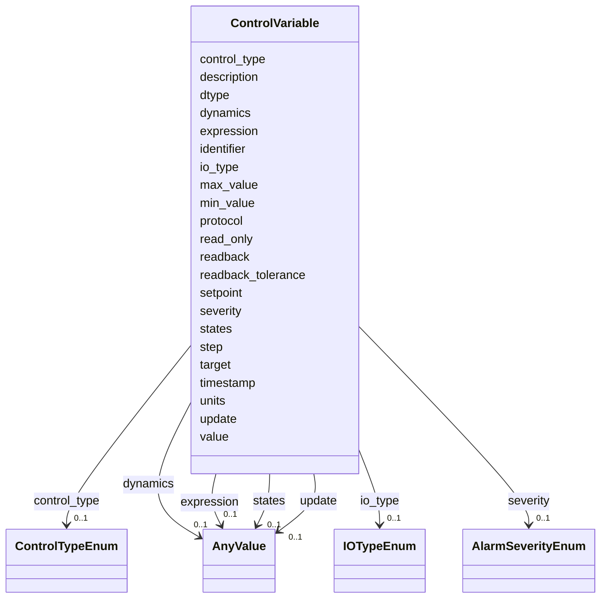

# Class: ControlVariable 


_A single process-variable entry mapping a logical name to a control-system PV identifier._


<div data-search-exclude markdown="1">


URI: [laura:ControlVariable](https://w3id.org/laura/ControlVariable)





<!-- no inheritance hierarchy -->

## Class Properties

| Property | Value |
| --- | --- |
| Class URI | [laura:ControlVariable](https://w3id.org/laura/ControlVariable) |


## Slots

| Name | Cardinality and Range | Description | Inheritance |
| ---  | --- | --- | --- |
| [identifier](identifier.md) | 0..1 <br/> [String](String.md) | Protocol-specific PV name (e | direct |
| [dtype](dtype.md) | 0..1 <br/> [String](String.md) | Data type, held as a Python type and serialised by name (e | direct |
| [protocol](protocol.md) | 0..1 <br/> [String](String.md) | Control-system protocol (e | direct |
| [units](units.md) | 0..1 <br/> [String](String.md) | Physical units string (e | direct |
| [description](description.md) | 0..1 <br/> [String](String.md) | Human-readable description | direct |
| [read_only](read_only.md) | 0..1 <br/> [Boolean](Boolean.md) | Whether the variable is read-only | direct |
| [value](value.md) | 0..1 <br/> [String](String.md)&nbsp;or&nbsp;<br />[Float](Float.md)&nbsp;or&nbsp;<br />[Integer](Integer.md) | Last-read value | direct |
| [timestamp](timestamp.md) | 0..1 <br/> [Datetime](Datetime.md) | Time at which ``value`` was read from the control system | direct |
| [severity](severity.md) | 0..1 <br/> [AlarmSeverityEnum](AlarmSeverityEnum.md) | Alarm severity reported with ``value`` | direct |
| [min_value](min_value.md) | 0..1 <br/> [Float](Float.md) | Lowest value this variable may be set to, in ``units`` | direct |
| [max_value](max_value.md) | 0..1 <br/> [Float](Float.md) | Highest value this variable may be set to, in ``units`` | direct |
| [step](step.md) | 0..1 <br/> [Float](Float.md) | Smallest meaningful change in this variable, in ``units`` | direct |
| [readback_tolerance](readback_tolerance.md) | 0..1 <br/> [Float](Float.md) | Fractional deviation within which a readback counts as having reached its set... | direct |
| [control_type](control_type.md) | 0..1 <br/> [ControlTypeEnum](ControlTypeEnum.md) | Kind of quantity this variable carries | direct |
| [io_type](io_type.md) | 0..1 <br/> [IOTypeEnum](IOTypeEnum.md) | Physical quantity this variable carries (e | direct |
| [target](target.md) | 0..1 <br/> [String](String.md) | Dotted attribute path on the owning element that ``expression`` writes to (e | direct |
| [expression](expression.md) | 0..1 <br/> [AnyValue](AnyValue.md) | Expression graph computing the value written to ``target``, as nested mapping... | direct |
| [states](states.md) | 0..1 <br/> [AnyValue](AnyValue.md) | Mapping of state name to underlying control-system value, for ``control_type:... | direct |
| [readback](readback.md) | 0..1 <br/> [String](String.md) | Name of the readback variable this set-point drives | direct |
| [setpoint](setpoint.md) | 0..1 <br/> [String](String.md) | Name of the set-point variable this readback follows | direct |
| [update](update.md) | 0..1 <br/> [AnyValue](AnyValue.md) | Signal generating this variable's value over time, as ``{function: <import pa... | direct |
| [dynamics](dynamics.md) | 0..1 <br/> [AnyValue](AnyValue.md) | Response model describing how this variable's readback follows its set-point,... | direct |


## Usages

| used by | used in | type | used |
| ---  | --- | --- | --- |
| [ControlsInformation](ControlsInformation.md) | [variables](variables.md) | range | [ControlVariable](ControlVariable.md) |


## Identifier and Mapping Information


### Schema Source


* from schema: https://w3id.org/laura/schema


## Mappings

| Mapping Type | Mapped Value |
| ---  | ---  |
| self | laura:ControlVariable |
| native | laura:ControlVariable |


## LinkML Source

<!-- TODO: investigate https://stackoverflow.com/questions/37606292/how-to-create-tabbed-code-blocks-in-mkdocs-or-sphinx -->

### Direct

<details>
```yaml
name: ControlVariable
description: A single process-variable entry mapping a logical name to a control-system
  PV identifier.
from_schema: https://w3id.org/laura/schema
attributes:
  identifier:
    name: identifier
    description: Protocol-specific PV name (e.g., EPICS PV address).
    from_schema: https://w3id.org/laura/schema/controls
    rank: 1000
    domain_of:
    - ControlVariable
    range: string
  dtype:
    name: dtype
    description: Data type, held as a Python type and serialised by name (e.g., ``float``,
      ``int``, ``str``).
    from_schema: https://w3id.org/laura/schema/controls
    rank: 1000
    ifabsent: string(float)
    domain_of:
    - ControlVariable
    range: string
  protocol:
    name: protocol
    description: Control-system protocol (e.g., ``EPICS``, ``Tango``).
    from_schema: https://w3id.org/laura/schema/controls
    rank: 1000
    domain_of:
    - ControlVariable
    range: string
  units:
    name: units
    description: Physical units string (e.g., ``A``, ``T/m``).
    from_schema: https://w3id.org/laura/schema/controls
    rank: 1000
    ifabsent: string(Arb. Units)
    domain_of:
    - ControlVariable
    range: string
  description:
    name: description
    description: Human-readable description.
    from_schema: https://w3id.org/laura/schema/controls
    rank: 1000
    ifabsent: string(Default Description)
    domain_of:
    - ControlVariable
    - MachineModel
    range: string
  read_only:
    name: read_only
    description: Whether the variable is read-only.
    from_schema: https://w3id.org/laura/schema/controls
    rank: 1000
    ifabsent: 'True'
    domain_of:
    - ControlVariable
    range: boolean
  value:
    name: value
    description: Last-read value. Scalar for most control types; a list for ``waveform``.
    from_schema: https://w3id.org/laura/schema/controls
    rank: 1000
    domain_of:
    - ControlVariable
    range: string
    any_of:
    - range: float
    - range: integer
    - range: string
  timestamp:
    name: timestamp
    description: Time at which ``value`` was read from the control system. Absent
      means the value has never been read, or came from a source that does not timestamp
      it.
    from_schema: https://w3id.org/laura/schema/controls
    rank: 1000
    domain_of:
    - ControlVariable
    range: datetime
  severity:
    name: severity
    description: Alarm severity reported with ``value``. Absent means no severity
      was supplied; it does not mean the reading was healthy.
    from_schema: https://w3id.org/laura/schema/controls
    rank: 1000
    domain_of:
    - ControlVariable
    range: AlarmSeverityEnum
  min_value:
    name: min_value
    description: Lowest value this variable may be set to, in ``units``. Advisory
      operating limit for anything writing a set-point, not a hardware interlock.
    from_schema: https://w3id.org/laura/schema/controls
    rank: 1000
    domain_of:
    - ControlVariable
    range: float
  max_value:
    name: max_value
    description: Highest value this variable may be set to, in ``units``. As ``min_value``,
      advisory rather than enforced.
    from_schema: https://w3id.org/laura/schema/controls
    rank: 1000
    domain_of:
    - ControlVariable
    range: float
  step:
    name: step
    description: Smallest meaningful change in this variable, in ``units``. Below
      this a set-point change is lost in noise or resolution.
    from_schema: https://w3id.org/laura/schema/controls
    rank: 1000
    domain_of:
    - ControlVariable
    range: float
  readback_tolerance:
    name: readback_tolerance
    description: Fractional deviation within which a readback counts as having reached
      its set-point (0.01 = 1 %). Named to avoid colliding with ``DegaussableElement.tolerance``,
      which is an absolute current band.
    from_schema: https://w3id.org/laura/schema/controls
    rank: 1000
    domain_of:
    - ControlVariable
    range: float
    minimum_value: 0.0
  control_type:
    name: control_type
    description: Kind of quantity this variable carries. Accepted in YAML as ``type``.
    from_schema: https://w3id.org/laura/schema/controls
    aliases:
    - type
    rank: 1000
    ifabsent: string(statistical)
    domain_of:
    - ControlVariable
    range: ControlTypeEnum
  io_type:
    name: io_type
    description: Physical quantity this variable carries (e.g. ``voltage``, ``beam_position``),
      as opposed to ``control_type``, which is the shape of its value.
    from_schema: https://w3id.org/laura/schema/controls
    rank: 1000
    ifabsent: string(unknown)
    domain_of:
    - ControlVariable
    range: IOTypeEnum
  target:
    name: target
    description: Dotted attribute path on the owning element that ``expression`` writes
      to (e.g., ``magnetic.k1l``). Not a set-point value.
    from_schema: https://w3id.org/laura/schema/controls
    rank: 1000
    domain_of:
    - ControlVariable
    range: string
  expression:
    name: expression
    description: 'Expression graph computing the value written to ``target``, as nested
      mappings of the form ``{op: mul, args: [<symbol>, <symbol>]}``, where a symbol
      is a variable name or a dotted attribute path. Operators are ``add``, ``sub``,
      ``mul``, ``truediv`` and ``pow``.'
    from_schema: https://w3id.org/laura/schema/controls
    rank: 1000
    domain_of:
    - ControlVariable
    range: AnyValue
  states:
    name: states
    description: 'Mapping of state name to underlying control-system value, for ``control_type:
      state``.'
    from_schema: https://w3id.org/laura/schema/controls
    rank: 1000
    domain_of:
    - ControlVariable
    range: AnyValue
  readback:
    name: readback
    description: Name of the readback variable this set-point drives.
    from_schema: https://w3id.org/laura/schema/controls
    rank: 1000
    domain_of:
    - ControlVariable
    range: string
  setpoint:
    name: setpoint
    description: Name of the set-point variable this readback follows.
    from_schema: https://w3id.org/laura/schema/controls
    rank: 1000
    domain_of:
    - ControlVariable
    range: string
  update:
    name: update
    description: 'Signal generating this variable''s value over time, as ``{function:
      <import path>, **kwargs}`` -- see ``laura.utils.signals``. Stored with ``function``
      as a fully qualified import path so it resolves without LAURA.'
    from_schema: https://w3id.org/laura/schema/controls
    rank: 1000
    domain_of:
    - ControlVariable
    range: AnyValue
  dynamics:
    name: dynamics
    description: 'Response model describing how this variable''s readback follows
      its set-point, as ``{model: <import path>, **kwargs}`` -- see ``laura.utils.dynamics``.
      Only meaningful alongside ``readback`` or ``setpoint``.'
    from_schema: https://w3id.org/laura/schema/controls
    rank: 1000
    domain_of:
    - ControlVariable
    range: AnyValue
class_uri: laura:ControlVariable

```
</details>

### Induced

<details>
```yaml
name: ControlVariable
description: A single process-variable entry mapping a logical name to a control-system
  PV identifier.
from_schema: https://w3id.org/laura/schema
attributes:
  identifier:
    name: identifier
    description: Protocol-specific PV name (e.g., EPICS PV address).
    from_schema: https://w3id.org/laura/schema/controls
    rank: 1000
    owner: ControlVariable
    domain_of:
    - ControlVariable
    range: string
  dtype:
    name: dtype
    description: Data type, held as a Python type and serialised by name (e.g., ``float``,
      ``int``, ``str``).
    from_schema: https://w3id.org/laura/schema/controls
    rank: 1000
    ifabsent: string(float)
    owner: ControlVariable
    domain_of:
    - ControlVariable
    range: string
  protocol:
    name: protocol
    description: Control-system protocol (e.g., ``EPICS``, ``Tango``).
    from_schema: https://w3id.org/laura/schema/controls
    rank: 1000
    owner: ControlVariable
    domain_of:
    - ControlVariable
    range: string
  units:
    name: units
    description: Physical units string (e.g., ``A``, ``T/m``).
    from_schema: https://w3id.org/laura/schema/controls
    rank: 1000
    ifabsent: string(Arb. Units)
    owner: ControlVariable
    domain_of:
    - ControlVariable
    range: string
  description:
    name: description
    description: Human-readable description.
    from_schema: https://w3id.org/laura/schema/controls
    rank: 1000
    ifabsent: string(Default Description)
    owner: ControlVariable
    domain_of:
    - ControlVariable
    - MachineModel
    range: string
  read_only:
    name: read_only
    description: Whether the variable is read-only.
    from_schema: https://w3id.org/laura/schema/controls
    rank: 1000
    ifabsent: 'True'
    owner: ControlVariable
    domain_of:
    - ControlVariable
    range: boolean
  value:
    name: value
    description: Last-read value. Scalar for most control types; a list for ``waveform``.
    from_schema: https://w3id.org/laura/schema/controls
    rank: 1000
    owner: ControlVariable
    domain_of:
    - ControlVariable
    range: string
    any_of:
    - range: float
    - range: integer
    - range: string
  timestamp:
    name: timestamp
    description: Time at which ``value`` was read from the control system. Absent
      means the value has never been read, or came from a source that does not timestamp
      it.
    from_schema: https://w3id.org/laura/schema/controls
    rank: 1000
    owner: ControlVariable
    domain_of:
    - ControlVariable
    range: datetime
  severity:
    name: severity
    description: Alarm severity reported with ``value``. Absent means no severity
      was supplied; it does not mean the reading was healthy.
    from_schema: https://w3id.org/laura/schema/controls
    rank: 1000
    owner: ControlVariable
    domain_of:
    - ControlVariable
    range: AlarmSeverityEnum
  min_value:
    name: min_value
    description: Lowest value this variable may be set to, in ``units``. Advisory
      operating limit for anything writing a set-point, not a hardware interlock.
    from_schema: https://w3id.org/laura/schema/controls
    rank: 1000
    owner: ControlVariable
    domain_of:
    - ControlVariable
    range: float
  max_value:
    name: max_value
    description: Highest value this variable may be set to, in ``units``. As ``min_value``,
      advisory rather than enforced.
    from_schema: https://w3id.org/laura/schema/controls
    rank: 1000
    owner: ControlVariable
    domain_of:
    - ControlVariable
    range: float
  step:
    name: step
    description: Smallest meaningful change in this variable, in ``units``. Below
      this a set-point change is lost in noise or resolution.
    from_schema: https://w3id.org/laura/schema/controls
    rank: 1000
    owner: ControlVariable
    domain_of:
    - ControlVariable
    range: float
  readback_tolerance:
    name: readback_tolerance
    description: Fractional deviation within which a readback counts as having reached
      its set-point (0.01 = 1 %). Named to avoid colliding with ``DegaussableElement.tolerance``,
      which is an absolute current band.
    from_schema: https://w3id.org/laura/schema/controls
    rank: 1000
    owner: ControlVariable
    domain_of:
    - ControlVariable
    range: float
    minimum_value: 0.0
  control_type:
    name: control_type
    description: Kind of quantity this variable carries. Accepted in YAML as ``type``.
    from_schema: https://w3id.org/laura/schema/controls
    aliases:
    - type
    rank: 1000
    ifabsent: string(statistical)
    owner: ControlVariable
    domain_of:
    - ControlVariable
    range: ControlTypeEnum
  io_type:
    name: io_type
    description: Physical quantity this variable carries (e.g. ``voltage``, ``beam_position``),
      as opposed to ``control_type``, which is the shape of its value.
    from_schema: https://w3id.org/laura/schema/controls
    rank: 1000
    ifabsent: string(unknown)
    owner: ControlVariable
    domain_of:
    - ControlVariable
    range: IOTypeEnum
  target:
    name: target
    description: Dotted attribute path on the owning element that ``expression`` writes
      to (e.g., ``magnetic.k1l``). Not a set-point value.
    from_schema: https://w3id.org/laura/schema/controls
    rank: 1000
    owner: ControlVariable
    domain_of:
    - ControlVariable
    range: string
  expression:
    name: expression
    description: 'Expression graph computing the value written to ``target``, as nested
      mappings of the form ``{op: mul, args: [<symbol>, <symbol>]}``, where a symbol
      is a variable name or a dotted attribute path. Operators are ``add``, ``sub``,
      ``mul``, ``truediv`` and ``pow``.'
    from_schema: https://w3id.org/laura/schema/controls
    rank: 1000
    owner: ControlVariable
    domain_of:
    - ControlVariable
    range: AnyValue
  states:
    name: states
    description: 'Mapping of state name to underlying control-system value, for ``control_type:
      state``.'
    from_schema: https://w3id.org/laura/schema/controls
    rank: 1000
    owner: ControlVariable
    domain_of:
    - ControlVariable
    range: AnyValue
  readback:
    name: readback
    description: Name of the readback variable this set-point drives.
    from_schema: https://w3id.org/laura/schema/controls
    rank: 1000
    owner: ControlVariable
    domain_of:
    - ControlVariable
    range: string
  setpoint:
    name: setpoint
    description: Name of the set-point variable this readback follows.
    from_schema: https://w3id.org/laura/schema/controls
    rank: 1000
    owner: ControlVariable
    domain_of:
    - ControlVariable
    range: string
  update:
    name: update
    description: 'Signal generating this variable''s value over time, as ``{function:
      <import path>, **kwargs}`` -- see ``laura.utils.signals``. Stored with ``function``
      as a fully qualified import path so it resolves without LAURA.'
    from_schema: https://w3id.org/laura/schema/controls
    rank: 1000
    owner: ControlVariable
    domain_of:
    - ControlVariable
    range: AnyValue
  dynamics:
    name: dynamics
    description: 'Response model describing how this variable''s readback follows
      its set-point, as ``{model: <import path>, **kwargs}`` -- see ``laura.utils.dynamics``.
      Only meaningful alongside ``readback`` or ``setpoint``.'
    from_schema: https://w3id.org/laura/schema/controls
    rank: 1000
    owner: ControlVariable
    domain_of:
    - ControlVariable
    range: AnyValue
class_uri: laura:ControlVariable

```
</details></div>