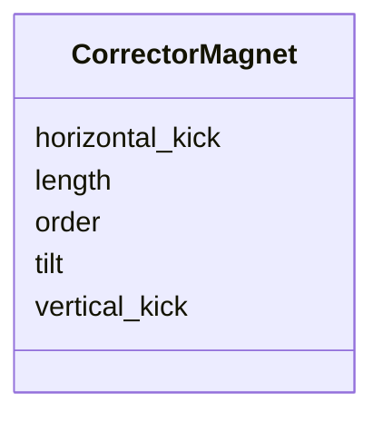

# Class: CorrectorMagnet 


_Steering-corrector field, expressed as horizontal and vertical kicks rather than multipole coefficients._


<div data-search-exclude markdown="1">


URI: [laura:Corrector_Magnet](https://w3id.org/laura/Corrector_Magnet)





<!-- no inheritance hierarchy -->

## Class Properties

| Property | Value |
| --- | --- |
| Class URI | [laura:Corrector_Magnet](https://w3id.org/laura/Corrector_Magnet) |


## Slots

| Name | Cardinality and Range | Description | Inheritance |
| ---  | --- | --- | --- |
| [length](length.md) | 0..1 <br/> [Float](Float.md) | Magnetic length [m] | direct |
| [order](order.md) | 0..1 <br/> [Integer](Integer.md) | Multipole order (0, a dipole field) | direct |
| [tilt](tilt.md) | 0..1 <br/> [Float](Float.md) | Roll of the corrector about the beam axis [rad] | direct |
| [horizontal_kick](horizontal_kick.md) | 0..1 <br/> [Float](Float.md) | Horizontal deflection [rad] | direct |
| [vertical_kick](vertical_kick.md) | 0..1 <br/> [Float](Float.md) | Vertical deflection [rad] | direct |


## Usages

| used by | used in | type | used |
| ---  | --- | --- | --- |
| [HorizontalCorrector](HorizontalCorrector.md) | [magnetic](magnetic.md) | range | [CorrectorMagnet](CorrectorMagnet.md) |
| [VerticalCorrector](VerticalCorrector.md) | [magnetic](magnetic.md) | range | [CorrectorMagnet](CorrectorMagnet.md) |
| [CombinedCorrector](CombinedCorrector.md) | [magnetic](magnetic.md) | range | [CorrectorMagnet](CorrectorMagnet.md) |


## Identifier and Mapping Information


### Schema Source


* from schema: https://w3id.org/laura/schema


## Mappings

| Mapping Type | Mapped Value |
| ---  | ---  |
| self | laura:Corrector_Magnet |
| native | laura:CorrectorMagnet |


## LinkML Source

<!-- TODO: investigate https://stackoverflow.com/questions/37606292/how-to-create-tabbed-code-blocks-in-mkdocs-or-sphinx -->

### Direct

<details>
```yaml
name: Corrector_Magnet
description: Steering-corrector field, expressed as horizontal and vertical kicks
  rather than multipole coefficients.
from_schema: https://w3id.org/laura/schema
attributes:
  length:
    name: length
    description: Magnetic length [m].
    from_schema: https://w3id.org/laura/schema/magnetic
    ifabsent: float(0.0)
    domain_of:
    - PhysicalElement
    - MagneticElement
    - Corrector_Magnet
    - Solenoid_Magnet
    - Wiggler_Magnet
    - NonLinearLens_Magnet
    range: float
    minimum_value: 0
  order:
    name: order
    description: Multipole order (0, a dipole field).
    from_schema: https://w3id.org/laura/schema/magnetic
    ifabsent: int(0)
    domain_of:
    - Multipole
    - MagneticElement
    - Corrector_Magnet
    - Solenoid_Magnet
    range: integer
  tilt:
    name: tilt
    description: Roll of the corrector about the beam axis [rad].
    from_schema: https://w3id.org/laura/schema/magnetic
    ifabsent: float(0.0)
    domain_of:
    - ElectrostaticSeparatorSimulationElement
    - MagneticElement
    - Corrector_Magnet
    - Solenoid_Magnet
    - Wiggler_Magnet
    - NonLinearLens_Magnet
    range: float
  horizontal_kick:
    name: horizontal_kick
    description: Horizontal deflection [rad]. May be a functional expression.
    from_schema: https://w3id.org/laura/schema/magnetic
    rank: 1000
    ifabsent: float(0.0)
    domain_of:
    - Corrector_Magnet
    range: float
  vertical_kick:
    name: vertical_kick
    description: Vertical deflection [rad]. May be a functional expression.
    from_schema: https://w3id.org/laura/schema/magnetic
    rank: 1000
    ifabsent: float(0.0)
    domain_of:
    - Corrector_Magnet
    range: float
class_uri: laura:Corrector_Magnet

```
</details>

### Induced

<details>
```yaml
name: Corrector_Magnet
description: Steering-corrector field, expressed as horizontal and vertical kicks
  rather than multipole coefficients.
from_schema: https://w3id.org/laura/schema
attributes:
  length:
    name: length
    description: Magnetic length [m].
    from_schema: https://w3id.org/laura/schema/magnetic
    ifabsent: float(0.0)
    owner: Corrector_Magnet
    domain_of:
    - PhysicalElement
    - MagneticElement
    - Corrector_Magnet
    - Solenoid_Magnet
    - Wiggler_Magnet
    - NonLinearLens_Magnet
    range: float
    minimum_value: 0
  order:
    name: order
    description: Multipole order (0, a dipole field).
    from_schema: https://w3id.org/laura/schema/magnetic
    ifabsent: int(0)
    owner: Corrector_Magnet
    domain_of:
    - Multipole
    - MagneticElement
    - Corrector_Magnet
    - Solenoid_Magnet
    range: integer
  tilt:
    name: tilt
    description: Roll of the corrector about the beam axis [rad].
    from_schema: https://w3id.org/laura/schema/magnetic
    ifabsent: float(0.0)
    owner: Corrector_Magnet
    domain_of:
    - ElectrostaticSeparatorSimulationElement
    - MagneticElement
    - Corrector_Magnet
    - Solenoid_Magnet
    - Wiggler_Magnet
    - NonLinearLens_Magnet
    range: float
  horizontal_kick:
    name: horizontal_kick
    description: Horizontal deflection [rad]. May be a functional expression.
    from_schema: https://w3id.org/laura/schema/magnetic
    rank: 1000
    ifabsent: float(0.0)
    owner: Corrector_Magnet
    domain_of:
    - Corrector_Magnet
    range: float
  vertical_kick:
    name: vertical_kick
    description: Vertical deflection [rad]. May be a functional expression.
    from_schema: https://w3id.org/laura/schema/magnetic
    rank: 1000
    ifabsent: float(0.0)
    owner: Corrector_Magnet
    domain_of:
    - Corrector_Magnet
    range: float
class_uri: laura:Corrector_Magnet

```
</details></div>