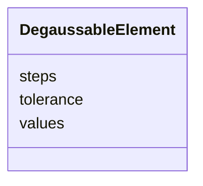

---
search:
  boost: 10.0
---

# Class: DegaussableElement 


_Degaussing (demagnetisation cycle) parameters for magnets that require a field-reset procedure._


<div data-search-exclude markdown="1">


URI: [laura:DegaussableElement](https://w3id.org/laura/DegaussableElement)





<!-- no inheritance hierarchy -->

## Class Properties

| Property | Value |
| --- | --- |
| Class URI | [laura:DegaussableElement](https://w3id.org/laura/DegaussableElement) |


## Slots

| Name | Cardinality and Range | Description | Inheritance |
| ---  | --- | --- | --- |
| [tolerance](tolerance.md) | 0..1 <br/> [Float](Float.md) | Current tolerance band during the degauss cycle [A] | direct |
| [values](values.md) | * <br/> [Float](Float.md) | Sequence of peak currents applied during the degauss cycle [A] | direct |
| [steps](steps.md) | 0..1 <br/> [Integer](Integer.md) | Number of degauss steps per half-cycle | direct |


## Usages

| used by | used in | type | used |
| ---  | --- | --- | --- |
| [Magnet](Magnet.md) | [degauss](degauss.md) | range | [DegaussableElement](DegaussableElement.md) |
| [Dipole](Dipole.md) | [degauss](degauss.md) | range | [DegaussableElement](DegaussableElement.md) |
| [Quadrupole](Quadrupole.md) | [degauss](degauss.md) | range | [DegaussableElement](DegaussableElement.md) |


## In Subsets


* [MagneticProperties](MagneticProperties.md)


## Identifier and Mapping Information


### Schema Source


* from schema: https://w3id.org/laura/schema


## Mappings

| Mapping Type | Mapped Value |
| ---  | ---  |
| self | laura:DegaussableElement |
| native | laura:DegaussableElement |


## LinkML Source

<!-- TODO: investigate https://stackoverflow.com/questions/37606292/how-to-create-tabbed-code-blocks-in-mkdocs-or-sphinx -->

### Direct

<details>
```yaml
name: DegaussableElement
description: Degaussing (demagnetisation cycle) parameters for magnets that require
  a field-reset procedure.
in_subset:
- magnetic_properties
from_schema: https://w3id.org/laura/schema
attributes:
  tolerance:
    name: tolerance
    description: Current tolerance band during the degauss cycle [A].
    from_schema: https://w3id.org/laura/schema/magnetic
    aliases:
    - degauss_tolerance
    rank: 1000
    ifabsent: float(0.5)
    domain_of:
    - DegaussableElement
    range: float
    unit:
      ucum_code: A
  values:
    name: values
    description: Sequence of peak currents applied during the degauss cycle [A].
    from_schema: https://w3id.org/laura/schema/magnetic
    aliases:
    - degauss_values
    rank: 1000
    domain_of:
    - DegaussableElement
    range: float
    multivalued: true
    unit:
      ucum_code: A
  steps:
    name: steps
    description: Number of degauss steps per half-cycle.
    from_schema: https://w3id.org/laura/schema/magnetic
    aliases:
    - num_degauss_steps
    rank: 1000
    ifabsent: int(11)
    domain_of:
    - DegaussableElement
    range: integer
    minimum_value: 1
class_uri: laura:DegaussableElement

```
</details>

### Induced

<details>
```yaml
name: DegaussableElement
description: Degaussing (demagnetisation cycle) parameters for magnets that require
  a field-reset procedure.
in_subset:
- magnetic_properties
from_schema: https://w3id.org/laura/schema
attributes:
  tolerance:
    name: tolerance
    description: Current tolerance band during the degauss cycle [A].
    from_schema: https://w3id.org/laura/schema/magnetic
    aliases:
    - degauss_tolerance
    rank: 1000
    ifabsent: float(0.5)
    owner: DegaussableElement
    domain_of:
    - DegaussableElement
    range: float
    unit:
      ucum_code: A
  values:
    name: values
    description: Sequence of peak currents applied during the degauss cycle [A].
    from_schema: https://w3id.org/laura/schema/magnetic
    aliases:
    - degauss_values
    rank: 1000
    owner: DegaussableElement
    domain_of:
    - DegaussableElement
    range: float
    multivalued: true
    unit:
      ucum_code: A
  steps:
    name: steps
    description: Number of degauss steps per half-cycle.
    from_schema: https://w3id.org/laura/schema/magnetic
    aliases:
    - num_degauss_steps
    rank: 1000
    ifabsent: int(11)
    owner: DegaussableElement
    domain_of:
    - DegaussableElement
    range: integer
    minimum_value: 1
class_uri: laura:DegaussableElement

```
</details></div>