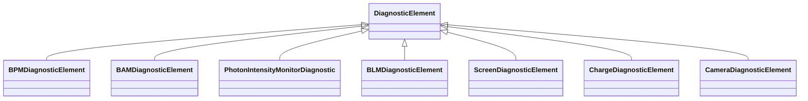

---
search:
  boost: 10.0
---

# Class: DiagnosticElement 


_Base class for diagnostic instrument sub-models.  Concrete sub-models extend this with instrument-specific fields._


<div data-search-exclude markdown="1">


URI: [laura:DiagnosticElement](https://w3id.org/laura/DiagnosticElement)





## Inheritance
* **DiagnosticElement**
    * [BPMDiagnosticElement](BPMDiagnosticElement.md)
    * [BAMDiagnosticElement](BAMDiagnosticElement.md)
    * [PhotonIntensityMonitorDiagnostic](PhotonIntensityMonitorDiagnostic.md)
    * [BLMDiagnosticElement](BLMDiagnosticElement.md)
    * [ScreenDiagnosticElement](ScreenDiagnosticElement.md)
    * [ChargeDiagnosticElement](ChargeDiagnosticElement.md)
    * [CameraDiagnosticElement](CameraDiagnosticElement.md)


## Class Properties

| Property | Value |
| --- | --- |
| Class URI | [laura:DiagnosticElement](https://w3id.org/laura/DiagnosticElement) |


## Slots

| Name | Cardinality and Range | Description | Inheritance |
| ---  | --- | --- | --- |


## Usages

| used by | used in | type | used |
| ---  | --- | --- | --- |
| [Diagnostic](Diagnostic.md) | [diagnostic](diagnostic.md) | range | [DiagnosticElement](DiagnosticElement.md) |
| [PhotonMonitor](PhotonMonitor.md) | [diagnostic](diagnostic.md) | range | [DiagnosticElement](DiagnosticElement.md) |


## Identifier and Mapping Information


### Schema Source


* from schema: https://w3id.org/laura/schema


## Mappings

| Mapping Type | Mapped Value |
| ---  | ---  |
| self | laura:DiagnosticElement |
| native | laura:DiagnosticElement |


## LinkML Source

<!-- TODO: investigate https://stackoverflow.com/questions/37606292/how-to-create-tabbed-code-blocks-in-mkdocs-or-sphinx -->

### Direct

<details>
```yaml
name: DiagnosticElement
description: Base class for diagnostic instrument sub-models.  Concrete sub-models
  extend this with instrument-specific fields.
from_schema: https://w3id.org/laura/schema
class_uri: laura:DiagnosticElement

```
</details>

### Induced

<details>
```yaml
name: DiagnosticElement
description: Base class for diagnostic instrument sub-models.  Concrete sub-models
  extend this with instrument-specific fields.
from_schema: https://w3id.org/laura/schema
class_uri: laura:DiagnosticElement

```
</details></div>