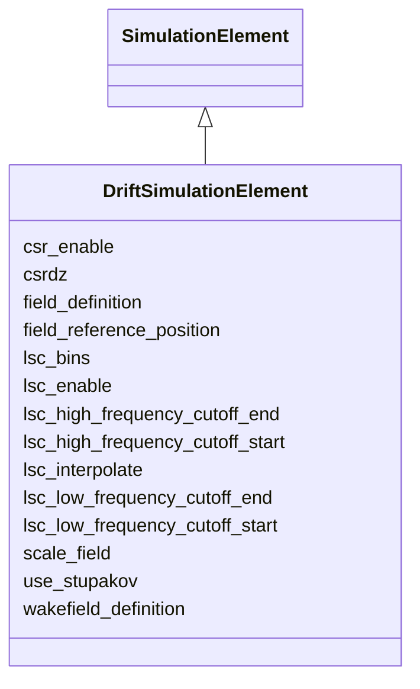

---
search:
  boost: 10.0
---

# Class: DriftSimulationElement 


_Simulation attributes for field-free drift sections._


<div data-search-exclude markdown="1">


URI: [laura:DriftSimulationElement](https://w3id.org/laura/DriftSimulationElement)





## Inheritance
* [SimulationElement](SimulationElement.md)
    * **DriftSimulationElement**


## Class Properties

| Property | Value |
| --- | --- |
| Class URI | [laura:DriftSimulationElement](https://w3id.org/laura/DriftSimulationElement) |


## Slots

| Name | Cardinality and Range | Description | Inheritance |
| ---  | --- | --- | --- |
| [lsc_bins](lsc_bins.md) | 0..1 <br/> [Integer](Integer.md) | Number of bins for LSC calculations | direct |
| [lsc_interpolate](lsc_interpolate.md) | 0..1 <br/> [Integer](Integer.md) | Flag to allow interpolation of computed LSC wake | direct |
| [csr_enable](csr_enable.md) | 0..1 <br/> [Boolean](Boolean.md) | Enable CSR drift calculations | direct |
| [lsc_enable](lsc_enable.md) | 0..1 <br/> [Boolean](Boolean.md) | Enable LSC drift calculations | direct |
| [use_stupakov](use_stupakov.md) | 0..1 <br/> [Integer](Integer.md) | Use Stupakov formula | direct |
| [csrdz](csrdz.md) | 0..1 <br/> [Float](Float.md) | Step size for CSR calculations | direct |
| [lsc_high_frequency_cutoff_start](lsc_high_frequency_cutoff_start.md) | 0..1 <br/> [Float](Float.md) | High-frequency cutoff start for LSC | direct |
| [lsc_high_frequency_cutoff_end](lsc_high_frequency_cutoff_end.md) | 0..1 <br/> [Float](Float.md) | High-frequency cutoff end for LSC | direct |
| [lsc_low_frequency_cutoff_start](lsc_low_frequency_cutoff_start.md) | 0..1 <br/> [Float](Float.md) | Low-frequency cutoff start for LSC | direct |
| [lsc_low_frequency_cutoff_end](lsc_low_frequency_cutoff_end.md) | 0..1 <br/> [Float](Float.md) | Low-frequency cutoff end for LSC | direct |
| [field_definition](field_definition.md) | 0..1 <br/> [String](String.md) | Path to the 3-D field-map file | [SimulationElement](SimulationElement.md) |
| [wakefield_definition](wakefield_definition.md) | 0..1 <br/> [String](String.md) | Path to the wakefield impedance file | [SimulationElement](SimulationElement.md) |
| [field_reference_position](field_reference_position.md) | 0..1 <br/> [String](String.md) | Longitudinal origin of the field map [m] | [SimulationElement](SimulationElement.md) |
| [scale_field](scale_field.md) | 0..1 <br/> [Float](Float.md) | Multiplicative scale factor applied to the field map | [SimulationElement](SimulationElement.md) |


## Usages

| used by | used in | type | used |
| ---  | --- | --- | --- |
| [Drift](Drift.md) | [simulation](simulation.md) | range | [DriftSimulationElement](DriftSimulationElement.md) |


## Identifier and Mapping Information


### Schema Source


* from schema: https://w3id.org/laura/schema


## Mappings

| Mapping Type | Mapped Value |
| ---  | ---  |
| self | laura:DriftSimulationElement |
| native | laura:DriftSimulationElement |


## LinkML Source

<!-- TODO: investigate https://stackoverflow.com/questions/37606292/how-to-create-tabbed-code-blocks-in-mkdocs-or-sphinx -->

### Direct

<details>
```yaml
name: DriftSimulationElement
description: Simulation attributes for field-free drift sections.
from_schema: https://w3id.org/laura/schema
is_a: SimulationElement
slots:
- lsc_bins
slot_usage:
  lsc_bins:
    name: lsc_bins
    description: Number of bins for LSC calculations.
    ifabsent: int(20)
attributes:
  lsc_interpolate:
    name: lsc_interpolate
    description: Flag to allow interpolation of computed LSC wake.
    from_schema: https://w3id.org/laura/schema/simulation
    rank: 1000
    ifabsent: int(1)
    domain_of:
    - DriftSimulationElement
    range: integer
  csr_enable:
    name: csr_enable
    description: Enable CSR drift calculations.
    from_schema: https://w3id.org/laura/schema/simulation
    ifabsent: 'True'
    domain_of:
    - MagnetSimulationElement
    - DriftSimulationElement
    range: boolean
  lsc_enable:
    name: lsc_enable
    description: Enable LSC drift calculations.
    from_schema: https://w3id.org/laura/schema/simulation
    rank: 1000
    ifabsent: 'True'
    domain_of:
    - DriftSimulationElement
    range: boolean
  use_stupakov:
    name: use_stupakov
    description: Use Stupakov formula.
    from_schema: https://w3id.org/laura/schema/simulation
    rank: 1000
    ifabsent: int(1)
    domain_of:
    - DriftSimulationElement
    range: integer
  csrdz:
    name: csrdz
    description: Step size for CSR calculations.
    from_schema: https://w3id.org/laura/schema/simulation
    rank: 1000
    ifabsent: float(0.01)
    domain_of:
    - DriftSimulationElement
    range: float
  lsc_high_frequency_cutoff_start:
    name: lsc_high_frequency_cutoff_start
    description: High-frequency cutoff start for LSC.
    from_schema: https://w3id.org/laura/schema/simulation
    rank: 1000
    domain_of:
    - DriftSimulationElement
    range: float
  lsc_high_frequency_cutoff_end:
    name: lsc_high_frequency_cutoff_end
    description: High-frequency cutoff end for LSC.
    from_schema: https://w3id.org/laura/schema/simulation
    rank: 1000
    domain_of:
    - DriftSimulationElement
    range: float
  lsc_low_frequency_cutoff_start:
    name: lsc_low_frequency_cutoff_start
    description: Low-frequency cutoff start for LSC.
    from_schema: https://w3id.org/laura/schema/simulation
    rank: 1000
    domain_of:
    - DriftSimulationElement
    range: float
  lsc_low_frequency_cutoff_end:
    name: lsc_low_frequency_cutoff_end
    description: Low-frequency cutoff end for LSC.
    from_schema: https://w3id.org/laura/schema/simulation
    rank: 1000
    domain_of:
    - DriftSimulationElement
    range: float
class_uri: laura:DriftSimulationElement

```
</details>

### Induced

<details>
```yaml
name: DriftSimulationElement
description: Simulation attributes for field-free drift sections.
from_schema: https://w3id.org/laura/schema
is_a: SimulationElement
slot_usage:
  lsc_bins:
    name: lsc_bins
    description: Number of bins for LSC calculations.
    ifabsent: int(20)
attributes:
  lsc_interpolate:
    name: lsc_interpolate
    description: Flag to allow interpolation of computed LSC wake.
    from_schema: https://w3id.org/laura/schema/simulation
    rank: 1000
    ifabsent: int(1)
    owner: DriftSimulationElement
    domain_of:
    - DriftSimulationElement
    range: integer
  csr_enable:
    name: csr_enable
    description: Enable CSR drift calculations.
    from_schema: https://w3id.org/laura/schema/simulation
    ifabsent: 'True'
    owner: DriftSimulationElement
    domain_of:
    - MagnetSimulationElement
    - DriftSimulationElement
    range: boolean
  lsc_enable:
    name: lsc_enable
    description: Enable LSC drift calculations.
    from_schema: https://w3id.org/laura/schema/simulation
    rank: 1000
    ifabsent: 'True'
    owner: DriftSimulationElement
    domain_of:
    - DriftSimulationElement
    range: boolean
  use_stupakov:
    name: use_stupakov
    description: Use Stupakov formula.
    from_schema: https://w3id.org/laura/schema/simulation
    rank: 1000
    ifabsent: int(1)
    owner: DriftSimulationElement
    domain_of:
    - DriftSimulationElement
    range: integer
  csrdz:
    name: csrdz
    description: Step size for CSR calculations.
    from_schema: https://w3id.org/laura/schema/simulation
    rank: 1000
    ifabsent: float(0.01)
    owner: DriftSimulationElement
    domain_of:
    - DriftSimulationElement
    range: float
  lsc_high_frequency_cutoff_start:
    name: lsc_high_frequency_cutoff_start
    description: High-frequency cutoff start for LSC.
    from_schema: https://w3id.org/laura/schema/simulation
    rank: 1000
    owner: DriftSimulationElement
    domain_of:
    - DriftSimulationElement
    range: float
  lsc_high_frequency_cutoff_end:
    name: lsc_high_frequency_cutoff_end
    description: High-frequency cutoff end for LSC.
    from_schema: https://w3id.org/laura/schema/simulation
    rank: 1000
    owner: DriftSimulationElement
    domain_of:
    - DriftSimulationElement
    range: float
  lsc_low_frequency_cutoff_start:
    name: lsc_low_frequency_cutoff_start
    description: Low-frequency cutoff start for LSC.
    from_schema: https://w3id.org/laura/schema/simulation
    rank: 1000
    owner: DriftSimulationElement
    domain_of:
    - DriftSimulationElement
    range: float
  lsc_low_frequency_cutoff_end:
    name: lsc_low_frequency_cutoff_end
    description: Low-frequency cutoff end for LSC.
    from_schema: https://w3id.org/laura/schema/simulation
    rank: 1000
    owner: DriftSimulationElement
    domain_of:
    - DriftSimulationElement
    range: float
  lsc_bins:
    name: lsc_bins
    description: Number of bins for LSC calculations.
    from_schema: https://w3id.org/laura/schema
    rank: 1000
    ifabsent: int(20)
    owner: DriftSimulationElement
    domain_of:
    - RFCavitySimulationElement
    - DriftSimulationElement
    range: integer
  field_definition:
    name: field_definition
    description: Path to the 3-D field-map file.
    from_schema: https://w3id.org/laura/schema/simulation
    rank: 1000
    owner: DriftSimulationElement
    domain_of:
    - SimulationElement
    range: string
  wakefield_definition:
    name: wakefield_definition
    description: Path to the wakefield impedance file.
    from_schema: https://w3id.org/laura/schema/simulation
    rank: 1000
    owner: DriftSimulationElement
    domain_of:
    - SimulationElement
    range: string
  field_reference_position:
    name: field_reference_position
    description: Longitudinal origin of the field map [m].
    from_schema: https://w3id.org/laura/schema/simulation
    rank: 1000
    owner: DriftSimulationElement
    domain_of:
    - SimulationElement
    range: string
  scale_field:
    name: scale_field
    description: Multiplicative scale factor applied to the field map.
    from_schema: https://w3id.org/laura/schema/simulation
    rank: 1000
    ifabsent: float(1)
    owner: DriftSimulationElement
    domain_of:
    - SimulationElement
    range: float
class_uri: laura:DriftSimulationElement

```
</details></div>