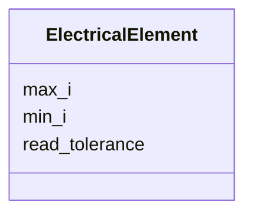

# Class: ElectricalElement 


_Power-supply electrical limits for a beamline element._


<div data-search-exclude markdown="1">


URI: [laura:ElectricalElement](https://w3id.org/laura/ElectricalElement)





<!-- no inheritance hierarchy -->

## Class Properties

| Property | Value |
| --- | --- |
| Class URI | [laura:ElectricalElement](https://w3id.org/laura/ElectricalElement) |


## Slots

| Name | Cardinality and Range | Description | Inheritance |
| ---  | --- | --- | --- |
| [min_i](min_i.md) | 0..1 <br/> [Float](Float.md) | Minimum current [A] | direct |
| [max_i](max_i.md) | 0..1 <br/> [Float](Float.md) | Maximum current [A] | direct |
| [read_tolerance](read_tolerance.md) | 0..1 <br/> [Float](Float.md) | Read-back vs | direct |


## Usages

| used by | used in | type | used |
| ---  | --- | --- | --- |
| [StandardElement](StandardElement.md) | [electrical](electrical.md) | range | [ElectricalElement](ElectricalElement.md) |
| [Element](Element.md) | [electrical](electrical.md) | range | [ElectricalElement](ElectricalElement.md) |
| [PhysicalAcceleratorElement](PhysicalAcceleratorElement.md) | [electrical](electrical.md) | range | [ElectricalElement](ElectricalElement.md) |
| [TwissMatch](TwissMatch.md) | [electrical](electrical.md) | range | [ElectricalElement](ElectricalElement.md) |
| [MatrixTransform](MatrixTransform.md) | [electrical](electrical.md) | range | [ElectricalElement](ElectricalElement.md) |
| [ElectrostaticSeparator](ElectrostaticSeparator.md) | [electrical](electrical.md) | range | [ElectricalElement](ElectricalElement.md) |
| [ACDipole](ACDipole.md) | [electrical](electrical.md) | range | [ElectricalElement](ElectricalElement.md) |
| [HorizontalACDipole](HorizontalACDipole.md) | [electrical](electrical.md) | range | [ElectricalElement](ElectricalElement.md) |
| [VerticalACDipole](VerticalACDipole.md) | [electrical](electrical.md) | range | [ElectricalElement](ElectricalElement.md) |
| [Wire](Wire.md) | [electrical](electrical.md) | range | [ElectricalElement](ElectricalElement.md) |
| [BeamBeam](BeamBeam.md) | [electrical](electrical.md) | range | [ElectricalElement](ElectricalElement.md) |
| [RFMultipole](RFMultipole.md) | [electrical](electrical.md) | range | [ElectricalElement](ElectricalElement.md) |
| [Stage](Stage.md) | [electrical](electrical.md) | range | [ElectricalElement](ElectricalElement.md) |
| [VacuumGauge](VacuumGauge.md) | [electrical](electrical.md) | range | [ElectricalElement](ElectricalElement.md) |
| [Laser](Laser.md) | [electrical](electrical.md) | range | [ElectricalElement](ElectricalElement.md) |
| [Shutter](Shutter.md) | [electrical](electrical.md) | range | [ElectricalElement](ElectricalElement.md) |
| [Valve](Valve.md) | [electrical](electrical.md) | range | [ElectricalElement](ElectricalElement.md) |
| [Marker](Marker.md) | [electrical](electrical.md) | range | [ElectricalElement](ElectricalElement.md) |
| [Aperture](Aperture.md) | [electrical](electrical.md) | range | [ElectricalElement](ElectricalElement.md) |
| [Collimator](Collimator.md) | [electrical](electrical.md) | range | [ElectricalElement](ElectricalElement.md) |
| [Drift](Drift.md) | [electrical](electrical.md) | range | [ElectricalElement](ElectricalElement.md) |
| [Lighting](Lighting.md) | [electrical](electrical.md) | range | [ElectricalElement](ElectricalElement.md) |
| [PowerSupply](PowerSupply.md) | [electrical](electrical.md) | range | [ElectricalElement](ElectricalElement.md) |
| [Magnet](Magnet.md) | [electrical](electrical.md) | range | [ElectricalElement](ElectricalElement.md) |
| [RFCavity](RFCavity.md) | [electrical](electrical.md) | range | [ElectricalElement](ElectricalElement.md) |
| [RFDeflectingCavity](RFDeflectingCavity.md) | [electrical](electrical.md) | range | [ElectricalElement](ElectricalElement.md) |
| [CrabCavity](CrabCavity.md) | [electrical](electrical.md) | range | [ElectricalElement](ElectricalElement.md) |
| [Wakefield](Wakefield.md) | [electrical](electrical.md) | range | [ElectricalElement](ElectricalElement.md) |
| [LowLevelRF](LowLevelRF.md) | [electrical](electrical.md) | range | [ElectricalElement](ElectricalElement.md) |
| [RFModulator](RFModulator.md) | [electrical](electrical.md) | range | [ElectricalElement](ElectricalElement.md) |
| [RFProtection](RFProtection.md) | [electrical](electrical.md) | range | [ElectricalElement](ElectricalElement.md) |
| [RFHeartbeat](RFHeartbeat.md) | [electrical](electrical.md) | range | [ElectricalElement](ElectricalElement.md) |
| [PID](PID.md) | [electrical](electrical.md) | range | [ElectricalElement](ElectricalElement.md) |
| [Diagnostic](Diagnostic.md) | [electrical](electrical.md) | range | [ElectricalElement](ElectricalElement.md) |
| [BeamPositionMonitor](BeamPositionMonitor.md) | [electrical](electrical.md) | range | [ElectricalElement](ElectricalElement.md) |
| [BeamArrivalMonitor](BeamArrivalMonitor.md) | [electrical](electrical.md) | range | [ElectricalElement](ElectricalElement.md) |
| [BunchLengthMonitor](BunchLengthMonitor.md) | [electrical](electrical.md) | range | [ElectricalElement](ElectricalElement.md) |
| [Camera](Camera.md) | [electrical](electrical.md) | range | [ElectricalElement](ElectricalElement.md) |
| [Screen](Screen.md) | [electrical](electrical.md) | range | [ElectricalElement](ElectricalElement.md) |
| [ChargeDiagnostic](ChargeDiagnostic.md) | [electrical](electrical.md) | range | [ElectricalElement](ElectricalElement.md) |
| [WallCurrentMonitor](WallCurrentMonitor.md) | [electrical](electrical.md) | range | [ElectricalElement](ElectricalElement.md) |
| [FaradayCupMonitor](FaradayCupMonitor.md) | [electrical](electrical.md) | range | [ElectricalElement](ElectricalElement.md) |
| [IntegratedCurrentTransformer](IntegratedCurrentTransformer.md) | [electrical](electrical.md) | range | [ElectricalElement](ElectricalElement.md) |
| [PhotonMonitor](PhotonMonitor.md) | [electrical](electrical.md) | range | [ElectricalElement](ElectricalElement.md) |
| [Plasma](Plasma.md) | [electrical](electrical.md) | range | [ElectricalElement](ElectricalElement.md) |
| [LaserEnergyMeter](LaserEnergyMeter.md) | [electrical](electrical.md) | range | [ElectricalElement](ElectricalElement.md) |
| [LaserHalfWavePlate](LaserHalfWavePlate.md) | [electrical](electrical.md) | range | [ElectricalElement](ElectricalElement.md) |
| [LaserMirror](LaserMirror.md) | [electrical](electrical.md) | range | [ElectricalElement](ElectricalElement.md) |
| [LaserAttenuator](LaserAttenuator.md) | [electrical](electrical.md) | range | [ElectricalElement](ElectricalElement.md) |
| [Dipole](Dipole.md) | [electrical](electrical.md) | range | [ElectricalElement](ElectricalElement.md) |
| [Quadrupole](Quadrupole.md) | [electrical](electrical.md) | range | [ElectricalElement](ElectricalElement.md) |
| [Sextupole](Sextupole.md) | [electrical](electrical.md) | range | [ElectricalElement](ElectricalElement.md) |
| [Octupole](Octupole.md) | [electrical](electrical.md) | range | [ElectricalElement](ElectricalElement.md) |
| [HorizontalCorrector](HorizontalCorrector.md) | [electrical](electrical.md) | range | [ElectricalElement](ElectricalElement.md) |
| [VerticalCorrector](VerticalCorrector.md) | [electrical](electrical.md) | range | [ElectricalElement](ElectricalElement.md) |
| [CombinedCorrector](CombinedCorrector.md) | [electrical](electrical.md) | range | [ElectricalElement](ElectricalElement.md) |
| [Solenoid](Solenoid.md) | [electrical](electrical.md) | range | [ElectricalElement](ElectricalElement.md) |
| [CombinedSolenoidQuadrupole](CombinedSolenoidQuadrupole.md) | [electrical](electrical.md) | range | [ElectricalElement](ElectricalElement.md) |
| [Wiggler](Wiggler.md) | [electrical](electrical.md) | range | [ElectricalElement](ElectricalElement.md) |
| [NonLinearLens](NonLinearLens.md) | [electrical](electrical.md) | range | [ElectricalElement](ElectricalElement.md) |


## Identifier and Mapping Information


### Schema Source


* from schema: https://w3id.org/laura/schema


## Mappings

| Mapping Type | Mapped Value |
| ---  | ---  |
| self | laura:ElectricalElement |
| native | laura:ElectricalElement |


## LinkML Source

<!-- TODO: investigate https://stackoverflow.com/questions/37606292/how-to-create-tabbed-code-blocks-in-mkdocs-or-sphinx -->

### Direct

<details>
```yaml
name: ElectricalElement
description: Power-supply electrical limits for a beamline element.
from_schema: https://w3id.org/laura/schema
attributes:
  min_i:
    name: min_i
    description: Minimum current [A].
    from_schema: https://w3id.org/laura/schema
    aliases:
    - minI
    rank: 1000
    ifabsent: float(0)
    domain_of:
    - ElectricalElement
    range: float
    unit:
      ucum_code: A
  max_i:
    name: max_i
    description: Maximum current [A].
    from_schema: https://w3id.org/laura/schema
    aliases:
    - maxI
    rank: 1000
    ifabsent: float(0)
    domain_of:
    - ElectricalElement
    range: float
    unit:
      ucum_code: A
  read_tolerance:
    name: read_tolerance
    description: Read-back vs. set-point tolerance fraction (default 0.1 = 10 %).
    from_schema: https://w3id.org/laura/schema
    aliases:
    - ri_tolerance
    rank: 1000
    ifabsent: float(0.1)
    domain_of:
    - ElectricalElement
    range: float
class_uri: laura:ElectricalElement

```
</details>

### Induced

<details>
```yaml
name: ElectricalElement
description: Power-supply electrical limits for a beamline element.
from_schema: https://w3id.org/laura/schema
attributes:
  min_i:
    name: min_i
    description: Minimum current [A].
    from_schema: https://w3id.org/laura/schema
    aliases:
    - minI
    rank: 1000
    ifabsent: float(0)
    owner: ElectricalElement
    domain_of:
    - ElectricalElement
    range: float
    unit:
      ucum_code: A
  max_i:
    name: max_i
    description: Maximum current [A].
    from_schema: https://w3id.org/laura/schema
    aliases:
    - maxI
    rank: 1000
    ifabsent: float(0)
    owner: ElectricalElement
    domain_of:
    - ElectricalElement
    range: float
    unit:
      ucum_code: A
  read_tolerance:
    name: read_tolerance
    description: Read-back vs. set-point tolerance fraction (default 0.1 = 10 %).
    from_schema: https://w3id.org/laura/schema
    aliases:
    - ri_tolerance
    rank: 1000
    ifabsent: float(0.1)
    owner: ElectricalElement
    domain_of:
    - ElectricalElement
    range: float
class_uri: laura:ElectricalElement

```
</details></div>