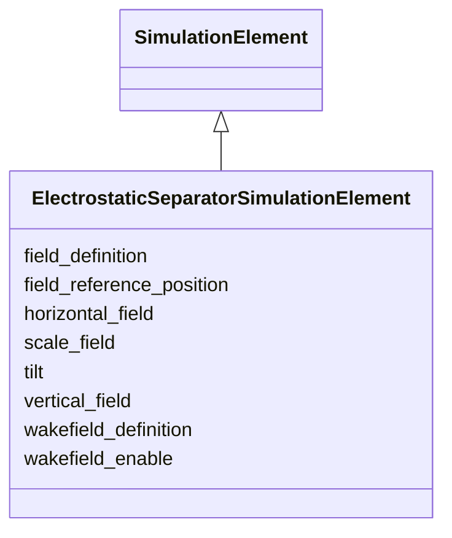

# Class: ElectrostaticSeparatorSimulationElement 


_Simulation attributes for a static electrostatic separator._


<div data-search-exclude markdown="1">


URI: [laura:ElectrostaticSeparatorSimulationElement](https://w3id.org/laura/ElectrostaticSeparatorSimulationElement)





## Inheritance
* [SimulationElement](SimulationElement.md)
    * **ElectrostaticSeparatorSimulationElement**


## Class Properties

| Property | Value |
| --- | --- |
| Class URI | [laura:ElectrostaticSeparatorSimulationElement](https://w3id.org/laura/ElectrostaticSeparatorSimulationElement) |


## Slots

| Name | Cardinality and Range | Description | Inheritance |
| ---  | --- | --- | --- |
| [horizontal_field](horizontal_field.md) | 0..1 <br/> [Float](Float.md)&nbsp;or&nbsp;<br />[String](String.md) | Horizontal deflecting electric field [V/m] | direct |
| [vertical_field](vertical_field.md) | 0..1 <br/> [Float](Float.md)&nbsp;or&nbsp;<br />[String](String.md) | Vertical deflecting electric field [V/m] | direct |
| [tilt](tilt.md) | 0..1 <br/> [Float](Float.md) | Rotation about the beam axis [rad] | direct |
| [field_definition](field_definition.md) | 0..1 <br/> [String](String.md) | Path to the 3-D field-map file | [SimulationElement](SimulationElement.md) |
| [wakefield_definition](wakefield_definition.md) | 0..1 <br/> [String](String.md) | Path to the wakefield impedance file | [SimulationElement](SimulationElement.md) |
| [wakefield_enable](wakefield_enable.md) | 0..1 <br/> [Boolean](Boolean.md) | Whether the wakefield named by wakefield_definition is applied | [SimulationElement](SimulationElement.md) |
| [field_reference_position](field_reference_position.md) | 0..1 <br/> [String](String.md) | Longitudinal origin of the field map [m] | [SimulationElement](SimulationElement.md) |
| [scale_field](scale_field.md) | 0..1 <br/> [Float](Float.md) | Multiplicative scale factor applied to the field map | [SimulationElement](SimulationElement.md) |


## Usages

| used by | used in | type | used |
| ---  | --- | --- | --- |
| [ElectrostaticSeparator](ElectrostaticSeparator.md) | [simulation](simulation.md) | range | [ElectrostaticSeparatorSimulationElement](ElectrostaticSeparatorSimulationElement.md) |


## Identifier and Mapping Information


### Schema Source


* from schema: https://w3id.org/laura/schema


## Mappings

| Mapping Type | Mapped Value |
| ---  | ---  |
| self | laura:ElectrostaticSeparatorSimulationElement |
| native | laura:ElectrostaticSeparatorSimulationElement |


## LinkML Source

<!-- TODO: investigate https://stackoverflow.com/questions/37606292/how-to-create-tabbed-code-blocks-in-mkdocs-or-sphinx -->

### Direct

<details>
```yaml
name: ElectrostaticSeparatorSimulationElement
description: Simulation attributes for a static electrostatic separator.
from_schema: https://w3id.org/laura/schema
is_a: SimulationElement
attributes:
  horizontal_field:
    name: horizontal_field
    description: Horizontal deflecting electric field [V/m].
    in_subset:
    - functional_parameters
    from_schema: https://w3id.org/laura/schema/simulation
    rank: 1000
    ifabsent: float(0.0)
    domain_of:
    - ElectrostaticSeparatorSimulationElement
    range: float
    unit:
      ucum_code: V/m
    any_of:
    - range: float
    - range: string
  vertical_field:
    name: vertical_field
    description: Vertical deflecting electric field [V/m].
    in_subset:
    - functional_parameters
    from_schema: https://w3id.org/laura/schema/simulation
    rank: 1000
    ifabsent: float(0.0)
    domain_of:
    - ElectrostaticSeparatorSimulationElement
    range: float
    unit:
      ucum_code: V/m
    any_of:
    - range: float
    - range: string
  tilt:
    name: tilt
    description: Rotation about the beam axis [rad].
    from_schema: https://w3id.org/laura/schema/simulation
    rank: 1000
    ifabsent: float(0.0)
    domain_of:
    - ElectrostaticSeparatorSimulationElement
    - MagneticElement
    - Corrector_Magnet
    - Solenoid_Magnet
    - Wiggler_Magnet
    - NonLinearLens_Magnet
    range: float
    unit:
      ucum_code: rad
class_uri: laura:ElectrostaticSeparatorSimulationElement

```
</details>

### Induced

<details>
```yaml
name: ElectrostaticSeparatorSimulationElement
description: Simulation attributes for a static electrostatic separator.
from_schema: https://w3id.org/laura/schema
is_a: SimulationElement
attributes:
  horizontal_field:
    name: horizontal_field
    description: Horizontal deflecting electric field [V/m].
    in_subset:
    - functional_parameters
    from_schema: https://w3id.org/laura/schema/simulation
    rank: 1000
    ifabsent: float(0.0)
    owner: ElectrostaticSeparatorSimulationElement
    domain_of:
    - ElectrostaticSeparatorSimulationElement
    range: float
    unit:
      ucum_code: V/m
    any_of:
    - range: float
    - range: string
  vertical_field:
    name: vertical_field
    description: Vertical deflecting electric field [V/m].
    in_subset:
    - functional_parameters
    from_schema: https://w3id.org/laura/schema/simulation
    rank: 1000
    ifabsent: float(0.0)
    owner: ElectrostaticSeparatorSimulationElement
    domain_of:
    - ElectrostaticSeparatorSimulationElement
    range: float
    unit:
      ucum_code: V/m
    any_of:
    - range: float
    - range: string
  tilt:
    name: tilt
    description: Rotation about the beam axis [rad].
    from_schema: https://w3id.org/laura/schema/simulation
    rank: 1000
    ifabsent: float(0.0)
    owner: ElectrostaticSeparatorSimulationElement
    domain_of:
    - ElectrostaticSeparatorSimulationElement
    - MagneticElement
    - Corrector_Magnet
    - Solenoid_Magnet
    - Wiggler_Magnet
    - NonLinearLens_Magnet
    range: float
    unit:
      ucum_code: rad
  field_definition:
    name: field_definition
    description: Path to the 3-D field-map file.
    from_schema: https://w3id.org/laura/schema/simulation
    rank: 1000
    owner: ElectrostaticSeparatorSimulationElement
    domain_of:
    - SimulationElement
    range: string
  wakefield_definition:
    name: wakefield_definition
    description: Path to the wakefield impedance file.
    from_schema: https://w3id.org/laura/schema/simulation
    rank: 1000
    owner: ElectrostaticSeparatorSimulationElement
    domain_of:
    - SimulationElement
    range: string
  wakefield_enable:
    name: wakefield_enable
    description: Whether the wakefield named by wakefield_definition is applied. Set
      false to track the element without its wakefield while keeping the definition
      itself.
    from_schema: https://w3id.org/laura/schema/simulation
    rank: 1000
    ifabsent: 'true'
    owner: ElectrostaticSeparatorSimulationElement
    domain_of:
    - SimulationElement
    range: boolean
  field_reference_position:
    name: field_reference_position
    description: Longitudinal origin of the field map [m].
    from_schema: https://w3id.org/laura/schema/simulation
    rank: 1000
    owner: ElectrostaticSeparatorSimulationElement
    domain_of:
    - SimulationElement
    range: string
  scale_field:
    name: scale_field
    description: Multiplicative scale factor applied to the field map.
    from_schema: https://w3id.org/laura/schema/simulation
    rank: 1000
    ifabsent: float(1)
    owner: ElectrostaticSeparatorSimulationElement
    domain_of:
    - SimulationElement
    range: float
class_uri: laura:ElectrostaticSeparatorSimulationElement

```
</details></div>