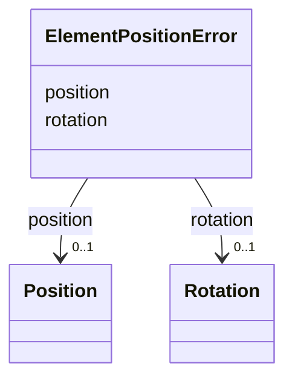

# Class: ElementPositionError 


_Alignment position and rotation errors for a physically-located element._


<div data-search-exclude markdown="1">


URI: [laura:ElementPositionError](https://w3id.org/laura/ElementPositionError)





<!-- no inheritance hierarchy -->

## Class Properties

| Property | Value |
| --- | --- |
| Class URI | [laura:ElementPositionError](https://w3id.org/laura/ElementPositionError) |


## Slots

| Name | Cardinality and Range | Description | Inheritance |
| ---  | --- | --- | --- |
| [position](position.md) | 0..1 <br/> [Position](Position.md) | Positional misalignment error [m] | direct |
| [rotation](rotation.md) | 0..1 <br/> [Rotation](Rotation.md) | Angular misalignment error [rad] | direct |


## Usages

| used by | used in | type | used |
| ---  | --- | --- | --- |
| [PhysicalElement](PhysicalElement.md) | [error](error.md) | range | [ElementPositionError](ElementPositionError.md) |


## Identifier and Mapping Information


### Schema Source


* from schema: https://w3id.org/laura/schema


## Mappings

| Mapping Type | Mapped Value |
| ---  | ---  |
| self | laura:ElementPositionError |
| native | laura:ElementPositionError |


## LinkML Source

<!-- TODO: investigate https://stackoverflow.com/questions/37606292/how-to-create-tabbed-code-blocks-in-mkdocs-or-sphinx -->

### Direct

<details>
```yaml
name: ElementPositionError
description: Alignment position and rotation errors for a physically-located element.
from_schema: https://w3id.org/laura/schema
attributes:
  position:
    name: position
    description: Positional misalignment error [m].
    from_schema: https://w3id.org/laura/schema/geometry
    rank: 1000
    domain_of:
    - ElementPositionError
    - ElementSurvey
    range: Position
  rotation:
    name: rotation
    description: Angular misalignment error [rad].
    from_schema: https://w3id.org/laura/schema/geometry
    rank: 1000
    domain_of:
    - ElementPositionError
    - ElementSurvey
    - PhysicalElement
    - CameraDiagnosticElement
    range: Rotation
class_uri: laura:ElementPositionError

```
</details>

### Induced

<details>
```yaml
name: ElementPositionError
description: Alignment position and rotation errors for a physically-located element.
from_schema: https://w3id.org/laura/schema
attributes:
  position:
    name: position
    description: Positional misalignment error [m].
    from_schema: https://w3id.org/laura/schema/geometry
    rank: 1000
    owner: ElementPositionError
    domain_of:
    - ElementPositionError
    - ElementSurvey
    range: Position
  rotation:
    name: rotation
    description: Angular misalignment error [rad].
    from_schema: https://w3id.org/laura/schema/geometry
    rank: 1000
    owner: ElementPositionError
    domain_of:
    - ElementPositionError
    - ElementSurvey
    - PhysicalElement
    - CameraDiagnosticElement
    range: Rotation
class_uri: laura:ElementPositionError

```
</details></div>