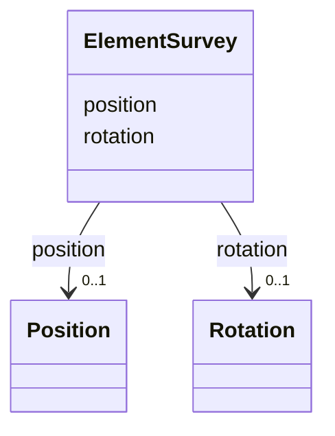

---
search:
  boost: 10.0
---

# Class: ElementSurvey 


_Survey-measured position and rotation of an element. Structure is identical to ElementPositionError._


<div data-search-exclude markdown="1">


URI: [laura:ElementSurvey](https://w3id.org/laura/ElementSurvey)





<!-- no inheritance hierarchy -->

## Class Properties

| Property | Value |
| --- | --- |
| Class URI | [laura:ElementSurvey](https://w3id.org/laura/ElementSurvey) |


## Slots

| Name | Cardinality and Range | Description | Inheritance |
| ---  | --- | --- | --- |
| [position](position.md) | 0..1 <br/> [Position](Position.md) | Surveyed position | direct |
| [rotation](rotation.md) | 0..1 <br/> [Rotation](Rotation.md) | Surveyed rotation | direct |


## Usages

| used by | used in | type | used |
| ---  | --- | --- | --- |
| [PhysicalElement](PhysicalElement.md) | [survey](survey.md) | range | [ElementSurvey](ElementSurvey.md) |


## Identifier and Mapping Information


### Schema Source


* from schema: https://w3id.org/laura/schema


## Mappings

| Mapping Type | Mapped Value |
| ---  | ---  |
| self | laura:ElementSurvey |
| native | laura:ElementSurvey |


## LinkML Source

<!-- TODO: investigate https://stackoverflow.com/questions/37606292/how-to-create-tabbed-code-blocks-in-mkdocs-or-sphinx -->

### Direct

<details>
```yaml
name: ElementSurvey
description: Survey-measured position and rotation of an element. Structure is identical
  to ElementPositionError.
from_schema: https://w3id.org/laura/schema
attributes:
  position:
    name: position
    description: Surveyed position.
    from_schema: https://w3id.org/laura/schema
    domain_of:
    - ElementPositionError
    - ElementSurvey
    range: Position
  rotation:
    name: rotation
    description: Surveyed rotation.
    from_schema: https://w3id.org/laura/schema
    domain_of:
    - ElementPositionError
    - ElementSurvey
    - PhysicalElement
    - CameraDiagnosticElement
    range: Rotation
class_uri: laura:ElementSurvey

```
</details>

### Induced

<details>
```yaml
name: ElementSurvey
description: Survey-measured position and rotation of an element. Structure is identical
  to ElementPositionError.
from_schema: https://w3id.org/laura/schema
attributes:
  position:
    name: position
    description: Surveyed position.
    from_schema: https://w3id.org/laura/schema
    owner: ElementSurvey
    domain_of:
    - ElementPositionError
    - ElementSurvey
    range: Position
  rotation:
    name: rotation
    description: Surveyed rotation.
    from_schema: https://w3id.org/laura/schema
    owner: ElementSurvey
    domain_of:
    - ElementPositionError
    - ElementSurvey
    - PhysicalElement
    - CameraDiagnosticElement
    range: Rotation
class_uri: laura:ElementSurvey

```
</details></div>