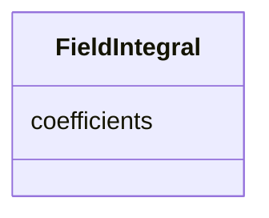

# Class: FieldIntegral 


_Polynomial fit of integrated field strength as a function of magnet current._


<div data-search-exclude markdown="1">


URI: [laura:FieldIntegral](https://w3id.org/laura/FieldIntegral)





<!-- no inheritance hierarchy -->

## Class Properties

| Property | Value |
| --- | --- |
| Class URI | [laura:FieldIntegral](https://w3id.org/laura/FieldIntegral) |


## Slots

| Name | Cardinality and Range | Description | Inheritance |
| ---  | --- | --- | --- |
| [coefficients](coefficients.md) | * <br/> [Double](Double.md) | Polynomial coefficients ordered from lowest to highest degree: ``FieldIntegra... | direct |


## Usages

| used by | used in | type | used |
| ---  | --- | --- | --- |
| [MagneticElement](MagneticElement.md) | [field_integral_coefficients](field_integral_coefficients.md) | range | [FieldIntegral](FieldIntegral.md) |
| [DipoleMagnet](DipoleMagnet.md) | [field_integral_coefficients](field_integral_coefficients.md) | range | [FieldIntegral](FieldIntegral.md) |
| [QuadrupoleMagnet](QuadrupoleMagnet.md) | [field_integral_coefficients](field_integral_coefficients.md) | range | [FieldIntegral](FieldIntegral.md) |
| [SextupoleMagnet](SextupoleMagnet.md) | [field_integral_coefficients](field_integral_coefficients.md) | range | [FieldIntegral](FieldIntegral.md) |
| [OctupoleMagnet](OctupoleMagnet.md) | [field_integral_coefficients](field_integral_coefficients.md) | range | [FieldIntegral](FieldIntegral.md) |
| [SolenoidMagnet](SolenoidMagnet.md) | [field_integral_coefficients](field_integral_coefficients.md) | range | [FieldIntegral](FieldIntegral.md) |


## Identifier and Mapping Information


### Schema Source


* from schema: https://w3id.org/laura/schema


## Mappings

| Mapping Type | Mapped Value |
| ---  | ---  |
| self | laura:FieldIntegral |
| native | laura:FieldIntegral |


## LinkML Source

<!-- TODO: investigate https://stackoverflow.com/questions/37606292/how-to-create-tabbed-code-blocks-in-mkdocs-or-sphinx -->

### Direct

<details>
```yaml
name: FieldIntegral
description: Polynomial fit of integrated field strength as a function of magnet current.
from_schema: https://w3id.org/laura/schema
attributes:
  coefficients:
    name: coefficients
    description: 'Polynomial coefficients ordered from lowest to highest degree: ``FieldIntegral
      = sum c_n . I^n``.'
    from_schema: https://w3id.org/laura/schema/magnetic
    rank: 1000
    domain_of:
    - FieldIntegral
    range: double
    multivalued: true
class_uri: laura:FieldIntegral

```
</details>

### Induced

<details>
```yaml
name: FieldIntegral
description: Polynomial fit of integrated field strength as a function of magnet current.
from_schema: https://w3id.org/laura/schema
attributes:
  coefficients:
    name: coefficients
    description: 'Polynomial coefficients ordered from lowest to highest degree: ``FieldIntegral
      = sum c_n . I^n``.'
    from_schema: https://w3id.org/laura/schema/magnetic
    rank: 1000
    owner: FieldIntegral
    domain_of:
    - FieldIntegral
    range: double
    multivalued: true
class_uri: laura:FieldIntegral

```
</details></div>