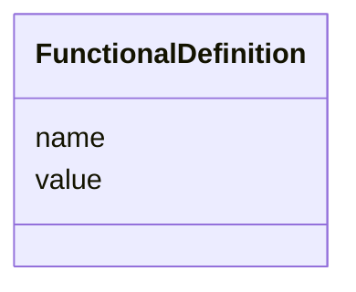

# Class: FunctionalDefinition 


_One named constant a lattice makes available to its elements, e.g. ``quad1_k1l: -2``.  A class rather than a bare map because LinkML has no free-form mapping type; the same keyed-inlined pattern as ControlVariable._


<div data-search-exclude markdown="1">


URI: [laura:FunctionalDefinition](https://w3id.org/laura/FunctionalDefinition)





<!-- no inheritance hierarchy -->

## Class Properties

| Property | Value |
| --- | --- |
| Class URI | [laura:FunctionalDefinition](https://w3id.org/laura/FunctionalDefinition) |


## Slots

| Name | Cardinality and Range | Description | Inheritance |
| ---  | --- | --- | --- |
| [name](name.md) | 1 <br/> [String](String.md) | The name elements refer to this definition by | direct |
| [value](value.md) | 1 <br/> [Double](Double.md) | The number it resolves to | direct |


## Usages

| used by | used in | type | used |
| ---  | --- | --- | --- |
| [SectionLattice](SectionLattice.md) | [functional_definitions](functional_definitions.md) | range | [FunctionalDefinition](FunctionalDefinition.md) |
| [MachineLayout](MachineLayout.md) | [functional_definitions](functional_definitions.md) | range | [FunctionalDefinition](FunctionalDefinition.md) |


## Identifier and Mapping Information


### Schema Source


* from schema: https://w3id.org/laura/schema


## Mappings

| Mapping Type | Mapped Value |
| ---  | ---  |
| self | laura:FunctionalDefinition |
| native | laura:FunctionalDefinition |


## LinkML Source

<!-- TODO: investigate https://stackoverflow.com/questions/37606292/how-to-create-tabbed-code-blocks-in-mkdocs-or-sphinx -->

### Direct

<details>
```yaml
name: FunctionalDefinition
description: 'One named constant a lattice makes available to its elements, e.g. ``quad1_k1l:
  -2``.  A class rather than a bare map because LinkML has no free-form mapping type;
  the same keyed-inlined pattern as ControlVariable.'
from_schema: https://w3id.org/laura/schema
attributes:
  name:
    name: name
    description: The name elements refer to this definition by.
    from_schema: https://w3id.org/laura/schema/machine
    key: true
    domain_of:
    - AcceleratorElement
    - ControlVariable
    - FunctionalDefinition
    - SectionLattice
    - MachineLayout
    range: string
  value:
    name: value
    description: The number it resolves to.  The Python model accepts int or float
      and stores whichever was given; both go out as a double.
    from_schema: https://w3id.org/laura/schema/machine
    domain_of:
    - ControlVariable
    - FunctionalDefinition
    range: double
    required: true
class_uri: laura:FunctionalDefinition

```
</details>

### Induced

<details>
```yaml
name: FunctionalDefinition
description: 'One named constant a lattice makes available to its elements, e.g. ``quad1_k1l:
  -2``.  A class rather than a bare map because LinkML has no free-form mapping type;
  the same keyed-inlined pattern as ControlVariable.'
from_schema: https://w3id.org/laura/schema
attributes:
  name:
    name: name
    description: The name elements refer to this definition by.
    from_schema: https://w3id.org/laura/schema/machine
    key: true
    owner: FunctionalDefinition
    domain_of:
    - AcceleratorElement
    - ControlVariable
    - FunctionalDefinition
    - SectionLattice
    - MachineLayout
    range: string
    required: true
  value:
    name: value
    description: The number it resolves to.  The Python model accepts int or float
      and stores whichever was given; both go out as a double.
    from_schema: https://w3id.org/laura/schema/machine
    owner: FunctionalDefinition
    domain_of:
    - ControlVariable
    - FunctionalDefinition
    range: double
    required: true
class_uri: laura:FunctionalDefinition

```
</details></div>