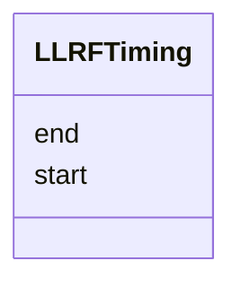

# Class: LLRFTiming 


_Start/end window timing definition._


<div data-search-exclude markdown="1">


URI: [laura:LLRFTiming](https://w3id.org/laura/LLRFTiming)





<!-- no inheritance hierarchy -->

## Class Properties

| Property | Value |
| --- | --- |
| Class URI | [laura:LLRFTiming](https://w3id.org/laura/LLRFTiming) |


## Slots

| Name | Cardinality and Range | Description | Inheritance |
| ---  | --- | --- | --- |
| [start](start.md) | 0..1 <br/> [Float](Float.md) | Start time | direct |
| [end](end.md) | 0..1 <br/> [Float](Float.md) | End time | direct |


## Usages

| used by | used in | type | used |
| ---  | --- | --- | --- |
| [LLRFTimings](LLRFTimings.md) | [klystron_forward](klystron_forward.md) | range | [LLRFTiming](LLRFTiming.md) |
| [LLRFTimings](LLRFTimings.md) | [klystron_reverse](klystron_reverse.md) | range | [LLRFTiming](LLRFTiming.md) |
| [LLRFTimings](LLRFTimings.md) | [cavity_forward](cavity_forward.md) | range | [LLRFTiming](LLRFTiming.md) |
| [LLRFTimings](LLRFTimings.md) | [cavity_reverse](cavity_reverse.md) | range | [LLRFTiming](LLRFTiming.md) |
| [LLRFTimings](LLRFTimings.md) | [cavity_probe](cavity_probe.md) | range | [LLRFTiming](LLRFTiming.md) |


## Identifier and Mapping Information


### Schema Source


* from schema: https://w3id.org/laura/schema


## Mappings

| Mapping Type | Mapped Value |
| ---  | ---  |
| self | laura:LLRFTiming |
| native | laura:LLRFTiming |


## LinkML Source

<!-- TODO: investigate https://stackoverflow.com/questions/37606292/how-to-create-tabbed-code-blocks-in-mkdocs-or-sphinx -->

### Direct

<details>
```yaml
name: LLRFTiming
description: Start/end window timing definition.
from_schema: https://w3id.org/laura/schema
attributes:
  start:
    name: start
    description: Start time.
    from_schema: https://w3id.org/laura/schema/rf
    rank: 1000
    domain_of:
    - LLRFTiming
    range: float
  end:
    name: end
    description: End time.
    from_schema: https://w3id.org/laura/schema/rf
    rank: 1000
    domain_of:
    - LLRFTiming
    range: float
class_uri: laura:LLRFTiming

```
</details>

### Induced

<details>
```yaml
name: LLRFTiming
description: Start/end window timing definition.
from_schema: https://w3id.org/laura/schema
attributes:
  start:
    name: start
    description: Start time.
    from_schema: https://w3id.org/laura/schema/rf
    rank: 1000
    owner: LLRFTiming
    domain_of:
    - LLRFTiming
    range: float
  end:
    name: end
    description: End time.
    from_schema: https://w3id.org/laura/schema/rf
    rank: 1000
    owner: LLRFTiming
    domain_of:
    - LLRFTiming
    range: float
class_uri: laura:LLRFTiming

```
</details></div>