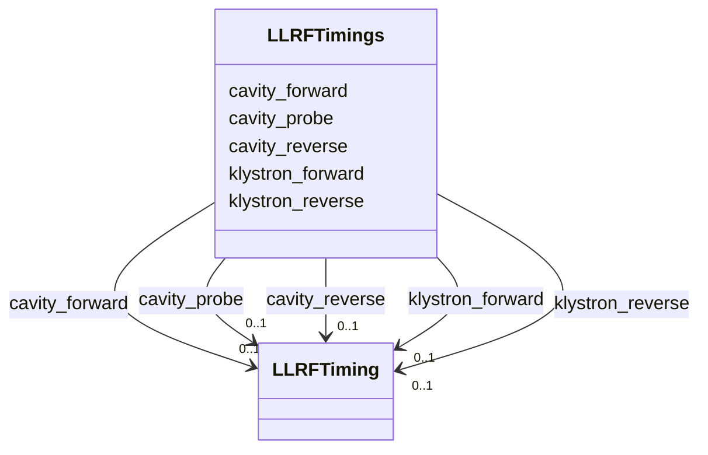

---
search:
  boost: 10.0
---

# Class: LLRFTimings 


_Collection of timing windows for key LLRF channels._


<div data-search-exclude markdown="1">


URI: [laura:LLRFTimings](https://w3id.org/laura/LLRFTimings)





<!-- no inheritance hierarchy -->

## Class Properties

| Property | Value |
| --- | --- |
| Class URI | [laura:LLRFTimings](https://w3id.org/laura/LLRFTimings) |


## Slots

| Name | Cardinality and Range | Description | Inheritance |
| ---  | --- | --- | --- |
| [klystron_forward](klystron_forward.md) | 0..1 <br/> [LLRFTiming](LLRFTiming.md) | Timing for klystron forward power | direct |
| [klystron_reverse](klystron_reverse.md) | 0..1 <br/> [LLRFTiming](LLRFTiming.md) | Timing for klystron reverse power | direct |
| [cavity_forward](cavity_forward.md) | 0..1 <br/> [LLRFTiming](LLRFTiming.md) | Timing for cavity forward power | direct |
| [cavity_reverse](cavity_reverse.md) | 0..1 <br/> [LLRFTiming](LLRFTiming.md) | Timing for cavity reverse power | direct |
| [cavity_probe](cavity_probe.md) | 0..1 <br/> [LLRFTiming](LLRFTiming.md) | Timing for cavity probe | direct |


## Usages

| used by | used in | type | used |
| ---  | --- | --- | --- |
| [LowLevelRFElement](LowLevelRFElement.md) | [timings](timings.md) | range | [LLRFTimings](LLRFTimings.md) |


## Identifier and Mapping Information


### Schema Source


* from schema: https://w3id.org/laura/schema


## Mappings

| Mapping Type | Mapped Value |
| ---  | ---  |
| self | laura:LLRFTimings |
| native | laura:LLRFTimings |


## LinkML Source

<!-- TODO: investigate https://stackoverflow.com/questions/37606292/how-to-create-tabbed-code-blocks-in-mkdocs-or-sphinx -->

### Direct

<details>
```yaml
name: LLRFTimings
description: Collection of timing windows for key LLRF channels.
from_schema: https://w3id.org/laura/schema
attributes:
  klystron_forward:
    name: klystron_forward
    description: Timing for klystron forward power.
    from_schema: https://w3id.org/laura/schema
    rank: 1000
    domain_of:
    - LLRFTimings
    range: LLRFTiming
  klystron_reverse:
    name: klystron_reverse
    description: Timing for klystron reverse power.
    from_schema: https://w3id.org/laura/schema
    rank: 1000
    domain_of:
    - LLRFTimings
    range: LLRFTiming
  cavity_forward:
    name: cavity_forward
    description: Timing for cavity forward power.
    from_schema: https://w3id.org/laura/schema
    rank: 1000
    domain_of:
    - LLRFTimings
    range: LLRFTiming
  cavity_reverse:
    name: cavity_reverse
    description: Timing for cavity reverse power.
    from_schema: https://w3id.org/laura/schema
    rank: 1000
    domain_of:
    - LLRFTimings
    range: LLRFTiming
  cavity_probe:
    name: cavity_probe
    description: Timing for cavity probe.
    from_schema: https://w3id.org/laura/schema
    rank: 1000
    domain_of:
    - LLRFTimings
    range: LLRFTiming
class_uri: laura:LLRFTimings

```
</details>

### Induced

<details>
```yaml
name: LLRFTimings
description: Collection of timing windows for key LLRF channels.
from_schema: https://w3id.org/laura/schema
attributes:
  klystron_forward:
    name: klystron_forward
    description: Timing for klystron forward power.
    from_schema: https://w3id.org/laura/schema
    rank: 1000
    owner: LLRFTimings
    domain_of:
    - LLRFTimings
    range: LLRFTiming
  klystron_reverse:
    name: klystron_reverse
    description: Timing for klystron reverse power.
    from_schema: https://w3id.org/laura/schema
    rank: 1000
    owner: LLRFTimings
    domain_of:
    - LLRFTimings
    range: LLRFTiming
  cavity_forward:
    name: cavity_forward
    description: Timing for cavity forward power.
    from_schema: https://w3id.org/laura/schema
    rank: 1000
    owner: LLRFTimings
    domain_of:
    - LLRFTimings
    range: LLRFTiming
  cavity_reverse:
    name: cavity_reverse
    description: Timing for cavity reverse power.
    from_schema: https://w3id.org/laura/schema
    rank: 1000
    owner: LLRFTimings
    domain_of:
    - LLRFTimings
    range: LLRFTiming
  cavity_probe:
    name: cavity_probe
    description: Timing for cavity probe.
    from_schema: https://w3id.org/laura/schema
    rank: 1000
    owner: LLRFTimings
    domain_of:
    - LLRFTimings
    range: LLRFTiming
class_uri: laura:LLRFTimings

```
</details></div>