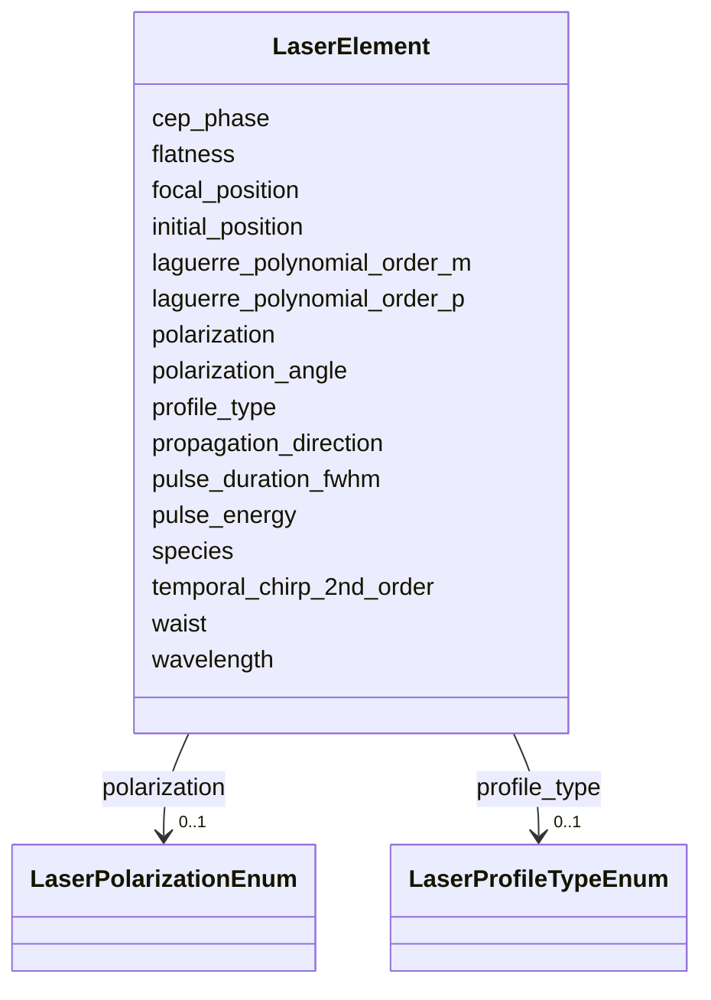

# Class: LaserElement 


_Laser-beam parameters (wavelength, pulse energy, profile, etc.) for a laser element or laser-driven plasma stage._


<div data-search-exclude markdown="1">


URI: [laura:LaserElement](https://w3id.org/laura/LaserElement)





<!-- no inheritance hierarchy -->

## Class Properties

| Property | Value |
| --- | --- |
| Class URI | [laura:LaserElement](https://w3id.org/laura/LaserElement) |


## Slots

| Name | Cardinality and Range | Description | Inheritance |
| ---  | --- | --- | --- |
| [initial_position](initial_position.md) | 0..1 <br/> [Float](Float.md) | Initial longitudinal position of the laser pulse [m] | direct |
| [waist](waist.md) | 0..1 <br/> [Float](Float.md) | Laser beam waist (1/e^2 radius) [m] | direct |
| [wavelength](wavelength.md) | 0..1 <br/> [Float](Float.md) | Laser wavelength [m] | direct |
| [pulse_energy](pulse_energy.md) | 0..1 <br/> [Float](Float.md) | Laser pulse energy [J] | direct |
| [pulse_duration_fwhm](pulse_duration_fwhm.md) | 0..1 <br/> [Float](Float.md) | Pulse duration at FWHM [s] | direct |
| [focal_position](focal_position.md) | 0..1 <br/> [Float](Float.md) | Focal (waist) position along the propagation axis [m] | direct |
| [cep_phase](cep_phase.md) | 0..1 <br/> [Float](Float.md) | Carrier-envelope phase [rad] | direct |
| [polarization](polarization.md) | 0..1 <br/> [LaserPolarizationEnum](LaserPolarizationEnum.md) | Laser polarization state | direct |
| [profile_type](profile_type.md) | 0..1 <br/> [LaserProfileTypeEnum](LaserProfileTypeEnum.md) | Transverse intensity profile model | direct |
| [laguerre_polynomial_order_p](laguerre_polynomial_order_p.md) | 0..1 <br/> [Integer](Integer.md) | Radial Laguerre-Gaussian mode index p (for ``profile_type = laguerre-gaussian... | direct |
| [laguerre_polynomial_order_m](laguerre_polynomial_order_m.md) | 0..1 <br/> [Integer](Integer.md) | Azimuthal order of Laguerre-Gaussian polynomial mode (for ``profile_type = la... | direct |
| [flatness](flatness.md) | 0..1 <br/> [Integer](Integer.md) | Flatness order N of a flattened-Gaussian profile (for ``profile_type = flatte... | direct |
| [propagation_direction](propagation_direction.md) | 0..1 <br/> [Integer](Integer.md) | Laser propagation direction; +1 means laser  and particles co-propagate, -1 m... | direct |
| [polarization_angle](polarization_angle.md) | 0..1 <br/> [Float](Float.md) | Laser polarization angle with respect to the x-axis | direct |
| [temporal_chirp_2nd_order](temporal_chirp_2nd_order.md) | 0..1 <br/> [Float](Float.md) | The amount of temporal chirp, at focus (in the lab frame) | direct |
| [species](species.md) | 0..1 <br/> [String](String.md) | The laser is either added directly to the interpolation grid initially (direc... | direct |


## Usages

| used by | used in | type | used |
| ---  | --- | --- | --- |
| [Laser](Laser.md) | [laser](laser.md) | range | [LaserElement](LaserElement.md) |
| [Plasma](Plasma.md) | [laser](laser.md) | range | [LaserElement](LaserElement.md) |
| [Wiggler](Wiggler.md) | [laser](laser.md) | range | [LaserElement](LaserElement.md) |


## In Subsets


* [LaserProperties](LaserProperties.md)


## Identifier and Mapping Information


### Schema Source


* from schema: https://w3id.org/laura/schema


## Mappings

| Mapping Type | Mapped Value |
| ---  | ---  |
| self | laura:LaserElement |
| native | laura:LaserElement |


## LinkML Source

<!-- TODO: investigate https://stackoverflow.com/questions/37606292/how-to-create-tabbed-code-blocks-in-mkdocs-or-sphinx -->

### Direct

<details>
```yaml
name: LaserElement
description: Laser-beam parameters (wavelength, pulse energy, profile, etc.) for a
  laser element or laser-driven plasma stage.
in_subset:
- laser_properties
from_schema: https://w3id.org/laura/schema
attributes:
  initial_position:
    name: initial_position
    description: Initial longitudinal position of the laser pulse [m].
    from_schema: https://w3id.org/laura/schema/laser_plasma
    rank: 1000
    ifabsent: float(0)
    domain_of:
    - LaserElement
    range: float
    unit:
      ucum_code: m
  waist:
    name: waist
    description: Laser beam waist (1/e^2 radius) [m].
    from_schema: https://w3id.org/laura/schema/laser_plasma
    rank: 1000
    ifabsent: float(0)
    domain_of:
    - LaserElement
    range: float
    minimum_value: 0.0
    unit:
      ucum_code: m
  wavelength:
    name: wavelength
    description: Laser wavelength [m].
    from_schema: https://w3id.org/laura/schema/laser_plasma
    rank: 1000
    domain_of:
    - LaserElement
    range: float
    minimum_value: 0.0
    unit:
      ucum_code: m
  pulse_energy:
    name: pulse_energy
    description: Laser pulse energy [J].
    from_schema: https://w3id.org/laura/schema/laser_plasma
    rank: 1000
    domain_of:
    - LaserElement
    range: float
    minimum_value: 0.0
    unit:
      ucum_code: J
  pulse_duration_fwhm:
    name: pulse_duration_fwhm
    description: Pulse duration at FWHM [s].
    from_schema: https://w3id.org/laura/schema/laser_plasma
    rank: 1000
    domain_of:
    - LaserElement
    range: float
    minimum_value: 0.0
    unit:
      ucum_code: s
  focal_position:
    name: focal_position
    description: Focal (waist) position along the propagation axis [m].
    from_schema: https://w3id.org/laura/schema/laser_plasma
    rank: 1000
    ifabsent: float(0.0)
    domain_of:
    - LaserElement
    range: float
    unit:
      ucum_code: m
  cep_phase:
    name: cep_phase
    description: Carrier-envelope phase [rad].
    from_schema: https://w3id.org/laura/schema/laser_plasma
    rank: 1000
    ifabsent: float(0)
    domain_of:
    - LaserElement
    range: float
    unit:
      ucum_code: rad
  polarization:
    name: polarization
    description: Laser polarization state.
    from_schema: https://w3id.org/laura/schema/laser_plasma
    rank: 1000
    domain_of:
    - LaserElement
    range: LaserPolarizationEnum
  profile_type:
    name: profile_type
    description: Transverse intensity profile model.
    from_schema: https://w3id.org/laura/schema/laser_plasma
    rank: 1000
    ifabsent: string(gaussian)
    domain_of:
    - LaserElement
    range: LaserProfileTypeEnum
  laguerre_polynomial_order_p:
    name: laguerre_polynomial_order_p
    description: Radial Laguerre-Gaussian mode index p (for ``profile_type = laguerre-gaussian``).
    from_schema: https://w3id.org/laura/schema/laser_plasma
    rank: 1000
    ifabsent: int(0)
    domain_of:
    - LaserElement
    range: integer
    minimum_value: 0
  laguerre_polynomial_order_m:
    name: laguerre_polynomial_order_m
    description: Azimuthal order of Laguerre-Gaussian polynomial mode (for ``profile_type
      = laguerre-gaussian``).
    from_schema: https://w3id.org/laura/schema/laser_plasma
    rank: 1000
    ifabsent: int(0)
    domain_of:
    - LaserElement
    range: integer
    minimum_value: 0
  flatness:
    name: flatness
    description: Flatness order N of a flattened-Gaussian profile (for ``profile_type
      = flattened-gaussian``).
    from_schema: https://w3id.org/laura/schema/laser_plasma
    rank: 1000
    ifabsent: int(6)
    domain_of:
    - LaserElement
    range: integer
    minimum_value: 1
  propagation_direction:
    name: propagation_direction
    description: Laser propagation direction; +1 means laser  and particles co-propagate,
      -1 means they counter-propagate.
    from_schema: https://w3id.org/laura/schema/laser_plasma
    rank: 1000
    ifabsent: int(1)
    domain_of:
    - LaserElement
    range: integer
    minimum_value: -1
    maximum_value: 1
  polarization_angle:
    name: polarization_angle
    description: Laser polarization angle with respect to the x-axis.
    from_schema: https://w3id.org/laura/schema/laser_plasma
    rank: 1000
    ifabsent: float(0)
    domain_of:
    - LaserElement
    range: float
  temporal_chirp_2nd_order:
    name: temporal_chirp_2nd_order
    description: The amount of temporal chirp, at focus (in the lab frame).
    from_schema: https://w3id.org/laura/schema/laser_plasma
    rank: 1000
    ifabsent: float(0)
    domain_of:
    - LaserElement
    range: float
  species:
    name: species
    description: The laser is either added directly to the interpolation grid initially
      (direct) or it is progressively emitted by an antenna (antenna).
    from_schema: https://w3id.org/laura/schema/laser_plasma
    rank: 1000
    ifabsent: string(antenna)
    domain_of:
    - LaserElement
    - PlasmaElement
    range: string
class_uri: laura:LaserElement

```
</details>

### Induced

<details>
```yaml
name: LaserElement
description: Laser-beam parameters (wavelength, pulse energy, profile, etc.) for a
  laser element or laser-driven plasma stage.
in_subset:
- laser_properties
from_schema: https://w3id.org/laura/schema
attributes:
  initial_position:
    name: initial_position
    description: Initial longitudinal position of the laser pulse [m].
    from_schema: https://w3id.org/laura/schema/laser_plasma
    rank: 1000
    ifabsent: float(0)
    owner: LaserElement
    domain_of:
    - LaserElement
    range: float
    unit:
      ucum_code: m
  waist:
    name: waist
    description: Laser beam waist (1/e^2 radius) [m].
    from_schema: https://w3id.org/laura/schema/laser_plasma
    rank: 1000
    ifabsent: float(0)
    owner: LaserElement
    domain_of:
    - LaserElement
    range: float
    minimum_value: 0.0
    unit:
      ucum_code: m
  wavelength:
    name: wavelength
    description: Laser wavelength [m].
    from_schema: https://w3id.org/laura/schema/laser_plasma
    rank: 1000
    owner: LaserElement
    domain_of:
    - LaserElement
    range: float
    minimum_value: 0.0
    unit:
      ucum_code: m
  pulse_energy:
    name: pulse_energy
    description: Laser pulse energy [J].
    from_schema: https://w3id.org/laura/schema/laser_plasma
    rank: 1000
    owner: LaserElement
    domain_of:
    - LaserElement
    range: float
    minimum_value: 0.0
    unit:
      ucum_code: J
  pulse_duration_fwhm:
    name: pulse_duration_fwhm
    description: Pulse duration at FWHM [s].
    from_schema: https://w3id.org/laura/schema/laser_plasma
    rank: 1000
    owner: LaserElement
    domain_of:
    - LaserElement
    range: float
    minimum_value: 0.0
    unit:
      ucum_code: s
  focal_position:
    name: focal_position
    description: Focal (waist) position along the propagation axis [m].
    from_schema: https://w3id.org/laura/schema/laser_plasma
    rank: 1000
    ifabsent: float(0.0)
    owner: LaserElement
    domain_of:
    - LaserElement
    range: float
    unit:
      ucum_code: m
  cep_phase:
    name: cep_phase
    description: Carrier-envelope phase [rad].
    from_schema: https://w3id.org/laura/schema/laser_plasma
    rank: 1000
    ifabsent: float(0)
    owner: LaserElement
    domain_of:
    - LaserElement
    range: float
    unit:
      ucum_code: rad
  polarization:
    name: polarization
    description: Laser polarization state.
    from_schema: https://w3id.org/laura/schema/laser_plasma
    rank: 1000
    owner: LaserElement
    domain_of:
    - LaserElement
    range: LaserPolarizationEnum
  profile_type:
    name: profile_type
    description: Transverse intensity profile model.
    from_schema: https://w3id.org/laura/schema/laser_plasma
    rank: 1000
    ifabsent: string(gaussian)
    owner: LaserElement
    domain_of:
    - LaserElement
    range: LaserProfileTypeEnum
  laguerre_polynomial_order_p:
    name: laguerre_polynomial_order_p
    description: Radial Laguerre-Gaussian mode index p (for ``profile_type = laguerre-gaussian``).
    from_schema: https://w3id.org/laura/schema/laser_plasma
    rank: 1000
    ifabsent: int(0)
    owner: LaserElement
    domain_of:
    - LaserElement
    range: integer
    minimum_value: 0
  laguerre_polynomial_order_m:
    name: laguerre_polynomial_order_m
    description: Azimuthal order of Laguerre-Gaussian polynomial mode (for ``profile_type
      = laguerre-gaussian``).
    from_schema: https://w3id.org/laura/schema/laser_plasma
    rank: 1000
    ifabsent: int(0)
    owner: LaserElement
    domain_of:
    - LaserElement
    range: integer
    minimum_value: 0
  flatness:
    name: flatness
    description: Flatness order N of a flattened-Gaussian profile (for ``profile_type
      = flattened-gaussian``).
    from_schema: https://w3id.org/laura/schema/laser_plasma
    rank: 1000
    ifabsent: int(6)
    owner: LaserElement
    domain_of:
    - LaserElement
    range: integer
    minimum_value: 1
  propagation_direction:
    name: propagation_direction
    description: Laser propagation direction; +1 means laser  and particles co-propagate,
      -1 means they counter-propagate.
    from_schema: https://w3id.org/laura/schema/laser_plasma
    rank: 1000
    ifabsent: int(1)
    owner: LaserElement
    domain_of:
    - LaserElement
    range: integer
    minimum_value: -1
    maximum_value: 1
  polarization_angle:
    name: polarization_angle
    description: Laser polarization angle with respect to the x-axis.
    from_schema: https://w3id.org/laura/schema/laser_plasma
    rank: 1000
    ifabsent: float(0)
    owner: LaserElement
    domain_of:
    - LaserElement
    range: float
  temporal_chirp_2nd_order:
    name: temporal_chirp_2nd_order
    description: The amount of temporal chirp, at focus (in the lab frame).
    from_schema: https://w3id.org/laura/schema/laser_plasma
    rank: 1000
    ifabsent: float(0)
    owner: LaserElement
    domain_of:
    - LaserElement
    range: float
  species:
    name: species
    description: The laser is either added directly to the interpolation grid initially
      (direct) or it is progressively emitted by an antenna (antenna).
    from_schema: https://w3id.org/laura/schema/laser_plasma
    rank: 1000
    ifabsent: string(antenna)
    owner: LaserElement
    domain_of:
    - LaserElement
    - PlasmaElement
    range: string
class_uri: laura:LaserElement

```
</details></div>