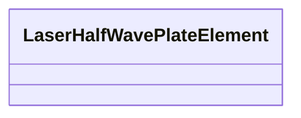

# Class: LaserHalfWavePlateElement 


_Half-wave plate sub-model (no additional fields)._


<div data-search-exclude markdown="1">


URI: [laura:LaserHalfWavePlateElement](https://w3id.org/laura/LaserHalfWavePlateElement)





<!-- no inheritance hierarchy -->

## Class Properties

| Property | Value |
| --- | --- |
| Class URI | [laura:LaserHalfWavePlateElement](https://w3id.org/laura/LaserHalfWavePlateElement) |


## Slots

| Name | Cardinality and Range | Description | Inheritance |
| ---  | --- | --- | --- |


## Usages

| used by | used in | type | used |
| ---  | --- | --- | --- |
| [LaserHalfWavePlate](LaserHalfWavePlate.md) | [laser](laser.md) | range | [LaserHalfWavePlateElement](LaserHalfWavePlateElement.md) |


## Identifier and Mapping Information


### Schema Source


* from schema: https://w3id.org/laura/schema


## Mappings

| Mapping Type | Mapped Value |
| ---  | ---  |
| self | laura:LaserHalfWavePlateElement |
| native | laura:LaserHalfWavePlateElement |


## LinkML Source

<!-- TODO: investigate https://stackoverflow.com/questions/37606292/how-to-create-tabbed-code-blocks-in-mkdocs-or-sphinx -->

### Direct

<details>
```yaml
name: LaserHalfWavePlateElement
description: Half-wave plate sub-model (no additional fields).
from_schema: https://w3id.org/laura/schema
class_uri: laura:LaserHalfWavePlateElement

```
</details>

### Induced

<details>
```yaml
name: LaserHalfWavePlateElement
description: Half-wave plate sub-model (no additional fields).
from_schema: https://w3id.org/laura/schema
class_uri: laura:LaserHalfWavePlateElement

```
</details></div>