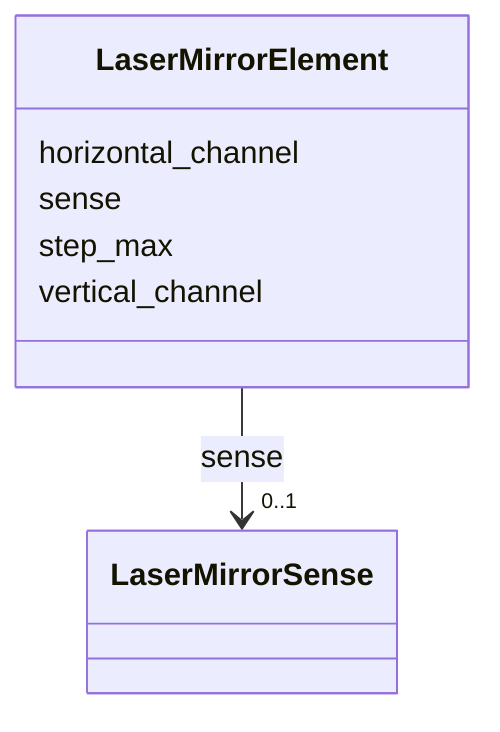

# Class: LaserMirrorElement 


_Mirror steering parameters for a laser mirror._


<div data-search-exclude markdown="1">


URI: [laura:LaserMirrorElement](https://w3id.org/laura/LaserMirrorElement)





<!-- no inheritance hierarchy -->

## Class Properties

| Property | Value |
| --- | --- |
| Class URI | [laura:LaserMirrorElement](https://w3id.org/laura/LaserMirrorElement) |


## Slots

| Name | Cardinality and Range | Description | Inheritance |
| ---  | --- | --- | --- |
| [step_max](step_max.md) | 0..1 <br/> [Double](Double.md) | Maximum step size for mirror adjustment | direct |
| [sense](sense.md) | 0..1 <br/> [LaserMirrorSense](LaserMirrorSense.md) | Mirror sense/interlock configuration | direct |
| [vertical_channel](vertical_channel.md) | 0..1 <br/> [Integer](Integer.md) | Vertical control channel index | direct |
| [horizontal_channel](horizontal_channel.md) | 0..1 <br/> [Integer](Integer.md) | Horizontal control channel index | direct |


## Usages

| used by | used in | type | used |
| ---  | --- | --- | --- |
| [LaserMirror](LaserMirror.md) | [laser](laser.md) | range | [LaserMirrorElement](LaserMirrorElement.md) |


## Identifier and Mapping Information


### Schema Source


* from schema: https://w3id.org/laura/schema


## Mappings

| Mapping Type | Mapped Value |
| ---  | ---  |
| self | laura:LaserMirrorElement |
| native | laura:LaserMirrorElement |


## LinkML Source

<!-- TODO: investigate https://stackoverflow.com/questions/37606292/how-to-create-tabbed-code-blocks-in-mkdocs-or-sphinx -->

### Direct

<details>
```yaml
name: LaserMirrorElement
description: Mirror steering parameters for a laser mirror.
from_schema: https://w3id.org/laura/schema
attributes:
  step_max:
    name: step_max
    description: Maximum step size for mirror adjustment.
    from_schema: https://w3id.org/laura/schema/laser_plasma
    rank: 1000
    domain_of:
    - LaserMirrorElement
    range: double
  sense:
    name: sense
    description: Mirror sense/interlock configuration.
    from_schema: https://w3id.org/laura/schema/laser_plasma
    rank: 1000
    domain_of:
    - LaserMirrorElement
    range: LaserMirrorSense
  vertical_channel:
    name: vertical_channel
    description: Vertical control channel index.
    from_schema: https://w3id.org/laura/schema/laser_plasma
    rank: 1000
    domain_of:
    - LaserMirrorElement
    range: integer
  horizontal_channel:
    name: horizontal_channel
    description: Horizontal control channel index.
    from_schema: https://w3id.org/laura/schema/laser_plasma
    rank: 1000
    domain_of:
    - LaserMirrorElement
    range: integer
class_uri: laura:LaserMirrorElement

```
</details>

### Induced

<details>
```yaml
name: LaserMirrorElement
description: Mirror steering parameters for a laser mirror.
from_schema: https://w3id.org/laura/schema
attributes:
  step_max:
    name: step_max
    description: Maximum step size for mirror adjustment.
    from_schema: https://w3id.org/laura/schema/laser_plasma
    rank: 1000
    owner: LaserMirrorElement
    domain_of:
    - LaserMirrorElement
    range: double
  sense:
    name: sense
    description: Mirror sense/interlock configuration.
    from_schema: https://w3id.org/laura/schema/laser_plasma
    rank: 1000
    owner: LaserMirrorElement
    domain_of:
    - LaserMirrorElement
    range: LaserMirrorSense
  vertical_channel:
    name: vertical_channel
    description: Vertical control channel index.
    from_schema: https://w3id.org/laura/schema/laser_plasma
    rank: 1000
    owner: LaserMirrorElement
    domain_of:
    - LaserMirrorElement
    range: integer
  horizontal_channel:
    name: horizontal_channel
    description: Horizontal control channel index.
    from_schema: https://w3id.org/laura/schema/laser_plasma
    rank: 1000
    owner: LaserMirrorElement
    domain_of:
    - LaserMirrorElement
    range: integer
class_uri: laura:LaserMirrorElement

```
</details></div>