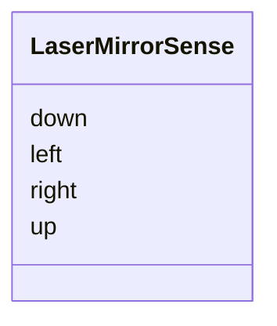

# Class: LaserMirrorSense 


_Mirror sense switch values._


<div data-search-exclude markdown="1">


URI: [laura:LaserMirrorSense](https://w3id.org/laura/LaserMirrorSense)





<!-- no inheritance hierarchy -->

## Class Properties

| Property | Value |
| --- | --- |
| Class URI | [laura:LaserMirrorSense](https://w3id.org/laura/LaserMirrorSense) |


## Slots

| Name | Cardinality and Range | Description | Inheritance |
| ---  | --- | --- | --- |
| [left](left.md) | 0..1 <br/> [Float](Float.md) | Left sense value | direct |
| [right](right.md) | 0..1 <br/> [Float](Float.md) | Right sense value | direct |
| [up](up.md) | 0..1 <br/> [Float](Float.md) | Up sense value | direct |
| [down](down.md) | 0..1 <br/> [Float](Float.md) | Down sense value | direct |


## Usages

| used by | used in | type | used |
| ---  | --- | --- | --- |
| [LaserMirrorElement](LaserMirrorElement.md) | [sense](sense.md) | range | [LaserMirrorSense](LaserMirrorSense.md) |


## Identifier and Mapping Information


### Schema Source


* from schema: https://w3id.org/laura/schema


## Mappings

| Mapping Type | Mapped Value |
| ---  | ---  |
| self | laura:LaserMirrorSense |
| native | laura:LaserMirrorSense |


## LinkML Source

<!-- TODO: investigate https://stackoverflow.com/questions/37606292/how-to-create-tabbed-code-blocks-in-mkdocs-or-sphinx -->

### Direct

<details>
```yaml
name: LaserMirrorSense
description: Mirror sense switch values.
from_schema: https://w3id.org/laura/schema
attributes:
  left:
    name: left
    description: Left sense value.
    from_schema: https://w3id.org/laura/schema/laser_plasma
    aliases:
    - left_sense
    rank: 1000
    domain_of:
    - LaserMirrorSense
    range: float
  right:
    name: right
    description: Right sense value.
    from_schema: https://w3id.org/laura/schema/laser_plasma
    aliases:
    - right_sense
    rank: 1000
    domain_of:
    - LaserMirrorSense
    range: float
  up:
    name: up
    description: Up sense value.
    from_schema: https://w3id.org/laura/schema/laser_plasma
    aliases:
    - up_sense
    rank: 1000
    domain_of:
    - LaserMirrorSense
    range: float
  down:
    name: down
    description: Down sense value.
    from_schema: https://w3id.org/laura/schema/laser_plasma
    aliases:
    - down_sense
    rank: 1000
    domain_of:
    - LaserMirrorSense
    range: float
class_uri: laura:LaserMirrorSense

```
</details>

### Induced

<details>
```yaml
name: LaserMirrorSense
description: Mirror sense switch values.
from_schema: https://w3id.org/laura/schema
attributes:
  left:
    name: left
    description: Left sense value.
    from_schema: https://w3id.org/laura/schema/laser_plasma
    aliases:
    - left_sense
    rank: 1000
    owner: LaserMirrorSense
    domain_of:
    - LaserMirrorSense
    range: float
  right:
    name: right
    description: Right sense value.
    from_schema: https://w3id.org/laura/schema/laser_plasma
    aliases:
    - right_sense
    rank: 1000
    owner: LaserMirrorSense
    domain_of:
    - LaserMirrorSense
    range: float
  up:
    name: up
    description: Up sense value.
    from_schema: https://w3id.org/laura/schema/laser_plasma
    aliases:
    - up_sense
    rank: 1000
    owner: LaserMirrorSense
    domain_of:
    - LaserMirrorSense
    range: float
  down:
    name: down
    description: Down sense value.
    from_schema: https://w3id.org/laura/schema/laser_plasma
    aliases:
    - down_sense
    rank: 1000
    owner: LaserMirrorSense
    domain_of:
    - LaserMirrorSense
    range: float
class_uri: laura:LaserMirrorSense

```
</details></div>