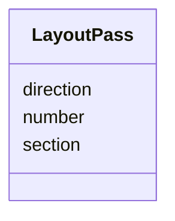

# Class: LayoutPass 


_One traversal of one section by one beam path._


<div data-search-exclude markdown="1">


URI: [laura:LayoutPass](https://w3id.org/laura/LayoutPass)





<!-- no inheritance hierarchy -->

## Class Properties

| Property | Value |
| --- | --- |
| Class URI | [laura:LayoutPass](https://w3id.org/laura/LayoutPass) |


## Slots

| Name | Cardinality and Range | Description | Inheritance |
| ---  | --- | --- | --- |
| [section](section.md) | 1 <br/> [String](String.md) | Name of the section traversed on this pass | direct |
| [direction](direction.md) | 0..1 <br/> [Integer](Integer.md) | 1 if this pass traverses the section forwards, -1 if backwards | direct |
| [number](number.md) | 0..1 <br/> [Integer](Integer.md) | Multipass occurrence number, counting from 1 | direct |


## Usages

| used by | used in | type | used |
| ---  | --- | --- | --- |
| [MachineLayout](MachineLayout.md) | [passes](passes.md) | range | [LayoutPass](LayoutPass.md) |


## Identifier and Mapping Information


### Schema Source


* from schema: https://w3id.org/laura/schema


## Mappings

| Mapping Type | Mapped Value |
| ---  | ---  |
| self | laura:LayoutPass |
| native | laura:LayoutPass |


## LinkML Source

<!-- TODO: investigate https://stackoverflow.com/questions/37606292/how-to-create-tabbed-code-blocks-in-mkdocs-or-sphinx -->

### Direct

<details>
```yaml
name: LayoutPass
description: One traversal of one section by one beam path.
from_schema: https://w3id.org/laura/schema
attributes:
  section:
    name: section
    description: Name of the section traversed on this pass.
    from_schema: https://w3id.org/laura/schema/machine
    rank: 1000
    domain_of:
    - LayoutPass
    range: string
    required: true
  direction:
    name: direction
    description: 1 if this pass traverses the section forwards, -1 if backwards. A
      property of the path, not of the section.
    from_schema: https://w3id.org/laura/schema/machine
    rank: 1000
    ifabsent: int(1)
    domain_of:
    - LayoutPass
    range: integer
  number:
    name: number
    description: Multipass occurrence number, counting from 1. Absent for an ordinary
      single traversal and for repetition, where each occurrence is a separate device
      with its own section.
    from_schema: https://w3id.org/laura/schema/machine
    rank: 1000
    domain_of:
    - LayoutPass
    range: integer
class_uri: laura:LayoutPass

```
</details>

### Induced

<details>
```yaml
name: LayoutPass
description: One traversal of one section by one beam path.
from_schema: https://w3id.org/laura/schema
attributes:
  section:
    name: section
    description: Name of the section traversed on this pass.
    from_schema: https://w3id.org/laura/schema/machine
    rank: 1000
    owner: LayoutPass
    domain_of:
    - LayoutPass
    range: string
    required: true
  direction:
    name: direction
    description: 1 if this pass traverses the section forwards, -1 if backwards. A
      property of the path, not of the section.
    from_schema: https://w3id.org/laura/schema/machine
    rank: 1000
    ifabsent: int(1)
    owner: LayoutPass
    domain_of:
    - LayoutPass
    range: integer
  number:
    name: number
    description: Multipass occurrence number, counting from 1. Absent for an ordinary
      single traversal and for repetition, where each occurrence is a separate device
      with its own section.
    from_schema: https://w3id.org/laura/schema/machine
    rank: 1000
    owner: LayoutPass
    domain_of:
    - LayoutPass
    range: integer
class_uri: laura:LayoutPass

```
</details></div>