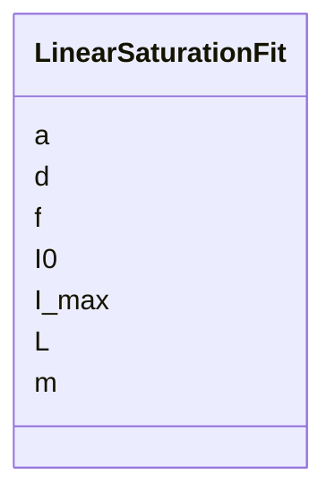

---
search:
  boost: 10.0
---

# Class: LinearSaturationFit 


_Bi-linear saturation model mapping magnet current to integrated field strength (K-value conversion)._


<div data-search-exclude markdown="1">


URI: [laura:LinearSaturationFit](https://w3id.org/laura/LinearSaturationFit)





<!-- no inheritance hierarchy -->

## Class Properties

| Property | Value |
| --- | --- |
| Class URI | [laura:LinearSaturationFit](https://w3id.org/laura/LinearSaturationFit) |


## Slots

| Name | Cardinality and Range | Description | Inheritance |
| ---  | --- | --- | --- |
| [m](m.md) | 0..1 <br/> [Float](Float.md) | Linear slope of the unsaturated region | direct |
| [I_max](I_max.md) | 0..1 <br/> [Float](Float.md) | Current at which saturation begins [A] | direct |
| [f](f.md) | 0..1 <br/> [Float](Float.md) | Saturation fraction (slope ratio below/above I_max) | direct |
| [a](a.md) | 0..1 <br/> [Float](Float.md) | Quadratic saturation coefficient | direct |
| [I0](I0.md) | 0..1 <br/> [Float](Float.md) | Current offset [A] | direct |
| [d](d.md) | 0..1 <br/> [Float](Float.md) | Constant offset term | direct |
| [L](L.md) | 0..1 <br/> [Float](Float.md) | Effective magnetic length [m] | direct |


## Usages

| used by | used in | type | used |
| ---  | --- | --- | --- |
| [MagneticElement](MagneticElement.md) | [linear_saturation_coefficients](linear_saturation_coefficients.md) | range | [LinearSaturationFit](LinearSaturationFit.md) |
| [DipoleMagnet](DipoleMagnet.md) | [linear_saturation_coefficients](linear_saturation_coefficients.md) | range | [LinearSaturationFit](LinearSaturationFit.md) |
| [QuadrupoleMagnet](QuadrupoleMagnet.md) | [linear_saturation_coefficients](linear_saturation_coefficients.md) | range | [LinearSaturationFit](LinearSaturationFit.md) |


## Identifier and Mapping Information


### Schema Source


* from schema: https://w3id.org/laura/schema


## Mappings

| Mapping Type | Mapped Value |
| ---  | ---  |
| self | laura:LinearSaturationFit |
| native | laura:LinearSaturationFit |


## LinkML Source

<!-- TODO: investigate https://stackoverflow.com/questions/37606292/how-to-create-tabbed-code-blocks-in-mkdocs-or-sphinx -->

### Direct

<details>
```yaml
name: LinearSaturationFit
description: Bi-linear saturation model mapping magnet current to integrated field
  strength (K-value conversion).
from_schema: https://w3id.org/laura/schema
attributes:
  m:
    name: m
    description: Linear slope of the unsaturated region.
    from_schema: https://w3id.org/laura/schema/magnetic
    rank: 1000
    ifabsent: float(0)
    domain_of:
    - LinearSaturationFit
    range: float
  I_max:
    name: I_max
    description: Current at which saturation begins [A].
    from_schema: https://w3id.org/laura/schema/magnetic
    rank: 1000
    ifabsent: float(0)
    domain_of:
    - LinearSaturationFit
    range: float
    unit:
      ucum_code: A
  f:
    name: f
    description: Saturation fraction (slope ratio below/above I_max).
    from_schema: https://w3id.org/laura/schema/magnetic
    rank: 1000
    ifabsent: float(0)
    domain_of:
    - LinearSaturationFit
    range: float
  a:
    name: a
    description: Quadratic saturation coefficient.
    from_schema: https://w3id.org/laura/schema/magnetic
    rank: 1000
    ifabsent: float(0)
    domain_of:
    - LinearSaturationFit
    range: float
  I0:
    name: I0
    description: Current offset [A].
    from_schema: https://w3id.org/laura/schema/magnetic
    rank: 1000
    ifabsent: float(0)
    domain_of:
    - LinearSaturationFit
    range: float
    unit:
      ucum_code: A
  d:
    name: d
    description: Constant offset term.
    from_schema: https://w3id.org/laura/schema/magnetic
    rank: 1000
    ifabsent: float(0)
    domain_of:
    - LinearSaturationFit
    range: float
  L:
    name: L
    description: Effective magnetic length [m].
    from_schema: https://w3id.org/laura/schema/magnetic
    rank: 1000
    ifabsent: float(0)
    domain_of:
    - LinearSaturationFit
    range: float
    unit:
      ucum_code: m
class_uri: laura:LinearSaturationFit

```
</details>

### Induced

<details>
```yaml
name: LinearSaturationFit
description: Bi-linear saturation model mapping magnet current to integrated field
  strength (K-value conversion).
from_schema: https://w3id.org/laura/schema
attributes:
  m:
    name: m
    description: Linear slope of the unsaturated region.
    from_schema: https://w3id.org/laura/schema/magnetic
    rank: 1000
    ifabsent: float(0)
    owner: LinearSaturationFit
    domain_of:
    - LinearSaturationFit
    range: float
  I_max:
    name: I_max
    description: Current at which saturation begins [A].
    from_schema: https://w3id.org/laura/schema/magnetic
    rank: 1000
    ifabsent: float(0)
    owner: LinearSaturationFit
    domain_of:
    - LinearSaturationFit
    range: float
    unit:
      ucum_code: A
  f:
    name: f
    description: Saturation fraction (slope ratio below/above I_max).
    from_schema: https://w3id.org/laura/schema/magnetic
    rank: 1000
    ifabsent: float(0)
    owner: LinearSaturationFit
    domain_of:
    - LinearSaturationFit
    range: float
  a:
    name: a
    description: Quadratic saturation coefficient.
    from_schema: https://w3id.org/laura/schema/magnetic
    rank: 1000
    ifabsent: float(0)
    owner: LinearSaturationFit
    domain_of:
    - LinearSaturationFit
    range: float
  I0:
    name: I0
    description: Current offset [A].
    from_schema: https://w3id.org/laura/schema/magnetic
    rank: 1000
    ifabsent: float(0)
    owner: LinearSaturationFit
    domain_of:
    - LinearSaturationFit
    range: float
    unit:
      ucum_code: A
  d:
    name: d
    description: Constant offset term.
    from_schema: https://w3id.org/laura/schema/magnetic
    rank: 1000
    ifabsent: float(0)
    owner: LinearSaturationFit
    domain_of:
    - LinearSaturationFit
    range: float
  L:
    name: L
    description: Effective magnetic length [m].
    from_schema: https://w3id.org/laura/schema/magnetic
    rank: 1000
    ifabsent: float(0)
    owner: LinearSaturationFit
    domain_of:
    - LinearSaturationFit
    range: float
    unit:
      ucum_code: m
class_uri: laura:LinearSaturationFit

```
</details></div>