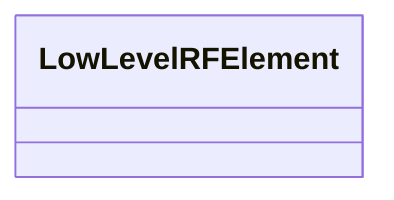

---
search:
  boost: 10.0
---

# Class: LowLevelRFElement 


_Low-level RF (LLRF) system parameters._


<div data-search-exclude markdown="1">


URI: [laura:LowLevelRFElement](https://w3id.org/laura/LowLevelRFElement)





<!-- no inheritance hierarchy -->

## Class Properties

| Property | Value |
| --- | --- |
| Class URI | [laura:LowLevelRFElement](https://w3id.org/laura/LowLevelRFElement) |


## Slots

| Name | Cardinality and Range | Description | Inheritance |
| ---  | --- | --- | --- |


## Usages

| used by | used in | type | used |
| ---  | --- | --- | --- |
| [LowLevelRF](LowLevelRF.md) | [llrf](llrf.md) | range | [LowLevelRFElement](LowLevelRFElement.md) |


## Identifier and Mapping Information


### Schema Source


* from schema: https://w3id.org/laura/schema


## Mappings

| Mapping Type | Mapped Value |
| ---  | ---  |
| self | laura:LowLevelRFElement |
| native | laura:LowLevelRFElement |


## LinkML Source

<!-- TODO: investigate https://stackoverflow.com/questions/37606292/how-to-create-tabbed-code-blocks-in-mkdocs-or-sphinx -->

### Direct

<details>
```yaml
name: LowLevelRFElement
description: Low-level RF (LLRF) system parameters.
from_schema: https://w3id.org/laura/schema
class_uri: laura:LowLevelRFElement

```
</details>

### Induced

<details>
```yaml
name: LowLevelRFElement
description: Low-level RF (LLRF) system parameters.
from_schema: https://w3id.org/laura/schema
class_uri: laura:LowLevelRFElement

```
</details></div>