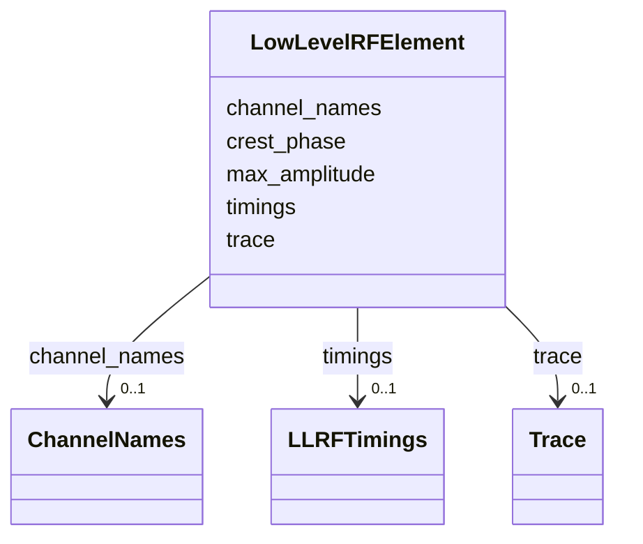

---
search:
  boost: 10.0
---

# Class: LowLevelRFElement 


_Low-level RF (LLRF) system parameters._


<div data-search-exclude markdown="1">


URI: [laura:LowLevelRFElement](https://w3id.org/laura/LowLevelRFElement)





<!-- no inheritance hierarchy -->

## Class Properties

| Property | Value |
| --- | --- |
| Class URI | [laura:LowLevelRFElement](https://w3id.org/laura/LowLevelRFElement) |


## Slots

| Name | Cardinality and Range | Description | Inheritance |
| ---  | --- | --- | --- |
| [trace](trace.md) | 0..1 <br/> [Trace](Trace.md) | Trace metadata | direct |
| [max_amplitude](max_amplitude.md) | 0..1 <br/> [Float](Float.md) | Maximum allowed amplitude | direct |
| [channel_names](channel_names.md) | 0..1 <br/> [ChannelNames](ChannelNames.md) | Channel labels | direct |
| [crest_phase](crest_phase.md) | 0..1 <br/> [Float](Float.md) | Cavity crest phase | direct |
| [timings](timings.md) | 0..1 <br/> [LLRFTimings](LLRFTimings.md) | Timing windows for LLRF channels | direct |


## Usages

| used by | used in | type | used |
| ---  | --- | --- | --- |
| [LowLevelRF](LowLevelRF.md) | [llrf](llrf.md) | range | [LowLevelRFElement](LowLevelRFElement.md) |


## Identifier and Mapping Information


### Schema Source


* from schema: https://w3id.org/laura/schema


## Mappings

| Mapping Type | Mapped Value |
| ---  | ---  |
| self | laura:LowLevelRFElement |
| native | laura:LowLevelRFElement |


## LinkML Source

<!-- TODO: investigate https://stackoverflow.com/questions/37606292/how-to-create-tabbed-code-blocks-in-mkdocs-or-sphinx -->

### Direct

<details>
```yaml
name: LowLevelRFElement
description: Low-level RF (LLRF) system parameters.
from_schema: https://w3id.org/laura/schema
attributes:
  trace:
    name: trace
    description: Trace metadata.
    from_schema: https://w3id.org/laura/schema
    rank: 1000
    domain_of:
    - LowLevelRFElement
    range: Trace
  max_amplitude:
    name: max_amplitude
    description: Maximum allowed amplitude.
    from_schema: https://w3id.org/laura/schema
    aliases:
    - MAX_AMPLITUDE
    rank: 1000
    domain_of:
    - LowLevelRFElement
    range: float
  channel_names:
    name: channel_names
    description: Channel labels.
    from_schema: https://w3id.org/laura/schema
    rank: 1000
    domain_of:
    - LowLevelRFElement
    range: ChannelNames
  crest_phase:
    name: crest_phase
    description: Cavity crest phase.
    from_schema: https://w3id.org/laura/schema
    rank: 1000
    domain_of:
    - LowLevelRFElement
    range: float
  timings:
    name: timings
    description: Timing windows for LLRF channels.
    from_schema: https://w3id.org/laura/schema
    rank: 1000
    domain_of:
    - LowLevelRFElement
    range: LLRFTimings
class_uri: laura:LowLevelRFElement

```
</details>

### Induced

<details>
```yaml
name: LowLevelRFElement
description: Low-level RF (LLRF) system parameters.
from_schema: https://w3id.org/laura/schema
attributes:
  trace:
    name: trace
    description: Trace metadata.
    from_schema: https://w3id.org/laura/schema
    rank: 1000
    owner: LowLevelRFElement
    domain_of:
    - LowLevelRFElement
    range: Trace
  max_amplitude:
    name: max_amplitude
    description: Maximum allowed amplitude.
    from_schema: https://w3id.org/laura/schema
    aliases:
    - MAX_AMPLITUDE
    rank: 1000
    owner: LowLevelRFElement
    domain_of:
    - LowLevelRFElement
    range: float
  channel_names:
    name: channel_names
    description: Channel labels.
    from_schema: https://w3id.org/laura/schema
    rank: 1000
    owner: LowLevelRFElement
    domain_of:
    - LowLevelRFElement
    range: ChannelNames
  crest_phase:
    name: crest_phase
    description: Cavity crest phase.
    from_schema: https://w3id.org/laura/schema
    rank: 1000
    owner: LowLevelRFElement
    domain_of:
    - LowLevelRFElement
    range: float
  timings:
    name: timings
    description: Timing windows for LLRF channels.
    from_schema: https://w3id.org/laura/schema
    rank: 1000
    owner: LowLevelRFElement
    domain_of:
    - LowLevelRFElement
    range: LLRFTimings
class_uri: laura:LowLevelRFElement

```
</details></div>