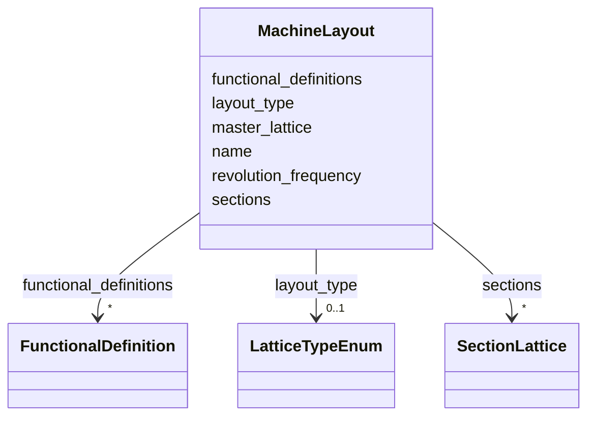

# Class: MachineLayout 


_A beamline layout: a contiguous sequence of sections._


<div data-search-exclude markdown="1">


URI: [laura:MachineLayout](https://w3id.org/laura/MachineLayout)





<!-- no inheritance hierarchy -->

## Class Properties

| Property | Value |
| --- | --- |
| Class URI | [laura:MachineLayout](https://w3id.org/laura/MachineLayout) |


## Slots

| Name | Cardinality and Range | Description | Inheritance |
| ---  | --- | --- | --- |
| [name](name.md) | 1 <br/> [String](String.md) | Unique layout name | direct |
| [master_lattice](master_lattice.md) | 0..1 <br/> [String](String.md) | Name of the master lattice this layout belongs to | direct |
| [sections](sections.md) | * <br/> [SectionLattice](SectionLattice.md) | The sections making up this layout, keyed by name | direct |
| [layout_type](layout_type.md) | 0..1 <br/> [LatticeTypeEnum](LatticeTypeEnum.md) | What this layout carries | direct |
| [functional_definitions](functional_definitions.md) | * <br/> [FunctionalDefinition](FunctionalDefinition.md) | Named constants this layout's elements may refer to, keyed by name | direct |
| [revolution_frequency](revolution_frequency.md) | 0..1 <br/> [Double](Double.md) | The ring's revolution frequency [Hz], if this layout is a closed ring | direct |


## Usages

| used by | used in | type | used |
| ---  | --- | --- | --- |
| [MachineModel](MachineModel.md) | [layouts](layouts.md) | range | [MachineLayout](MachineLayout.md) |


## Identifier and Mapping Information


### Schema Source


* from schema: https://w3id.org/laura/schema


## Mappings

| Mapping Type | Mapped Value |
| ---  | ---  |
| self | laura:MachineLayout |
| native | laura:MachineLayout |


## LinkML Source

<!-- TODO: investigate https://stackoverflow.com/questions/37606292/how-to-create-tabbed-code-blocks-in-mkdocs-or-sphinx -->

### Direct

<details>
```yaml
name: MachineLayout
description: 'A beamline layout: a contiguous sequence of sections.'
from_schema: https://w3id.org/laura/schema
attributes:
  name:
    name: name
    description: Unique layout name.
    from_schema: https://w3id.org/laura/schema/machine
    identifier: true
    domain_of:
    - AcceleratorElement
    - ControlVariable
    - FunctionalDefinition
    - SectionLattice
    - MachineLayout
    range: string
  master_lattice:
    name: master_lattice
    description: Name of the master lattice this layout belongs to.
    from_schema: https://w3id.org/laura/schema/machine
    domain_of:
    - SectionLattice
    - MachineLayout
    range: string
  sections:
    name: sections
    description: The sections making up this layout, keyed by name.  References into
      MachineModel.sections rather than inlining them.
    from_schema: https://w3id.org/laura/schema/machine
    rank: 1000
    domain_of:
    - MachineLayout
    - MachineModel
    range: SectionLattice
    multivalued: true
  layout_type:
    name: layout_type
    description: What this layout carries.
    from_schema: https://w3id.org/laura/schema/machine
    rank: 1000
    ifabsent: string(beam)
    domain_of:
    - MachineLayout
    range: LatticeTypeEnum
  functional_definitions:
    name: functional_definitions
    description: Named constants this layout's elements may refer to, keyed by name.
    from_schema: https://w3id.org/laura/schema/machine
    domain_of:
    - SectionLattice
    - MachineLayout
    range: FunctionalDefinition
    multivalued: true
    inlined: true
    inlined_as_list: false
  revolution_frequency:
    name: revolution_frequency
    description: The ring's revolution frequency [Hz], if this layout is a closed
      ring.
    from_schema: https://w3id.org/laura/schema/machine
    domain_of:
    - SectionLattice
    - MachineLayout
    range: double
class_uri: laura:MachineLayout

```
</details>

### Induced

<details>
```yaml
name: MachineLayout
description: 'A beamline layout: a contiguous sequence of sections.'
from_schema: https://w3id.org/laura/schema
attributes:
  name:
    name: name
    description: Unique layout name.
    from_schema: https://w3id.org/laura/schema/machine
    identifier: true
    owner: MachineLayout
    domain_of:
    - AcceleratorElement
    - ControlVariable
    - FunctionalDefinition
    - SectionLattice
    - MachineLayout
    range: string
    required: true
  master_lattice:
    name: master_lattice
    description: Name of the master lattice this layout belongs to.
    from_schema: https://w3id.org/laura/schema/machine
    owner: MachineLayout
    domain_of:
    - SectionLattice
    - MachineLayout
    range: string
  sections:
    name: sections
    description: The sections making up this layout, keyed by name.  References into
      MachineModel.sections rather than inlining them.
    from_schema: https://w3id.org/laura/schema/machine
    rank: 1000
    owner: MachineLayout
    domain_of:
    - MachineLayout
    - MachineModel
    range: SectionLattice
    multivalued: true
  layout_type:
    name: layout_type
    description: What this layout carries.
    from_schema: https://w3id.org/laura/schema/machine
    rank: 1000
    ifabsent: string(beam)
    owner: MachineLayout
    domain_of:
    - MachineLayout
    range: LatticeTypeEnum
  functional_definitions:
    name: functional_definitions
    description: Named constants this layout's elements may refer to, keyed by name.
    from_schema: https://w3id.org/laura/schema/machine
    owner: MachineLayout
    domain_of:
    - SectionLattice
    - MachineLayout
    range: FunctionalDefinition
    multivalued: true
    inlined: true
    inlined_as_list: false
  revolution_frequency:
    name: revolution_frequency
    description: The ring's revolution frequency [Hz], if this layout is a closed
      ring.
    from_schema: https://w3id.org/laura/schema/machine
    owner: MachineLayout
    domain_of:
    - SectionLattice
    - MachineLayout
    range: double
class_uri: laura:MachineLayout

```
</details></div>