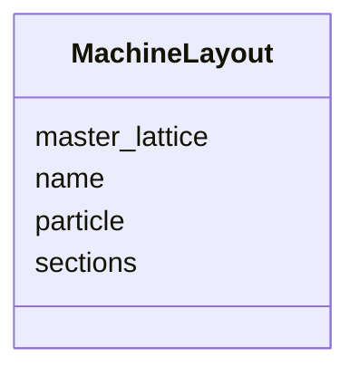

# Class: MachineLayout 


_An ordered list of section names defining a beamline layout (a contiguous sequence of sections)._


<div data-search-exclude markdown="1">


URI: [laura:MachineLayout](https://w3id.org/laura/MachineLayout)





<!-- no inheritance hierarchy -->

## Class Properties

| Property | Value |
| --- | --- |
| Class URI | [laura:MachineLayout](https://w3id.org/laura/MachineLayout) |


## Slots

| Name | Cardinality and Range | Description | Inheritance |
| ---  | --- | --- | --- |
| [name](name.md) | 1 <br/> [String](String.md) | Unique layout name | direct |
| [master_lattice](master_lattice.md) | 0..1 <br/> [String](String.md) | Name of the master lattice this layout belongs to | direct |
| [particle](particle.md) | 0..1 <br/> [String](String.md) | Design particle species for this layout, overriding the machine-wide value | direct |
| [sections](sections.md) | * <br/> [String](String.md) | Ordered list of section names | direct |


## Usages

| used by | used in | type | used |
| ---  | --- | --- | --- |
| [MachineModel](MachineModel.md) | [layouts](layouts.md) | range | [MachineLayout](MachineLayout.md) |


## Identifier and Mapping Information


### Schema Source


* from schema: https://w3id.org/laura/schema


## Mappings

| Mapping Type | Mapped Value |
| ---  | ---  |
| self | laura:MachineLayout |
| native | laura:MachineLayout |


## LinkML Source

<!-- TODO: investigate https://stackoverflow.com/questions/37606292/how-to-create-tabbed-code-blocks-in-mkdocs-or-sphinx -->

### Direct

<details>
```yaml
name: MachineLayout
description: An ordered list of section names defining a beamline layout (a contiguous
  sequence of sections).
from_schema: https://w3id.org/laura/schema
attributes:
  name:
    name: name
    description: Unique layout name.
    from_schema: https://w3id.org/laura/schema/machine
    identifier: true
    domain_of:
    - AcceleratorElement
    - SectionLattice
    - MachineLayout
    range: string
  master_lattice:
    name: master_lattice
    description: Name of the master lattice this layout belongs to.
    from_schema: https://w3id.org/laura/schema/machine
    domain_of:
    - SectionLattice
    - MachineLayout
    range: string
  particle:
    name: particle
    description: Design particle species for this layout, overriding the machine-wide
      value. Free text rather than an enum because the accepted set includes arbitrary
      ions (e.g. ``#12C+3``) alongside the fundamental particles.
    from_schema: https://w3id.org/laura/schema/machine
    rank: 1000
    domain_of:
    - MachineLayout
    - MachineModel
    range: string
    required: false
  sections:
    name: sections
    description: Ordered list of section names.
    from_schema: https://w3id.org/laura/schema/machine
    rank: 1000
    domain_of:
    - MachineLayout
    - MachineModel
    range: string
    multivalued: true
class_uri: laura:MachineLayout

```
</details>

### Induced

<details>
```yaml
name: MachineLayout
description: An ordered list of section names defining a beamline layout (a contiguous
  sequence of sections).
from_schema: https://w3id.org/laura/schema
attributes:
  name:
    name: name
    description: Unique layout name.
    from_schema: https://w3id.org/laura/schema/machine
    identifier: true
    owner: MachineLayout
    domain_of:
    - AcceleratorElement
    - SectionLattice
    - MachineLayout
    range: string
    required: true
  master_lattice:
    name: master_lattice
    description: Name of the master lattice this layout belongs to.
    from_schema: https://w3id.org/laura/schema/machine
    owner: MachineLayout
    domain_of:
    - SectionLattice
    - MachineLayout
    range: string
  particle:
    name: particle
    description: Design particle species for this layout, overriding the machine-wide
      value. Free text rather than an enum because the accepted set includes arbitrary
      ions (e.g. ``#12C+3``) alongside the fundamental particles.
    from_schema: https://w3id.org/laura/schema/machine
    rank: 1000
    owner: MachineLayout
    domain_of:
    - MachineLayout
    - MachineModel
    range: string
    required: false
  sections:
    name: sections
    description: Ordered list of section names.
    from_schema: https://w3id.org/laura/schema/machine
    rank: 1000
    owner: MachineLayout
    domain_of:
    - MachineLayout
    - MachineModel
    range: string
    multivalued: true
class_uri: laura:MachineLayout

```
</details></div>