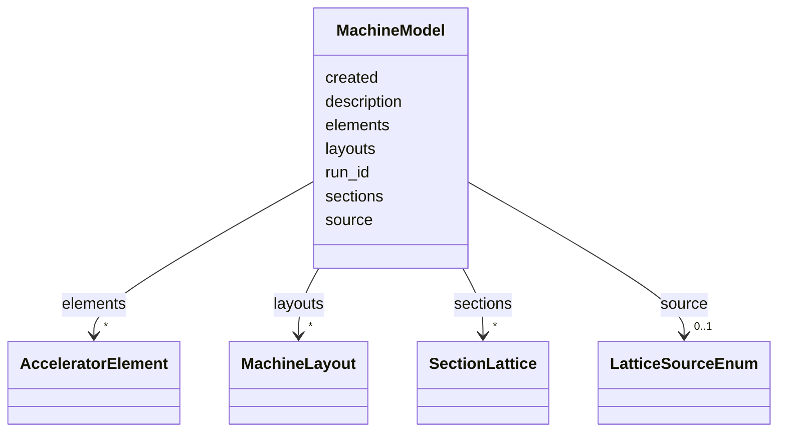

# Class: MachineModel 


_Top-level container for a complete accelerator lattice: elements, sections, layouts, and named lattice configurations._


<div data-search-exclude markdown="1">


URI: [laura:MachineModel](https://w3id.org/laura/MachineModel)





<!-- no inheritance hierarchy -->

## Class Properties

| Property | Value |
| --- | --- |
| Class URI | [laura:MachineModel](https://w3id.org/laura/MachineModel) |


## Slots

| Name | Cardinality and Range | Description | Inheritance |
| ---  | --- | --- | --- |
| [description](description.md) | 0..1 <br/> [String](String.md) | Human-readable description of what this machine model represents | direct |
| [created](created.md) | 0..1 <br/> [Datetime](Datetime.md) | When this model was produced -- for ``measured`` models, when the machine was... | direct |
| [source](source.md) | 0..1 <br/> [LatticeSourceEnum](LatticeSourceEnum.md) | Whether these values are design, measured or simulated | direct |
| [run_id](run_id.md) | 0..1 <br/> [String](String.md) | Identifier of the run, shot or scan this model belongs to, for matching it ag... | direct |
| [elements](elements.md) | * <br/> [AcceleratorElement](AcceleratorElement.md) | All elements in the machine, keyed by name | direct |
| [sections](sections.md) | * <br/> [SectionLattice](SectionLattice.md) | All named beamline sections | direct |
| [layouts](layouts.md) | * <br/> [MachineLayout](MachineLayout.md) | All named beamline layouts | direct |


## Identifier and Mapping Information


### Schema Source


* from schema: https://w3id.org/laura/schema


## Mappings

| Mapping Type | Mapped Value |
| ---  | ---  |
| self | laura:MachineModel |
| native | laura:MachineModel |


## LinkML Source

<!-- TODO: investigate https://stackoverflow.com/questions/37606292/how-to-create-tabbed-code-blocks-in-mkdocs-or-sphinx -->

### Direct

<details>
```yaml
name: MachineModel
description: 'Top-level container for a complete accelerator lattice: elements, sections,
  layouts, and named lattice configurations.'
from_schema: https://w3id.org/laura/schema
attributes:
  description:
    name: description
    description: Human-readable description of what this machine model represents.
    from_schema: https://w3id.org/laura/schema/machine
    slot_uri: dcterms:description
    domain_of:
    - ControlVariable
    - MachineModel
    range: string
  created:
    name: created
    description: When this model was produced -- for ``measured`` models, when the
      machine was read.
    from_schema: https://w3id.org/laura/schema/machine
    rank: 1000
    slot_uri: dcterms:created
    domain_of:
    - MachineModel
    range: datetime
  source:
    name: source
    description: Whether these values are design, measured or simulated. Defaults
      to ``design``, which is what an untagged lattice file has always been.
    from_schema: https://w3id.org/laura/schema/machine
    rank: 1000
    ifabsent: string(design)
    domain_of:
    - MachineModel
    range: LatticeSourceEnum
  run_id:
    name: run_id
    description: Identifier of the run, shot or scan this model belongs to, for matching
      it against data recorded elsewhere.
    from_schema: https://w3id.org/laura/schema/machine
    rank: 1000
    domain_of:
    - MachineModel
    range: string
  elements:
    name: elements
    description: All elements in the machine, keyed by name.
    from_schema: https://w3id.org/laura/schema/machine
    domain_of:
    - SectionLattice
    - MachineModel
    range: AcceleratorElement
    multivalued: true
  sections:
    name: sections
    description: All named beamline sections.
    from_schema: https://w3id.org/laura/schema/machine
    domain_of:
    - MachineLayout
    - MachineModel
    range: SectionLattice
    multivalued: true
  layouts:
    name: layouts
    description: All named beamline layouts.
    from_schema: https://w3id.org/laura/schema/machine
    rank: 1000
    domain_of:
    - MachineModel
    range: MachineLayout
    multivalued: true
class_uri: laura:MachineModel

```
</details>

### Induced

<details>
```yaml
name: MachineModel
description: 'Top-level container for a complete accelerator lattice: elements, sections,
  layouts, and named lattice configurations.'
from_schema: https://w3id.org/laura/schema
attributes:
  description:
    name: description
    description: Human-readable description of what this machine model represents.
    from_schema: https://w3id.org/laura/schema/machine
    slot_uri: dcterms:description
    owner: MachineModel
    domain_of:
    - ControlVariable
    - MachineModel
    range: string
  created:
    name: created
    description: When this model was produced -- for ``measured`` models, when the
      machine was read.
    from_schema: https://w3id.org/laura/schema/machine
    rank: 1000
    slot_uri: dcterms:created
    owner: MachineModel
    domain_of:
    - MachineModel
    range: datetime
  source:
    name: source
    description: Whether these values are design, measured or simulated. Defaults
      to ``design``, which is what an untagged lattice file has always been.
    from_schema: https://w3id.org/laura/schema/machine
    rank: 1000
    ifabsent: string(design)
    owner: MachineModel
    domain_of:
    - MachineModel
    range: LatticeSourceEnum
  run_id:
    name: run_id
    description: Identifier of the run, shot or scan this model belongs to, for matching
      it against data recorded elsewhere.
    from_schema: https://w3id.org/laura/schema/machine
    rank: 1000
    owner: MachineModel
    domain_of:
    - MachineModel
    range: string
  elements:
    name: elements
    description: All elements in the machine, keyed by name.
    from_schema: https://w3id.org/laura/schema/machine
    owner: MachineModel
    domain_of:
    - SectionLattice
    - MachineModel
    range: AcceleratorElement
    multivalued: true
  sections:
    name: sections
    description: All named beamline sections.
    from_schema: https://w3id.org/laura/schema/machine
    owner: MachineModel
    domain_of:
    - MachineLayout
    - MachineModel
    range: SectionLattice
    multivalued: true
  layouts:
    name: layouts
    description: All named beamline layouts.
    from_schema: https://w3id.org/laura/schema/machine
    rank: 1000
    owner: MachineModel
    domain_of:
    - MachineModel
    range: MachineLayout
    multivalued: true
class_uri: laura:MachineModel

```
</details></div>