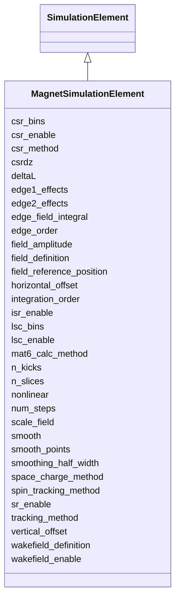

# Class: MagnetSimulationElement


_Simulation attributes specific to magnets: integrator settings, fringe-field model, and radiation flags._


<div data-search-exclude markdown="1">


URI: [laura:MagnetSimulationElement](https://w3id.org/laura/MagnetSimulationElement)





## Inheritance
* [SimulationElement](SimulationElement.md)
    * **MagnetSimulationElement**


## Class Properties

| Property | Value |
| --- | --- |
| Class URI | [laura:MagnetSimulationElement](https://w3id.org/laura/MagnetSimulationElement) |


## Slots

| Name | Cardinality and Range | Description | Inheritance |
| ---  | --- | --- | --- |
| [field_amplitude](field_amplitude.md) | 0..1 <br/> [Float](Float.md)&nbsp;or&nbsp;<br />[String](String.md) | Field amplitude scaling for magnet tracking | direct |
| [n_slices](n_slices.md) | 0..1 <br/> [Integer](Integer.md) | Number of longitudinal slices for thick-lens tracking | direct |
| [edge_field_integral](edge_field_integral.md) | 0..1 <br/> [Float](Float.md) | Fringe-field integral for edge focussing | direct |
| [edge1_effects](edge1_effects.md) | 0..1 <br/> [Boolean](Boolean.md) | Enable entrance-edge focussing effects | direct |
| [edge2_effects](edge2_effects.md) | 0..1 <br/> [Boolean](Boolean.md) | Enable exit-edge focussing effects | direct |
| [sr_enable](sr_enable.md) | 0..1 <br/> [Boolean](Boolean.md) | Enable synchrotron-radiation energy loss | direct |
| [isr_enable](isr_enable.md) | 0..1 <br/> [Boolean](Boolean.md) | Enable incoherent synchrotron-radiation emittance growth | direct |
| [csr_bins](csr_bins.md) | 0..1 <br/> [Integer](Integer.md) | Number of longitudinal bins for the CSR mesh | direct |
| [nonlinear](nonlinear.md) | 0..1 <br/> [Boolean](Boolean.md) | Include higher-order (sextupole+) field components | direct |
| [smoothing_half_width](smoothing_half_width.md) | 0..1 <br/> [Integer](Integer.md) | Half-width of the current-profile smoothing kernel | direct |
| [edge_order](edge_order.md) | 0..1 <br/> [Integer](Integer.md) | Polynomial order of the edge-field expansion | direct |
| [smooth_points](smooth_points.md) | 0..1 <br/> [Float](Float.md) | Number of points used to smooth the field map [ASTRA] | direct |
| [n_kicks](n_kicks.md) | 0..1 <br/> [Integer](Integer.md) | Number of integration kicks | [SimulationElement](SimulationElement.md) |
| [lsc_bins](lsc_bins.md) | 0..1 <br/> [Integer](Integer.md) | Number of bins used in longitudinal space-charge calculations | [SimulationElement](SimulationElement.md) |
| [csr_enable](csr_enable.md) | 0..1 <br/> [Boolean](Boolean.md) | Whether coherent synchrotron radiation effects are enabled | [SimulationElement](SimulationElement.md) |
| [lsc_enable](lsc_enable.md) | 0..1 <br/> [Boolean](Boolean.md) | Whether longitudinal space-charge effects are enabled | [SimulationElement](SimulationElement.md) |
| [tracking_method](tracking_method.md) | 0..1 <br/> [String](String.md) | Phase-space tracking algorithm requested from the target code | [SimulationElement](SimulationElement.md) |
| [mat6_calc_method](mat6_calc_method.md) | 0..1 <br/> [String](String.md) | Method used to calculate the element's 6x6 transfer matrix | [SimulationElement](SimulationElement.md) |
| [spin_tracking_method](spin_tracking_method.md) | 0..1 <br/> [String](String.md) | Spin-tracking algorithm requested from the target code | [SimulationElement](SimulationElement.md) |
| [integration_order](integration_order.md) | 0..1 <br/> [Integer](Integer.md) | Order of the symplectic integrator | [SimulationElement](SimulationElement.md) |
| [num_steps](num_steps.md) | 0..1 <br/> [Integer](Integer.md) | Number of integration steps through the element | [SimulationElement](SimulationElement.md) |
| [deltaL](deltaL.md) | 0..1 <br/> [Float](Float.md) | Longitudinal step-size override for thick-lens integration [m] | [SimulationElement](SimulationElement.md) |
| [csr_method](csr_method.md) | 0..1 <br/> [String](String.md) | Coherent-synchrotron-radiation tracking method | [SimulationElement](SimulationElement.md) |
| [space_charge_method](space_charge_method.md) | 0..1 <br/> [String](String.md) | Space-charge tracking method | [SimulationElement](SimulationElement.md) |
| [csrdz](csrdz.md) | 0..1 <br/> [Float](Float.md) | Longitudinal step size between CSR kicks [m] | [SimulationElement](SimulationElement.md) |
| [smooth](smooth.md) | 0..1 <br/> [Integer](Integer.md)&nbsp;or&nbsp;<br />[Float](Float.md) | Number of smoothing passes applied to the field map (ASTRA Q_smooth / S_smoot... | [SimulationElement](SimulationElement.md) |
| [horizontal_offset](horizontal_offset.md) | 0..1 <br/> [Float](Float.md) | Horizontal simulation offset from the reference orbit [m] | [SimulationElement](SimulationElement.md) |
| [vertical_offset](vertical_offset.md) | 0..1 <br/> [Float](Float.md) | Vertical simulation offset from the reference orbit [m] | [SimulationElement](SimulationElement.md) |
| [field_definition](field_definition.md) | 0..1 <br/> [String](String.md) | Path to the 3-D field-map file | [SimulationElement](SimulationElement.md) |
| [wakefield_definition](wakefield_definition.md) | 0..1 <br/> [String](String.md) | Path to the wakefield impedance file | [SimulationElement](SimulationElement.md) |
| [wakefield_enable](wakefield_enable.md) | 0..1 <br/> [Boolean](Boolean.md) | Whether the wakefield named by wakefield_definition is applied | [SimulationElement](SimulationElement.md) |
| [field_reference_position](field_reference_position.md) | 0..1 <br/> [String](String.md) | Longitudinal origin of the field map [m] | [SimulationElement](SimulationElement.md) |
| [scale_field](scale_field.md) | 0..1 <br/> [Float](Float.md) | Multiplicative scale factor applied to the field map | [SimulationElement](SimulationElement.md) |


## Usages

| used by | used in | type | used |
| ---  | --- | --- | --- |
| [Magnet](Magnet.md) | [simulation](simulation.md) | range | [MagnetSimulationElement](MagnetSimulationElement.md) |
| [Dipole](Dipole.md) | [simulation](simulation.md) | range | [MagnetSimulationElement](MagnetSimulationElement.md) |
| [Quadrupole](Quadrupole.md) | [simulation](simulation.md) | range | [MagnetSimulationElement](MagnetSimulationElement.md) |
| [Sextupole](Sextupole.md) | [simulation](simulation.md) | range | [MagnetSimulationElement](MagnetSimulationElement.md) |
| [Octupole](Octupole.md) | [simulation](simulation.md) | range | [MagnetSimulationElement](MagnetSimulationElement.md) |
| [HorizontalCorrector](HorizontalCorrector.md) | [simulation](simulation.md) | range | [MagnetSimulationElement](MagnetSimulationElement.md) |
| [VerticalCorrector](VerticalCorrector.md) | [simulation](simulation.md) | range | [MagnetSimulationElement](MagnetSimulationElement.md) |
| [CombinedCorrector](CombinedCorrector.md) | [simulation](simulation.md) | range | [MagnetSimulationElement](MagnetSimulationElement.md) |
| [Solenoid](Solenoid.md) | [simulation](simulation.md) | range | [MagnetSimulationElement](MagnetSimulationElement.md) |
| [CombinedSolenoidQuadrupole](CombinedSolenoidQuadrupole.md) | [simulation](simulation.md) | range | [MagnetSimulationElement](MagnetSimulationElement.md) |
| [Wiggler](Wiggler.md) | [simulation](simulation.md) | range | [MagnetSimulationElement](MagnetSimulationElement.md) |
| [NonLinearLens](NonLinearLens.md) | [simulation](simulation.md) | range | [MagnetSimulationElement](MagnetSimulationElement.md) |


## Identifier and Mapping Information


### Schema Source


* from schema: https://w3id.org/laura/schema


## Mappings

| Mapping Type | Mapped Value |
| ---  | ---  |
| self | laura:MagnetSimulationElement |
| native | laura:MagnetSimulationElement |


## LinkML Source

<!-- TODO: investigate https://stackoverflow.com/questions/37606292/how-to-create-tabbed-code-blocks-in-mkdocs-or-sphinx -->

### Direct

<details>
```yaml
name: MagnetSimulationElement
description: 'Simulation attributes specific to magnets: integrator settings, fringe-field
  model, and radiation flags.'
from_schema: https://w3id.org/laura/schema
is_a: SimulationElement
slots:
- field_amplitude
slot_usage:
  n_kicks:
    name: n_kicks
    description: Number of integration kicks.
    ifabsent: int(4)
    minimum_value: 1
  integration_order:
    name: integration_order
    description: Order of the symplectic integrator.
    ifabsent: int(4)
  deltaL:
    name: deltaL
    description: Longitudinal step-size override for thick-lens integration [m].
    ifabsent: float(0.0)
  field_amplitude:
    name: field_amplitude
    description: Field amplitude scaling for magnet tracking.
    ifabsent: float(0.0)
  smooth:
    name: smooth
    description: Number of smoothing passes applied to the field map (ASTRA Q_smooth
      / S_smooth).
    range: integer
attributes:
  n_slices:
    name: n_slices
    description: Number of longitudinal slices for thick-lens tracking.
    from_schema: https://w3id.org/laura/schema/simulation
    rank: 1000
    ifabsent: int(4)
    domain_of:
    - MagnetSimulationElement
    range: integer
    minimum_value: 1
  edge_field_integral:
    name: edge_field_integral
    description: Fringe-field integral for edge focussing.
    from_schema: https://w3id.org/laura/schema/simulation
    rank: 1000
    ifabsent: float(0.5)
    domain_of:
    - MagnetSimulationElement
    - MagneticElement
    range: float
  edge1_effects:
    name: edge1_effects
    description: Enable entrance-edge focussing effects.
    from_schema: https://w3id.org/laura/schema/simulation
    rank: 1000
    domain_of:
    - MagnetSimulationElement
    range: boolean
  edge2_effects:
    name: edge2_effects
    description: Enable exit-edge focussing effects.
    from_schema: https://w3id.org/laura/schema/simulation
    rank: 1000
    domain_of:
    - MagnetSimulationElement
    range: boolean
  sr_enable:
    name: sr_enable
    description: Enable synchrotron-radiation energy loss.
    from_schema: https://w3id.org/laura/schema/simulation
    rank: 1000
    ifabsent: 'True'
    domain_of:
    - MagnetSimulationElement
    range: boolean
  isr_enable:
    name: isr_enable
    description: Enable incoherent synchrotron-radiation emittance growth.
    from_schema: https://w3id.org/laura/schema/simulation
    rank: 1000
    ifabsent: 'True'
    domain_of:
    - MagnetSimulationElement
    range: boolean
  csr_bins:
    name: csr_bins
    description: Number of longitudinal bins for the CSR mesh.
    from_schema: https://w3id.org/laura/schema/simulation
    rank: 1000
    ifabsent: int(100)
    domain_of:
    - MagnetSimulationElement
    range: integer
  nonlinear:
    name: nonlinear
    description: Include higher-order (sextupole+) field components.
    from_schema: https://w3id.org/laura/schema/simulation
    rank: 1000
    domain_of:
    - MagnetSimulationElement
    range: boolean
  smoothing_half_width:
    name: smoothing_half_width
    description: Half-width of the current-profile smoothing kernel.
    from_schema: https://w3id.org/laura/schema/simulation
    rank: 1000
    ifabsent: int(1)
    domain_of:
    - MagnetSimulationElement
    range: integer
  edge_order:
    name: edge_order
    description: Polynomial order of the edge-field expansion.
    from_schema: https://w3id.org/laura/schema/simulation
    rank: 1000
    ifabsent: int(2)
    domain_of:
    - MagnetSimulationElement
    range: integer
  smooth_points:
    name: smooth_points
    description: Number of points used to smooth the field map [ASTRA].
    from_schema: https://w3id.org/laura/schema/simulation
    rank: 1000
    ifabsent: float(2)
    domain_of:
    - MagnetSimulationElement
    range: float
class_uri: laura:MagnetSimulationElement

```
</details>

### Induced

<details>
```yaml
name: MagnetSimulationElement
description: 'Simulation attributes specific to magnets: integrator settings, fringe-field
  model, and radiation flags.'
from_schema: https://w3id.org/laura/schema
is_a: SimulationElement
slot_usage:
  n_kicks:
    name: n_kicks
    description: Number of integration kicks.
    ifabsent: int(4)
    minimum_value: 1
  integration_order:
    name: integration_order
    description: Order of the symplectic integrator.
    ifabsent: int(4)
  deltaL:
    name: deltaL
    description: Longitudinal step-size override for thick-lens integration [m].
    ifabsent: float(0.0)
  field_amplitude:
    name: field_amplitude
    description: Field amplitude scaling for magnet tracking.
    ifabsent: float(0.0)
  smooth:
    name: smooth
    description: Number of smoothing passes applied to the field map (ASTRA Q_smooth
      / S_smooth).
    range: integer
attributes:
  n_slices:
    name: n_slices
    description: Number of longitudinal slices for thick-lens tracking.
    from_schema: https://w3id.org/laura/schema/simulation
    rank: 1000
    ifabsent: int(4)
    owner: MagnetSimulationElement
    domain_of:
    - MagnetSimulationElement
    range: integer
    minimum_value: 1
  edge_field_integral:
    name: edge_field_integral
    description: Fringe-field integral for edge focussing.
    from_schema: https://w3id.org/laura/schema/simulation
    rank: 1000
    ifabsent: float(0.5)
    owner: MagnetSimulationElement
    domain_of:
    - MagnetSimulationElement
    - MagneticElement
    range: float
  edge1_effects:
    name: edge1_effects
    description: Enable entrance-edge focussing effects.
    from_schema: https://w3id.org/laura/schema/simulation
    rank: 1000
    owner: MagnetSimulationElement
    domain_of:
    - MagnetSimulationElement
    range: boolean
  edge2_effects:
    name: edge2_effects
    description: Enable exit-edge focussing effects.
    from_schema: https://w3id.org/laura/schema/simulation
    rank: 1000
    owner: MagnetSimulationElement
    domain_of:
    - MagnetSimulationElement
    range: boolean
  sr_enable:
    name: sr_enable
    description: Enable synchrotron-radiation energy loss.
    from_schema: https://w3id.org/laura/schema/simulation
    rank: 1000
    ifabsent: 'True'
    owner: MagnetSimulationElement
    domain_of:
    - MagnetSimulationElement
    range: boolean
  isr_enable:
    name: isr_enable
    description: Enable incoherent synchrotron-radiation emittance growth.
    from_schema: https://w3id.org/laura/schema/simulation
    rank: 1000
    ifabsent: 'True'
    owner: MagnetSimulationElement
    domain_of:
    - MagnetSimulationElement
    range: boolean
  csr_bins:
    name: csr_bins
    description: Number of longitudinal bins for the CSR mesh.
    from_schema: https://w3id.org/laura/schema/simulation
    rank: 1000
    ifabsent: int(100)
    owner: MagnetSimulationElement
    domain_of:
    - MagnetSimulationElement
    range: integer
  nonlinear:
    name: nonlinear
    description: Include higher-order (sextupole+) field components.
    from_schema: https://w3id.org/laura/schema/simulation
    rank: 1000
    owner: MagnetSimulationElement
    domain_of:
    - MagnetSimulationElement
    range: boolean
  smoothing_half_width:
    name: smoothing_half_width
    description: Half-width of the current-profile smoothing kernel.
    from_schema: https://w3id.org/laura/schema/simulation
    rank: 1000
    ifabsent: int(1)
    owner: MagnetSimulationElement
    domain_of:
    - MagnetSimulationElement
    range: integer
  edge_order:
    name: edge_order
    description: Polynomial order of the edge-field expansion.
    from_schema: https://w3id.org/laura/schema/simulation
    rank: 1000
    ifabsent: int(2)
    owner: MagnetSimulationElement
    domain_of:
    - MagnetSimulationElement
    range: integer
  smooth_points:
    name: smooth_points
    description: Number of points used to smooth the field map [ASTRA].
    from_schema: https://w3id.org/laura/schema/simulation
    rank: 1000
    ifabsent: float(2)
    owner: MagnetSimulationElement
    domain_of:
    - MagnetSimulationElement
    range: float
  field_amplitude:
    name: field_amplitude
    description: Field amplitude scaling for magnet tracking.
    in_subset:
    - functional_parameters
    from_schema: https://w3id.org/laura/schema
    rank: 1000
    ifabsent: float(0.0)
    owner: MagnetSimulationElement
    domain_of:
    - MagnetSimulationElement
    - RFCavitySimulationElement
    - ACDipoleSimulationElement
    - RFMultipoleSimulationElement
    range: float
    any_of:
    - range: float
    - range: string
  n_kicks:
    name: n_kicks
    description: Number of integration kicks.
    from_schema: https://w3id.org/laura/schema
    rank: 1000
    ifabsent: int(4)
    owner: MagnetSimulationElement
    domain_of:
    - SimulationElement
    range: integer
    minimum_value: 1
  lsc_bins:
    name: lsc_bins
    description: Number of bins used in longitudinal space-charge calculations.
    from_schema: https://w3id.org/laura/schema
    rank: 1000
    owner: MagnetSimulationElement
    domain_of:
    - SimulationElement
    range: integer
  csr_enable:
    name: csr_enable
    description: Whether coherent synchrotron radiation effects are enabled.
    from_schema: https://w3id.org/laura/schema
    rank: 1000
    ifabsent: 'true'
    owner: MagnetSimulationElement
    domain_of:
    - SimulationElement
    range: boolean
  lsc_enable:
    name: lsc_enable
    description: Whether longitudinal space-charge effects are enabled.
    from_schema: https://w3id.org/laura/schema
    rank: 1000
    ifabsent: 'true'
    owner: MagnetSimulationElement
    domain_of:
    - SimulationElement
    range: boolean
  tracking_method:
    name: tracking_method
    description: Phase-space tracking algorithm requested from the target code.
    from_schema: https://w3id.org/laura/schema
    rank: 1000
    owner: MagnetSimulationElement
    domain_of:
    - SimulationElement
    range: string
  mat6_calc_method:
    name: mat6_calc_method
    description: Method used to calculate the element's 6x6 transfer matrix.
    from_schema: https://w3id.org/laura/schema
    rank: 1000
    owner: MagnetSimulationElement
    domain_of:
    - SimulationElement
    range: string
  spin_tracking_method:
    name: spin_tracking_method
    description: Spin-tracking algorithm requested from the target code.
    from_schema: https://w3id.org/laura/schema
    rank: 1000
    owner: MagnetSimulationElement
    domain_of:
    - SimulationElement
    range: string
  integration_order:
    name: integration_order
    description: Order of the symplectic integrator.
    from_schema: https://w3id.org/laura/schema
    aliases:
    - integrator_order
    rank: 1000
    ifabsent: int(4)
    owner: MagnetSimulationElement
    domain_of:
    - SimulationElement
    range: integer
    minimum_value: 1
  num_steps:
    name: num_steps
    description: Number of integration steps through the element.
    from_schema: https://w3id.org/laura/schema
    rank: 1000
    owner: MagnetSimulationElement
    domain_of:
    - SimulationElement
    range: integer
    minimum_value: 1
  deltaL:
    name: deltaL
    description: Longitudinal step-size override for thick-lens integration [m].
    from_schema: https://w3id.org/laura/schema
    aliases:
    - ds_step
    rank: 1000
    ifabsent: float(0.0)
    owner: MagnetSimulationElement
    domain_of:
    - SimulationElement
    range: float
    minimum_value: 0
    unit:
      ucum_code: m
  csr_method:
    name: csr_method
    description: Coherent-synchrotron-radiation tracking method.
    from_schema: https://w3id.org/laura/schema
    rank: 1000
    owner: MagnetSimulationElement
    domain_of:
    - SimulationElement
    range: string
  space_charge_method:
    name: space_charge_method
    description: Space-charge tracking method.
    from_schema: https://w3id.org/laura/schema
    rank: 1000
    owner: MagnetSimulationElement
    domain_of:
    - SimulationElement
    range: string
  csrdz:
    name: csrdz
    description: Longitudinal step size between CSR kicks [m].
    from_schema: https://w3id.org/laura/schema
    aliases:
    - csr_ds_step
    rank: 1000
    owner: MagnetSimulationElement
    domain_of:
    - SimulationElement
    range: float
    minimum_value: 0
    unit:
      ucum_code: m
  smooth:
    name: smooth
    description: Number of smoothing passes applied to the field map (ASTRA Q_smooth
      / S_smooth).
    from_schema: https://w3id.org/laura/schema
    rank: 1000
    owner: MagnetSimulationElement
    domain_of:
    - SimulationElement
    range: integer
    any_of:
    - range: integer
    - range: float
  horizontal_offset:
    name: horizontal_offset
    description: Horizontal simulation offset from the reference orbit [m].
    from_schema: https://w3id.org/laura/schema
    rank: 1000
    ifabsent: float(0.0)
    owner: MagnetSimulationElement
    domain_of:
    - SimulationElement
    range: float
    unit:
      ucum_code: m
  vertical_offset:
    name: vertical_offset
    description: Vertical simulation offset from the reference orbit [m].
    from_schema: https://w3id.org/laura/schema
    rank: 1000
    ifabsent: float(0.0)
    owner: MagnetSimulationElement
    domain_of:
    - SimulationElement
    range: float
    unit:
      ucum_code: m
  field_definition:
    name: field_definition
    description: Path to the 3-D field-map file.
    from_schema: https://w3id.org/laura/schema/simulation
    rank: 1000
    owner: MagnetSimulationElement
    domain_of:
    - SimulationElement
    range: string
  wakefield_definition:
    name: wakefield_definition
    description: Path to the wakefield impedance file.
    from_schema: https://w3id.org/laura/schema/simulation
    rank: 1000
    owner: MagnetSimulationElement
    domain_of:
    - SimulationElement
    range: string
  wakefield_enable:
    name: wakefield_enable
    description: Whether the wakefield named by wakefield_definition is applied. Set
      false to track the element without its wakefield while keeping the definition
      itself.
    from_schema: https://w3id.org/laura/schema/simulation
    rank: 1000
    ifabsent: 'true'
    owner: MagnetSimulationElement
    domain_of:
    - SimulationElement
    range: boolean
  field_reference_position:
    name: field_reference_position
    description: Longitudinal origin of the field map [m].
    from_schema: https://w3id.org/laura/schema/simulation
    rank: 1000
    owner: MagnetSimulationElement
    domain_of:
    - SimulationElement
    range: string
  scale_field:
    name: scale_field
    description: Multiplicative scale factor applied to the field map.
    from_schema: https://w3id.org/laura/schema/simulation
    rank: 1000
    ifabsent: float(1)
    owner: MagnetSimulationElement
    domain_of:
    - SimulationElement
    range: float
class_uri: laura:MagnetSimulationElement

```
</details></div>