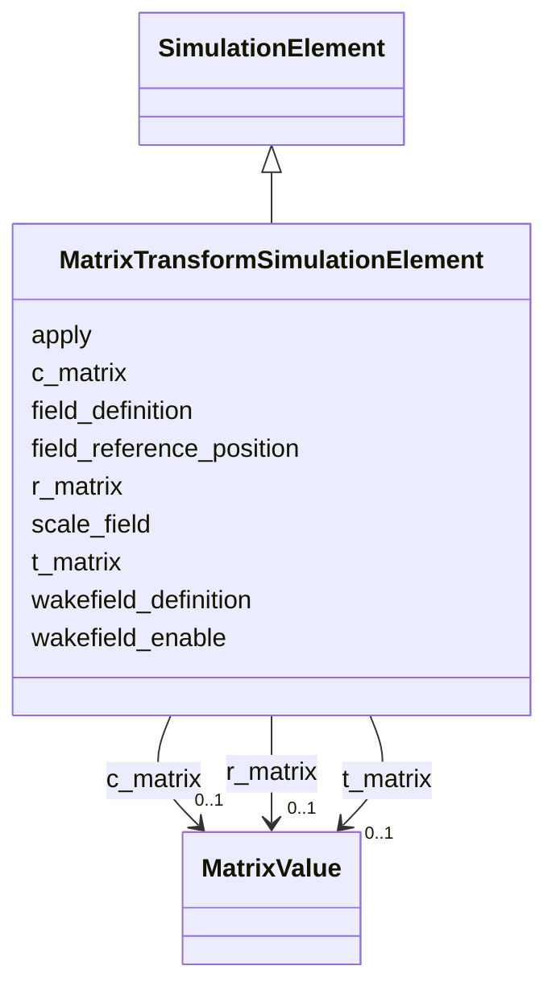

# Class: MatrixTransformSimulationElement 


_Zero-, first-, and second-order transfer-map coefficients for a matrix transform element. Each coefficient collection accepts the dense form or the named coefficient mapping understood by the Python model._


<div data-search-exclude markdown="1">


URI: [laura:MatrixTransformSimulationElement](https://w3id.org/laura/MatrixTransformSimulationElement)





## Inheritance
* [SimulationElement](SimulationElement.md)
    * **MatrixTransformSimulationElement**


## Class Properties

| Property | Value |
| --- | --- |
| Class URI | [laura:MatrixTransformSimulationElement](https://w3id.org/laura/MatrixTransformSimulationElement) |


## Slots

| Name | Cardinality and Range | Description | Inheritance |
| ---  | --- | --- | --- |
| [apply](apply.md) | 0..1 <br/> [Boolean](Boolean.md) | Whether to apply the transfer map | direct |
| [c_matrix](c_matrix.md) | 0..1 <br/> [MatrixValue](MatrixValue.md) | C-matrix (zeroth-order transfer vector) | direct |
| [r_matrix](r_matrix.md) | 0..1 <br/> [MatrixValue](MatrixValue.md) | R-matrix (first-order transfer matrix) | direct |
| [t_matrix](t_matrix.md) | 0..1 <br/> [MatrixValue](MatrixValue.md) | T-matrix (second-order transfer tensor) | direct |
| [field_definition](field_definition.md) | 0..1 <br/> [String](String.md) | Path to the 3-D field-map file | [SimulationElement](SimulationElement.md) |
| [wakefield_definition](wakefield_definition.md) | 0..1 <br/> [String](String.md) | Path to the wakefield impedance file | [SimulationElement](SimulationElement.md) |
| [wakefield_enable](wakefield_enable.md) | 0..1 <br/> [Boolean](Boolean.md) | Whether the wakefield named by wakefield_definition is applied | [SimulationElement](SimulationElement.md) |
| [field_reference_position](field_reference_position.md) | 0..1 <br/> [String](String.md) | Longitudinal origin of the field map [m] | [SimulationElement](SimulationElement.md) |
| [scale_field](scale_field.md) | 0..1 <br/> [Double](Double.md) | Multiplicative scale factor applied to the field map | [SimulationElement](SimulationElement.md) |


## Usages

| used by | used in | type | used |
| ---  | --- | --- | --- |
| [MatrixTransform](MatrixTransform.md) | [simulation](simulation.md) | range | [MatrixTransformSimulationElement](MatrixTransformSimulationElement.md) |


## Identifier and Mapping Information


### Schema Source


* from schema: https://w3id.org/laura/schema


## Mappings

| Mapping Type | Mapped Value |
| ---  | ---  |
| self | laura:MatrixTransformSimulationElement |
| native | laura:MatrixTransformSimulationElement |


## LinkML Source

<!-- TODO: investigate https://stackoverflow.com/questions/37606292/how-to-create-tabbed-code-blocks-in-mkdocs-or-sphinx -->

### Direct

<details>
```yaml
name: MatrixTransformSimulationElement
description: Zero-, first-, and second-order transfer-map coefficients for a matrix
  transform element. Each coefficient collection accepts the dense form or the named
  coefficient mapping understood by the Python model.
from_schema: https://w3id.org/laura/schema
is_a: SimulationElement
attributes:
  apply:
    name: apply
    description: Whether to apply the transfer map.
    from_schema: https://w3id.org/laura/schema/simulation
    rank: 1000
    ifabsent: 'False'
    domain_of:
    - MatrixTransformSimulationElement
    range: boolean
  c_matrix:
    name: c_matrix
    description: C-matrix (zeroth-order transfer vector).
    from_schema: https://w3id.org/laura/schema/simulation
    rank: 1000
    domain_of:
    - MatrixTransformSimulationElement
    range: MatrixValue
  r_matrix:
    name: r_matrix
    description: R-matrix (first-order transfer matrix).
    from_schema: https://w3id.org/laura/schema/simulation
    rank: 1000
    domain_of:
    - MatrixTransformSimulationElement
    range: MatrixValue
  t_matrix:
    name: t_matrix
    description: T-matrix (second-order transfer tensor).
    from_schema: https://w3id.org/laura/schema/simulation
    rank: 1000
    domain_of:
    - MatrixTransformSimulationElement
    range: MatrixValue
class_uri: laura:MatrixTransformSimulationElement

```
</details>

### Induced

<details>
```yaml
name: MatrixTransformSimulationElement
description: Zero-, first-, and second-order transfer-map coefficients for a matrix
  transform element. Each coefficient collection accepts the dense form or the named
  coefficient mapping understood by the Python model.
from_schema: https://w3id.org/laura/schema
is_a: SimulationElement
attributes:
  apply:
    name: apply
    description: Whether to apply the transfer map.
    from_schema: https://w3id.org/laura/schema/simulation
    rank: 1000
    ifabsent: 'False'
    owner: MatrixTransformSimulationElement
    domain_of:
    - MatrixTransformSimulationElement
    range: boolean
  c_matrix:
    name: c_matrix
    description: C-matrix (zeroth-order transfer vector).
    from_schema: https://w3id.org/laura/schema/simulation
    rank: 1000
    owner: MatrixTransformSimulationElement
    domain_of:
    - MatrixTransformSimulationElement
    range: MatrixValue
  r_matrix:
    name: r_matrix
    description: R-matrix (first-order transfer matrix).
    from_schema: https://w3id.org/laura/schema/simulation
    rank: 1000
    owner: MatrixTransformSimulationElement
    domain_of:
    - MatrixTransformSimulationElement
    range: MatrixValue
  t_matrix:
    name: t_matrix
    description: T-matrix (second-order transfer tensor).
    from_schema: https://w3id.org/laura/schema/simulation
    rank: 1000
    owner: MatrixTransformSimulationElement
    domain_of:
    - MatrixTransformSimulationElement
    range: MatrixValue
  field_definition:
    name: field_definition
    description: Path to the 3-D field-map file.
    from_schema: https://w3id.org/laura/schema/simulation
    rank: 1000
    owner: MatrixTransformSimulationElement
    domain_of:
    - SimulationElement
    range: string
  wakefield_definition:
    name: wakefield_definition
    description: Path to the wakefield impedance file.
    from_schema: https://w3id.org/laura/schema/simulation
    rank: 1000
    owner: MatrixTransformSimulationElement
    domain_of:
    - SimulationElement
    range: string
  wakefield_enable:
    name: wakefield_enable
    description: Whether the wakefield named by wakefield_definition is applied. Set
      false to track the element without its wakefield while keeping the definition
      itself.
    from_schema: https://w3id.org/laura/schema/simulation
    rank: 1000
    ifabsent: 'true'
    owner: MatrixTransformSimulationElement
    domain_of:
    - SimulationElement
    range: boolean
  field_reference_position:
    name: field_reference_position
    description: Longitudinal origin of the field map [m].
    from_schema: https://w3id.org/laura/schema/simulation
    rank: 1000
    owner: MatrixTransformSimulationElement
    domain_of:
    - SimulationElement
    range: string
  scale_field:
    name: scale_field
    description: Multiplicative scale factor applied to the field map.
    from_schema: https://w3id.org/laura/schema/simulation
    rank: 1000
    ifabsent: float(1)
    owner: MatrixTransformSimulationElement
    domain_of:
    - SimulationElement
    range: double
class_uri: laura:MatrixTransformSimulationElement

```
</details></div>