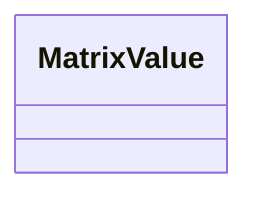

# Class: MatrixValue 


_An unconstrained serializable matrix value. The handwritten matrix model validates dense arrays and named coefficient mappings into NumPy arrays._


<div data-search-exclude markdown="1">


URI: [linkml:Any](https://w3id.org/linkml/Any)





<!-- no inheritance hierarchy -->

## Class Properties

| Property | Value |
| --- | --- |
| Class URI | [linkml:Any](https://w3id.org/linkml/Any) |


## Slots

| Name | Cardinality and Range | Description | Inheritance |
| ---  | --- | --- | --- |


## Usages

| used by | used in | type | used |
| ---  | --- | --- | --- |
| [MatrixTransformSimulationElement](MatrixTransformSimulationElement.md) | [c_matrix](c_matrix.md) | range | [MatrixValue](MatrixValue.md) |
| [MatrixTransformSimulationElement](MatrixTransformSimulationElement.md) | [r_matrix](r_matrix.md) | range | [MatrixValue](MatrixValue.md) |
| [MatrixTransformSimulationElement](MatrixTransformSimulationElement.md) | [t_matrix](t_matrix.md) | range | [MatrixValue](MatrixValue.md) |


## Identifier and Mapping Information


### Schema Source


* from schema: https://w3id.org/laura/schema


## Mappings

| Mapping Type | Mapped Value |
| ---  | ---  |
| self | linkml:Any |
| native | laura:MatrixValue |


## LinkML Source

<!-- TODO: investigate https://stackoverflow.com/questions/37606292/how-to-create-tabbed-code-blocks-in-mkdocs-or-sphinx -->

### Direct

<details>
```yaml
name: MatrixValue
description: An unconstrained serializable matrix value. The handwritten matrix model
  validates dense arrays and named coefficient mappings into NumPy arrays.
from_schema: https://w3id.org/laura/schema
class_uri: linkml:Any

```
</details>

### Induced

<details>
```yaml
name: MatrixValue
description: An unconstrained serializable matrix value. The handwritten matrix model
  validates dense arrays and named coefficient mappings into NumPy arrays.
from_schema: https://w3id.org/laura/schema
class_uri: linkml:Any

```
</details></div>