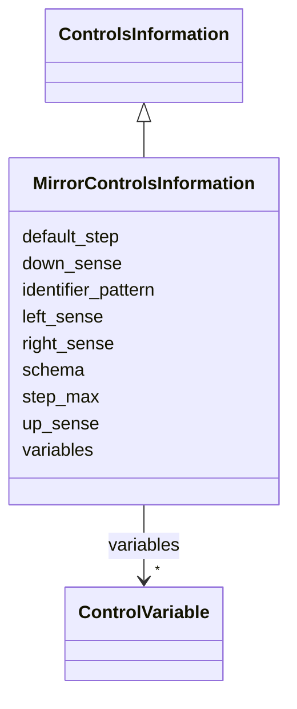

# Class: MirrorControlsInformation 


_Control interface of a steerable laser mirror._


<div data-search-exclude markdown="1">


URI: [laura:MirrorControlsInformation](https://w3id.org/laura/MirrorControlsInformation)





## Inheritance
* [ControlsInformation](ControlsInformation.md)
    * **MirrorControlsInformation**


## Class Properties

| Property | Value |
| --- | --- |
| Class URI | [laura:MirrorControlsInformation](https://w3id.org/laura/MirrorControlsInformation) |


## Slots

| Name | Cardinality and Range | Description | Inheritance |
| ---  | --- | --- | --- |
| [step_max](step_max.md) | 0..1 <br/> [Double](Double.md) | Largest adjustment a single step may make | direct |
| [default_step](default_step.md) | 0..1 <br/> [Double](Double.md) | Adjustment made by a step that does not say how far | direct |
| [right_sense](right_sense.md) | 0..1 <br/> [Integer](Integer.md) | Sign relating a rightward move to the actuator's direction | direct |
| [up_sense](up_sense.md) | 0..1 <br/> [Integer](Integer.md) | Sign relating an upward move to the actuator's direction | direct |
| [left_sense](left_sense.md) | 0..1 <br/> [Integer](Integer.md) | Sign relating a leftward move to the actuator's direction | direct |
| [down_sense](down_sense.md) | 0..1 <br/> [Integer](Integer.md) | Sign relating a downward move to the actuator's direction | direct |
| [variables](variables.md) | * <br/> [ControlVariable](ControlVariable.md) | Named control variables keyed by logical name | [ControlsInformation](ControlsInformation.md) |
| [schema](schema.md) | 0..1 <br/> [String](String.md) | The shared controls schema file ``variables`` was expanded from, if any | [ControlsInformation](ControlsInformation.md) |
| [identifier_pattern](identifier_pattern.md) | 0..1 <br/> [String](String.md) | What ``{name}`` in that file was substituted with, where it was not the eleme... | [ControlsInformation](ControlsInformation.md) |


## Usages

| used by | used in | type | used |
| ---  | --- | --- | --- |
| [LaserMirror](LaserMirror.md) | [controls](controls.md) | range | [MirrorControlsInformation](MirrorControlsInformation.md) |


## Identifier and Mapping Information


### Schema Source


* from schema: https://w3id.org/laura/schema


## Mappings

| Mapping Type | Mapped Value |
| ---  | ---  |
| self | laura:MirrorControlsInformation |
| native | laura:MirrorControlsInformation |


## LinkML Source

<!-- TODO: investigate https://stackoverflow.com/questions/37606292/how-to-create-tabbed-code-blocks-in-mkdocs-or-sphinx -->

### Direct

<details>
```yaml
name: MirrorControlsInformation
description: Control interface of a steerable laser mirror.
from_schema: https://w3id.org/laura/schema
is_a: ControlsInformation
attributes:
  step_max:
    name: step_max
    description: Largest adjustment a single step may make.
    from_schema: https://w3id.org/laura/schema/controls
    rank: 1000
    ifabsent: float(0.05)
    domain_of:
    - MirrorControlsInformation
    - LaserMirrorElement
    range: double
  default_step:
    name: default_step
    description: Adjustment made by a step that does not say how far.
    from_schema: https://w3id.org/laura/schema/controls
    rank: 1000
    ifabsent: float(0.005)
    domain_of:
    - MirrorControlsInformation
    range: double
  right_sense:
    name: right_sense
    description: Sign relating a rightward move to the actuator's direction.
    from_schema: https://w3id.org/laura/schema/controls
    rank: 1000
    ifabsent: int(-1)
    domain_of:
    - MirrorControlsInformation
    range: integer
  up_sense:
    name: up_sense
    description: Sign relating an upward move to the actuator's direction.
    from_schema: https://w3id.org/laura/schema/controls
    rank: 1000
    ifabsent: int(-1)
    domain_of:
    - MirrorControlsInformation
    range: integer
  left_sense:
    name: left_sense
    description: Sign relating a leftward move to the actuator's direction.
    from_schema: https://w3id.org/laura/schema/controls
    rank: 1000
    ifabsent: int(1)
    domain_of:
    - MirrorControlsInformation
    range: integer
  down_sense:
    name: down_sense
    description: Sign relating a downward move to the actuator's direction.
    from_schema: https://w3id.org/laura/schema/controls
    rank: 1000
    ifabsent: int(1)
    domain_of:
    - MirrorControlsInformation
    range: integer
class_uri: laura:MirrorControlsInformation

```
</details>

### Induced

<details>
```yaml
name: MirrorControlsInformation
description: Control interface of a steerable laser mirror.
from_schema: https://w3id.org/laura/schema
is_a: ControlsInformation
attributes:
  step_max:
    name: step_max
    description: Largest adjustment a single step may make.
    from_schema: https://w3id.org/laura/schema/controls
    rank: 1000
    ifabsent: float(0.05)
    owner: MirrorControlsInformation
    domain_of:
    - MirrorControlsInformation
    - LaserMirrorElement
    range: double
  default_step:
    name: default_step
    description: Adjustment made by a step that does not say how far.
    from_schema: https://w3id.org/laura/schema/controls
    rank: 1000
    ifabsent: float(0.005)
    owner: MirrorControlsInformation
    domain_of:
    - MirrorControlsInformation
    range: double
  right_sense:
    name: right_sense
    description: Sign relating a rightward move to the actuator's direction.
    from_schema: https://w3id.org/laura/schema/controls
    rank: 1000
    ifabsent: int(-1)
    owner: MirrorControlsInformation
    domain_of:
    - MirrorControlsInformation
    range: integer
  up_sense:
    name: up_sense
    description: Sign relating an upward move to the actuator's direction.
    from_schema: https://w3id.org/laura/schema/controls
    rank: 1000
    ifabsent: int(-1)
    owner: MirrorControlsInformation
    domain_of:
    - MirrorControlsInformation
    range: integer
  left_sense:
    name: left_sense
    description: Sign relating a leftward move to the actuator's direction.
    from_schema: https://w3id.org/laura/schema/controls
    rank: 1000
    ifabsent: int(1)
    owner: MirrorControlsInformation
    domain_of:
    - MirrorControlsInformation
    range: integer
  down_sense:
    name: down_sense
    description: Sign relating a downward move to the actuator's direction.
    from_schema: https://w3id.org/laura/schema/controls
    rank: 1000
    ifabsent: int(1)
    owner: MirrorControlsInformation
    domain_of:
    - MirrorControlsInformation
    range: integer
  variables:
    name: variables
    description: Named control variables keyed by logical name.
    from_schema: https://w3id.org/laura/schema/controls
    rank: 1000
    owner: MirrorControlsInformation
    domain_of:
    - ControlsInformation
    range: ControlVariable
    multivalued: true
    inlined: true
    inlined_as_list: false
  schema:
    name: schema
    description: 'The shared controls schema file ``variables`` was expanded from,
      if any.  Kept only as a record of where they came from: the expansion happens
      while the element YAML is read, so ``variables`` is always already resolved
      by the time anything sees this class.'
    from_schema: https://w3id.org/laura/schema/controls
    rank: 1000
    owner: MirrorControlsInformation
    domain_of:
    - ControlsInformation
    range: string
  identifier_pattern:
    name: identifier_pattern
    description: What ``{name}`` in that file was substituted with, where it was not
      the element's own name.
    from_schema: https://w3id.org/laura/schema/controls
    rank: 1000
    owner: MirrorControlsInformation
    domain_of:
    - ControlsInformation
    range: string
class_uri: laura:MirrorControlsInformation

```
</details></div>