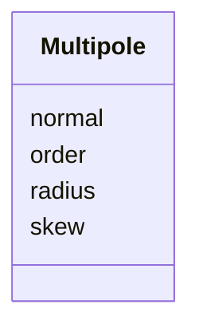

---
search:
  boost: 10.0
---

# Class: Multipole 


_Individual multipole field component, characterised by order and integrated normal / skew strengths at a reference radius._


<div data-search-exclude markdown="1">


URI: [laura:Multipole](https://w3id.org/laura/Multipole)





<!-- no inheritance hierarchy -->

## Class Properties

| Property | Value |
| --- | --- |
| Class URI | [laura:Multipole](https://w3id.org/laura/Multipole) |


## Slots

| Name | Cardinality and Range | Description | Inheritance |
| ---  | --- | --- | --- |
| [order](order.md) | 0..1 <br/> [Integer](Integer.md) | Multipole order (0 = dipole, 1 = quadrupole, ?) | direct |
| [normal](normal.md) | 0..1 <br/> [Float](Float.md) | Integrated normal (upright) multipole strength [T | direct |
| [skew](skew.md) | 0..1 <br/> [Float](Float.md) | Integrated skew (rotated) multipole strength [T | direct |
| [radius](radius.md) | 0..1 <br/> [Float](Float.md) | Reference radius for multipole normalisation [m] | direct |


## Usages

| used by | used in | type | used |
| ---  | --- | --- | --- |
| [Multipoles](Multipoles.md) | [K0L](K0L.md) | range | [Multipole](Multipole.md) |
| [Multipoles](Multipoles.md) | [K1L](K1L.md) | range | [Multipole](Multipole.md) |
| [Multipoles](Multipoles.md) | [K2L](K2L.md) | range | [Multipole](Multipole.md) |
| [Multipoles](Multipoles.md) | [K3L](K3L.md) | range | [Multipole](Multipole.md) |
| [Multipoles](Multipoles.md) | [K4L](K4L.md) | range | [Multipole](Multipole.md) |


## Identifier and Mapping Information


### Schema Source


* from schema: https://w3id.org/laura/schema


## Mappings

| Mapping Type | Mapped Value |
| ---  | ---  |
| self | laura:Multipole |
| native | laura:Multipole |


## LinkML Source

<!-- TODO: investigate https://stackoverflow.com/questions/37606292/how-to-create-tabbed-code-blocks-in-mkdocs-or-sphinx -->

### Direct

<details>
```yaml
name: Multipole
description: Individual multipole field component, characterised by order and integrated
  normal / skew strengths at a reference radius.
from_schema: https://w3id.org/laura/schema
attributes:
  order:
    name: order
    description: Multipole order (0 = dipole, 1 = quadrupole, ?).
    from_schema: https://w3id.org/laura/schema/magnetic
    rank: 1000
    ifabsent: int(0)
    domain_of:
    - Multipole
    - MagneticElement
    range: integer
    minimum_value: 0
  normal:
    name: normal
    description: Integrated normal (upright) multipole strength [T.m^{1-n}].
    from_schema: https://w3id.org/laura/schema/magnetic
    rank: 1000
    ifabsent: float(0)
    domain_of:
    - Multipole
    range: float
  skew:
    name: skew
    description: Integrated skew (rotated) multipole strength [T.m^{1-n}].
    from_schema: https://w3id.org/laura/schema/magnetic
    rank: 1000
    ifabsent: float(0)
    domain_of:
    - Multipole
    - MagneticElement
    range: float
  radius:
    name: radius
    description: Reference radius for multipole normalisation [m].
    from_schema: https://w3id.org/laura/schema/magnetic
    rank: 1000
    ifabsent: float(0)
    domain_of:
    - Multipole
    - ApertureElement
    - CameraMask
    range: float
    unit:
      ucum_code: m
class_uri: laura:Multipole

```
</details>

### Induced

<details>
```yaml
name: Multipole
description: Individual multipole field component, characterised by order and integrated
  normal / skew strengths at a reference radius.
from_schema: https://w3id.org/laura/schema
attributes:
  order:
    name: order
    description: Multipole order (0 = dipole, 1 = quadrupole, ?).
    from_schema: https://w3id.org/laura/schema/magnetic
    rank: 1000
    ifabsent: int(0)
    owner: Multipole
    domain_of:
    - Multipole
    - MagneticElement
    range: integer
    minimum_value: 0
  normal:
    name: normal
    description: Integrated normal (upright) multipole strength [T.m^{1-n}].
    from_schema: https://w3id.org/laura/schema/magnetic
    rank: 1000
    ifabsent: float(0)
    owner: Multipole
    domain_of:
    - Multipole
    range: float
  skew:
    name: skew
    description: Integrated skew (rotated) multipole strength [T.m^{1-n}].
    from_schema: https://w3id.org/laura/schema/magnetic
    rank: 1000
    ifabsent: float(0)
    owner: Multipole
    domain_of:
    - Multipole
    - MagneticElement
    range: float
  radius:
    name: radius
    description: Reference radius for multipole normalisation [m].
    from_schema: https://w3id.org/laura/schema/magnetic
    rank: 1000
    ifabsent: float(0)
    owner: Multipole
    domain_of:
    - Multipole
    - ApertureElement
    - CameraMask
    range: float
    unit:
      ucum_code: m
class_uri: laura:Multipole

```
</details></div>