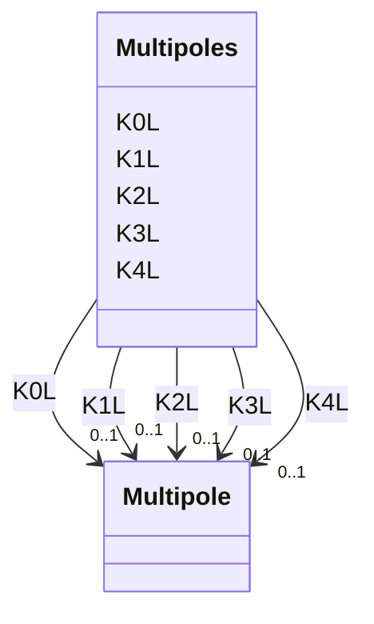

# Class: Multipoles 


_Complete set of integrated multipole strengths up to decapole order, as named slots for efficient element look-up._


<div data-search-exclude markdown="1">


URI: [laura:MultipoleList](https://w3id.org/laura/MultipoleList)





<!-- no inheritance hierarchy -->

## Class Properties

| Property | Value |
| --- | --- |
| Class URI | [laura:MultipoleList](https://w3id.org/laura/MultipoleList) |


## Slots

| Name | Cardinality and Range | Description | Inheritance |
| ---  | --- | --- | --- |
| [K0L](K0L.md) | 0..1 <br/> [Multipole](Multipole.md) | Integrated dipole field | direct |
| [K1L](K1L.md) | 0..1 <br/> [Multipole](Multipole.md) | Integrated quadrupole gradient | direct |
| [K2L](K2L.md) | 0..1 <br/> [Multipole](Multipole.md) | Integrated sextupole strength | direct |
| [K3L](K3L.md) | 0..1 <br/> [Multipole](Multipole.md) | Integrated octupole strength | direct |
| [K4L](K4L.md) | 0..1 <br/> [Multipole](Multipole.md) | Integrated decapole strength | direct |


## Usages

| used by | used in | type | used |
| ---  | --- | --- | --- |
| [MagneticElement](MagneticElement.md) | [multipoles](multipoles.md) | range | [Multipoles](Multipoles.md) |
| [MagneticElement](MagneticElement.md) | [systematic_multipoles](systematic_multipoles.md) | range | [Multipoles](Multipoles.md) |
| [MagneticElement](MagneticElement.md) | [random_multipoles](random_multipoles.md) | range | [Multipoles](Multipoles.md) |
| [DipoleMagnet](DipoleMagnet.md) | [multipoles](multipoles.md) | range | [Multipoles](Multipoles.md) |
| [DipoleMagnet](DipoleMagnet.md) | [systematic_multipoles](systematic_multipoles.md) | range | [Multipoles](Multipoles.md) |
| [DipoleMagnet](DipoleMagnet.md) | [random_multipoles](random_multipoles.md) | range | [Multipoles](Multipoles.md) |
| [QuadrupoleMagnet](QuadrupoleMagnet.md) | [multipoles](multipoles.md) | range | [Multipoles](Multipoles.md) |
| [QuadrupoleMagnet](QuadrupoleMagnet.md) | [systematic_multipoles](systematic_multipoles.md) | range | [Multipoles](Multipoles.md) |
| [QuadrupoleMagnet](QuadrupoleMagnet.md) | [random_multipoles](random_multipoles.md) | range | [Multipoles](Multipoles.md) |
| [SextupoleMagnet](SextupoleMagnet.md) | [multipoles](multipoles.md) | range | [Multipoles](Multipoles.md) |
| [SextupoleMagnet](SextupoleMagnet.md) | [systematic_multipoles](systematic_multipoles.md) | range | [Multipoles](Multipoles.md) |
| [SextupoleMagnet](SextupoleMagnet.md) | [random_multipoles](random_multipoles.md) | range | [Multipoles](Multipoles.md) |
| [OctupoleMagnet](OctupoleMagnet.md) | [multipoles](multipoles.md) | range | [Multipoles](Multipoles.md) |
| [OctupoleMagnet](OctupoleMagnet.md) | [systematic_multipoles](systematic_multipoles.md) | range | [Multipoles](Multipoles.md) |
| [OctupoleMagnet](OctupoleMagnet.md) | [random_multipoles](random_multipoles.md) | range | [Multipoles](Multipoles.md) |
| [DecapoleMagnet](DecapoleMagnet.md) | [multipoles](multipoles.md) | range | [Multipoles](Multipoles.md) |
| [DecapoleMagnet](DecapoleMagnet.md) | [systematic_multipoles](systematic_multipoles.md) | range | [Multipoles](Multipoles.md) |
| [DecapoleMagnet](DecapoleMagnet.md) | [random_multipoles](random_multipoles.md) | range | [Multipoles](Multipoles.md) |
| [CombinedSolenoidQuadrupoleMagnet](CombinedSolenoidQuadrupoleMagnet.md) | [multipoles](multipoles.md) | range | [Multipoles](Multipoles.md) |
| [CombinedSolenoidQuadrupoleMagnet](CombinedSolenoidQuadrupoleMagnet.md) | [systematic_multipoles](systematic_multipoles.md) | range | [Multipoles](Multipoles.md) |
| [CombinedSolenoidQuadrupoleMagnet](CombinedSolenoidQuadrupoleMagnet.md) | [random_multipoles](random_multipoles.md) | range | [Multipoles](Multipoles.md) |


## Identifier and Mapping Information


### Schema Source


* from schema: https://w3id.org/laura/schema


## Mappings

| Mapping Type | Mapped Value |
| ---  | ---  |
| self | laura:MultipoleList |
| native | laura:Multipoles |


## LinkML Source

<!-- TODO: investigate https://stackoverflow.com/questions/37606292/how-to-create-tabbed-code-blocks-in-mkdocs-or-sphinx -->

### Direct

<details>
```yaml
name: Multipoles
description: Complete set of integrated multipole strengths up to decapole order,
  as named slots for efficient element look-up.
from_schema: https://w3id.org/laura/schema
attributes:
  K0L:
    name: K0L
    description: Integrated dipole field.
    from_schema: https://w3id.org/laura/schema/magnetic
    rank: 1000
    domain_of:
    - Multipoles
    range: Multipole
  K1L:
    name: K1L
    description: Integrated quadrupole gradient.
    from_schema: https://w3id.org/laura/schema/magnetic
    rank: 1000
    domain_of:
    - Multipoles
    range: Multipole
  K2L:
    name: K2L
    description: Integrated sextupole strength.
    from_schema: https://w3id.org/laura/schema/magnetic
    rank: 1000
    domain_of:
    - Multipoles
    range: Multipole
  K3L:
    name: K3L
    description: Integrated octupole strength.
    from_schema: https://w3id.org/laura/schema/magnetic
    rank: 1000
    domain_of:
    - Multipoles
    range: Multipole
  K4L:
    name: K4L
    description: Integrated decapole strength.
    from_schema: https://w3id.org/laura/schema/magnetic
    rank: 1000
    domain_of:
    - Multipoles
    range: Multipole
class_uri: laura:MultipoleList

```
</details>

### Induced

<details>
```yaml
name: Multipoles
description: Complete set of integrated multipole strengths up to decapole order,
  as named slots for efficient element look-up.
from_schema: https://w3id.org/laura/schema
attributes:
  K0L:
    name: K0L
    description: Integrated dipole field.
    from_schema: https://w3id.org/laura/schema/magnetic
    rank: 1000
    owner: Multipoles
    domain_of:
    - Multipoles
    range: Multipole
  K1L:
    name: K1L
    description: Integrated quadrupole gradient.
    from_schema: https://w3id.org/laura/schema/magnetic
    rank: 1000
    owner: Multipoles
    domain_of:
    - Multipoles
    range: Multipole
  K2L:
    name: K2L
    description: Integrated sextupole strength.
    from_schema: https://w3id.org/laura/schema/magnetic
    rank: 1000
    owner: Multipoles
    domain_of:
    - Multipoles
    range: Multipole
  K3L:
    name: K3L
    description: Integrated octupole strength.
    from_schema: https://w3id.org/laura/schema/magnetic
    rank: 1000
    owner: Multipoles
    domain_of:
    - Multipoles
    range: Multipole
  K4L:
    name: K4L
    description: Integrated decapole strength.
    from_schema: https://w3id.org/laura/schema/magnetic
    rank: 1000
    owner: Multipoles
    domain_of:
    - Multipoles
    range: Multipole
class_uri: laura:MultipoleList

```
</details></div>